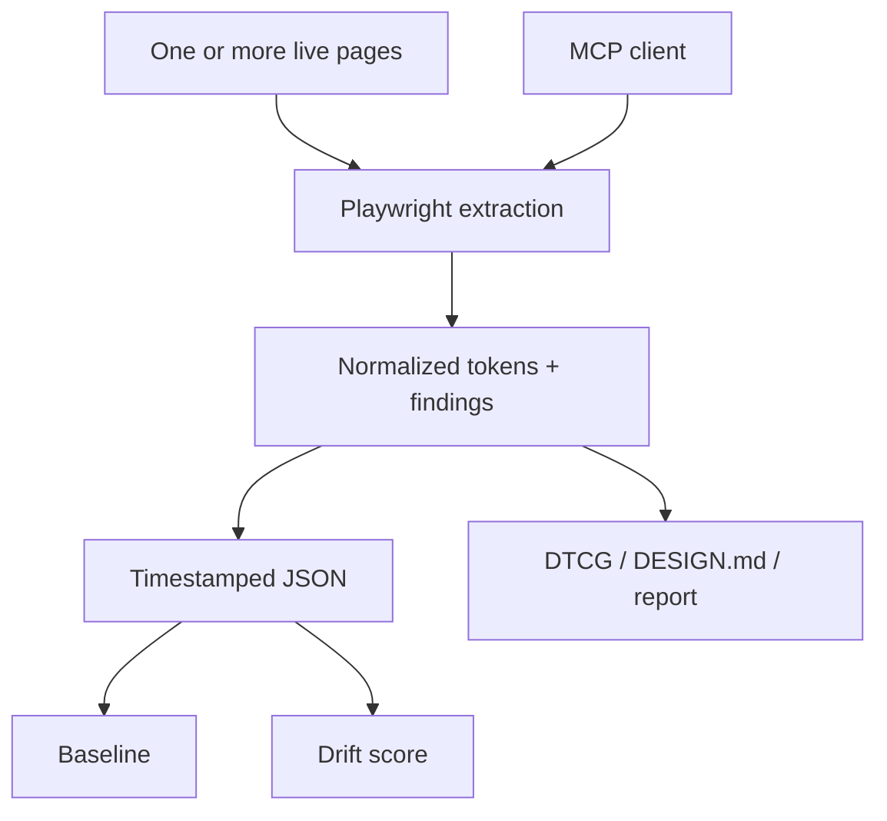

# Dembrandt

> Research status: **Source-level** · Last reviewed: **2026-08-12**

Dembrandt turns live websites into versioned design-system evidence. It combines deterministic browser extraction, an MCP interface for agents and optional hosted snapshot comparison; the durable outputs can be JSON, W3C DTCG tokens, `DESIGN.md` or an audit report.

## Design drift is first-class state

A single extraction can merge several pages, increasing confidence for tokens repeated across them. Saving output writes a timestamped local snapshot. With an account key, snapshots form a per-domain timeline; a baseline can be pinned and later captures scored for drift. That makes design-system change observable instead of treating every extraction as a fresh answer.

## Agent interface

The MCP server exposes token, palette, typography, component, surface, spacing and brand queries plus drift, findings, DTCG, DESIGN.md and report tools. Job controls make longer captures observable. Authentication cookies and mobile/WCAG modes are explicit inputs rather than hidden crawler state.

Pinned commit [`b149ef2`](https://github.com/dembrandt/dembrandt/commit/b149ef26d893404c7372dd40f4d6020d0e1d29cc) exposes:

- [`mcp-server.ts`](https://github.com/dembrandt/dembrandt/blob/b149ef26d893404c7372dd40f4d6020d0e1d29cc/mcp-server.ts);
- typed extractors under [`lib/extractors`](https://github.com/dembrandt/dembrandt/tree/b149ef26d893404c7372dd40f4d6020d0e1d29cc/lib/extractors);
- [drift computation](https://github.com/dembrandt/dembrandt/blob/b149ef26d893404c7372dd40f4d6020d0e1d29cc/lib/drift.ts);
- [DTCG formatting](https://github.com/dembrandt/dembrandt/blob/b149ef26d893404c7372dd40f4d6020d0e1d29cc/lib/formatters/dtcg.ts) and validation tests;
- an executable [CI drift-gate example](https://github.com/dembrandt/dembrandt/blob/b149ef26d893404c7372dd40f4d6020d0e1d29cc/examples/drift-gate.yml).

## Evidence limits

The CLI/MCP code is MIT-licensed. Hosted account retention and scoring were not live-tested, so source-level claims stop at published contracts and local paths. The organization profile does not establish a region.

## Decisive sources

- [Repository README](https://github.com/dembrandt/dembrandt/blob/b149ef26d893404c7372dd40f4d6020d0e1d29cc/README.md)
- [Product site](https://dembrandt.com/)
- [MIT license](https://github.com/dembrandt/dembrandt/blob/b149ef26d893404c7372dd40f4d6020d0e1d29cc/LICENSE)
