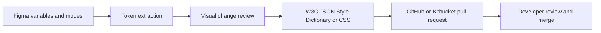

# Design System Sync

> Research status: **Architecture-level** · Last reviewed: **2026-08-12**

| Field | Verified value |
|---|---|
| Creator | Alexander Burgos |
| Team region | Manchester, United Kingdom |
| Figma plugin | `1561389071519901700` |
| Downstream authorities | GitHub or Bitbucket repository through a pull request |

Design System Sync converts a Figma variable change into a code review event. It scans design tokens and modes, presents a visual diff, serializes W3C Design Tokens, Style Dictionary or CSS Variables, then creates or updates a pull request in GitHub or Bitbucket. The repository does not become authoritative until reviewers merge that proposal.

## Review is the synchronization seam

The free plan includes five exports per month; Pro adds unlimited export and AI code generation. The public contract does not establish that AI is needed for the baseline token serialization. AI participates in the paid code-generation surface, while the ordinary governance loop is deterministic extraction plus human-reviewed delivery.

## Unknown synchronization semantics

No public source explains token identity across renames, whether deleted variables become explicit deletions, how aliases and unsupported Figma types map, how branch conflicts are rebased, or whether a failed PR can resume without rescanning. Git credentials and token data handling were not acceptance-tested. The creator portfolio is the first-party basis for the Manchester location.

## Primary evidence

- [Creator workflow post](https://forum.figma.com/share-your-feedback-26/export-figma-variables-directly-to-github-as-pull-requests-53332)
- [Creator portfolio and region evidence](https://alexanderburgos.netlify.app/)
- [Figma Community plugin 1561389071519901700](https://www.figma.com/community/plugin/1561389071519901700)
