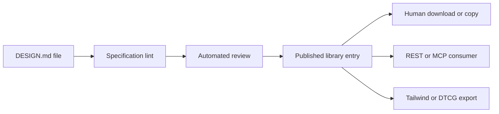

# DESIGNmd

> Research status: **Architecture-level** · Last reviewed: **2026-08-12**

DESIGNmd is a publication and distribution system for portable design-system documents. It is counted separately from the DESIGN.md format itself: the product owns submission validation review discovery and delivery of community artifacts.

## The uploaded file is a governed artifact

A DESIGN.md document combines YAML design tokens with Markdown rationale. A contributor authenticates with GitHub uploads a document and passes automated review against the stated specification before publication. Other users can browse search copy or download it.

This lifecycle is why DESIGNmd passes the boundary that static inspiration directories do not. The service operates a structured artifact and its publication state even though an external coding agent ultimately applies it to an interface.

## Authoring and consumption are separate interfaces

The product publishes `designmd-author` and `designmd-library` skills. The former helps create a conforming document; the latter helps find and consume published entries. REST and MCP make the library machine-addressable while Tailwind and Design Tokens Community Group exports materialize parts of the artifact for code.

Validation proves conformance to a file contract not visual quality originality safety or licensing. A syntactically valid token palette can still produce poor hierarchy and prose can still contain unsafe or irrelevant instructions. Those risks belong in consumer review rather than being hidden by the word “lint.”

## Evidence and source boundary

The public site exposes the workflow and artifact contract. A repository URL shown by the product was not reachable at review time so no source-derived implementation claim is made. The database schema review prompts ranking API implementation and immutable-version semantics remain closed. It is also unknown whether a published item can be revised in place or whether consumers can pin an immutable content hash.

Team region remains unknown on the reviewed first-party surface.

## Primary evidence

- [DESIGNmd about and workflow](https://designmd.ai/about)
- [DESIGNmd library](https://designmd.ai/)
