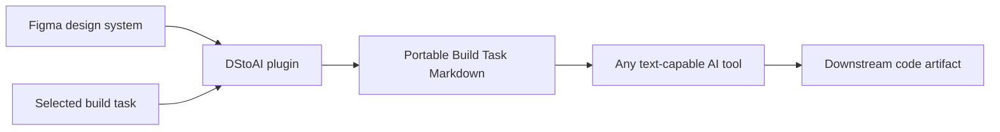

# DStoAI

> Research status: **Architecture-level** · Last reviewed: **2026-08-11**

| Field | Value |
|---|---|
| Team | DStoAI · team region not established |
| Ordinary job | package the relevant Figma system and build intent into a document any downstream AI tool can read |
| Upstream authority | Figma design system and selected task context |
| Owned handoff artifact | downloaded Build Task Markdown document |

## Materialization replaces a live bridge

DStoAI reads Figma component and token context and creates a text document that can be pasted into Claude Cursor Lovable v0 or another model surface. The document travels with the task and does not require the recipient to authenticate to Figma or maintain an MCP session.

## Portability trades away freshness

The exported Markdown is user-owned and easy to review diff and attach to work. It is also a snapshot. Later changes to the Figma system do not automatically update an already exported task. This is deliberate one-way design-code materialization rather than synchronized two-way authority.

The record remains in scope because the plugin operates a user's current Design artifact and produces task-specific machine-readable context. It is not a generic static prompt library. The downstream coding agent owns code changes; DStoAI owns the extraction/materialization boundary.

## Evidence ceiling

The implementation and export grammar are closed. Public evidence does not establish token coverage component traversal image handling drift detection or provenance metadata. Users must validate generated code against both the exported document and current Figma source.

## Primary evidence

- [DStoAI product](https://www.dstoai.com/)
- [DStoAI real-export entry](https://www.dstoai.com/#demo)
- [Maker profile linked by the product](https://lekanisaac.com/)
