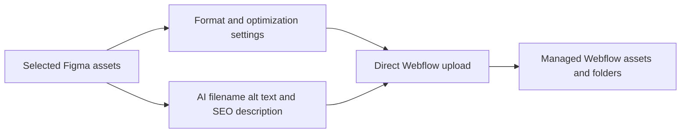

# ExportFlow

> Research status: **Architecture-level** · Last reviewed: **2026-08-12**

ExportFlow is a Figma-to-Webflow asset delivery plugin. Its core transfer is deterministic—selected frames or layers are encoded and uploaded into a chosen Webflow project and folder—while AI supplies filenames, alt text and SEO descriptions during the same handoff.

## AI operates on semantics, not layout

This is in scope because the model-authored metadata becomes part of a real design-delivery artifact, not because the plugin creates the visual composition. The user can choose PNG, SVG, JPG, AVIF or WebP and manage multiple target sites.

## Review boundary

Generated alt text requires human review: useful descriptions depend on page purpose and should not merely restate visible pixels. Public evidence does not document the model, surrounding-frame context, duplicate handling, metadata editing before upload, rollback, retry/idempotency or synchronization after a Figma asset changes.

The creator describes a single-maintainer current plugin but provides no reliable team-location evidence, so region remains unknown.

## Primary evidence

- [Figma Community plugin](https://www.figma.com/community/plugin/1657432195632964294/figma-to-webflow-exportflow)
- [Creator-authored workflow](https://www.reddit.com/r/webflow/comments/1vlcjtk/im_a_designer_not_a_developer_i_built_a_plugin/)
