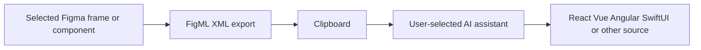

# FigML

> Research status: **Architecture-level** · Last reviewed: **2026-08-12**

FigML does not call a model on the user's behalf. It turns a selected Figma frame or component into concise XML that preserves essential hierarchy and styling; the user copies that XML into ChatGPT, Claude or another assistant and asks for framework-specific code.

## The user carries the artifact across the model boundary

The XML is the grounding intermediate. Figma remains the design authority and the resulting repository becomes a distinct implementation authority; the public product does not promise round-trip updates. The creator recommends exporting components or sections separately for complex designs, which exposes context size and translation quality as practical boundaries rather than hiding them.

## What “preserves” does not prove

The official material does not publish the XML schema, stable node identifiers, supported Figma properties, component-instance semantics, asset transport, token mapping or model-side validation. “Production-ready code” is a stated aim, not independently verified output quality. No public source repository or live acceptance run was found. Team region remains unknown.

## Primary evidence

- [Official product and workflow](https://figml.pro/)
- [Creator release post](https://forum.figma.com/showcase-your-work-14/figml-figma-xml-exporter-plugin-42202)
- [Figma Community plugin 1515328157096190551](https://www.figma.com/community/plugin/1515328157096190551)
