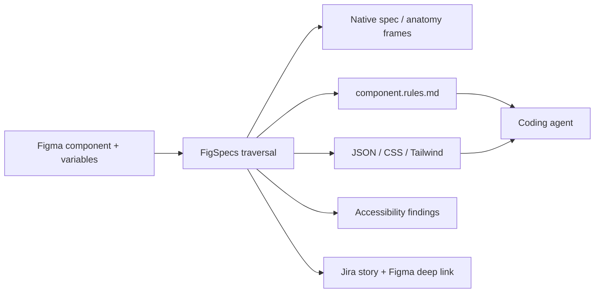

# FigSpecs

> Research status: **Architecture-level** · Last reviewed: **2026-08-11**

| Field | Value |
|---|---|
| Team | FigSpecs · team region not established |
| Ordinary job | turn a selected Figma component into native explanation and machine-readable implementation constraints |
| Upstream authority | selected Figma component tree and bound variables |
| Materialized artifacts | native spec/anatomy frames plus rules Markdown JSON CSS Tailwind and Jira attachments |

## Handoff becomes an inspectable artifact set

FigSpecs walks a selected component and nested instances to depth-bounded structure. It resolves variable bindings for color spacing radius opacity and typography rather than retaining only literal values. The plugin writes measurement panels and anatomy diagrams as native Figma frames and separately exports a structured component tree for people and coding agents.

## Governance is traceable back to the component

The generated Jira issue contains a deep link and attaches the machine-readable outputs. Bound tokens become semantic custom properties; unbound properties fall back to resolved values and therefore reveal where the design system lacks semantic authority. Native frames remain editable in Figma while exported files become downstream implementation evidence.

The plugin is included even though it is not an autonomous canvas agent because AI-readable governance and design-code translation are its ordinary Design loop. Unlike a static guideline library it reads a user's current artifact and creates project-specific native and file outputs.

## Evidence ceiling

The distributed plugin implementation is not public. Traversal correctness accessibility heuristics Jira credential storage and regeneration/diff behavior cannot be source-audited. Generated claims must still be checked against the live component.

## Primary evidence

- [FigSpecs product and technical FAQ](https://www.figspecs.pro/)
- [FigSpecs Figma Community plugin](https://www.figma.com/community/plugin/1612756059828219731/figspecs)
