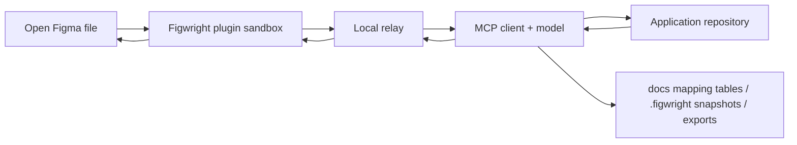

# Figwright

> Research status: **Source-level for the local server, Figma plugin and shipped agent skills; live Figma journey not exercised · v1.0** · Last reviewed: **2026-08-11**

| Field | Verified value |
|---|---|
| Maintainer | Roya / awdr74100, with contributors |
| Product | Free two-way Figma MCP server plus a manually imported Figma plugin |
| Category | Local bidirectional Figma agent bridge with repository-grounding joins |
| Current release in this snapshot | <code>v0.4.0</code>, published 2026-08-08 UTC |
| Advertised tool surface | 112 MCP tools: canvas reads/writes, exports and repository-grounding operations |
| Durable design artifact | The open Figma file; Figwright does not implement a second design-document store |
| Durable code artifact | Whatever files the calling coding agent writes in the user's repository |
| Auxiliary durable state | Optional mapping tables under <code>docs/</code>, <code>.figwright/snapshots/</code>, and explicitly exported files |
| License | MIT |
| Pinned source revision | [<code>6787645807b753d84251030334bc5e9bf63e9044</code>](https://github.com/awdr74100/figwright/tree/6787645807b753d84251030334bc5e9bf63e9044) |
| Published <code>v0.4.0</code> commit | [<code>3770d74cffbbf94b992b21500b99f6d4113a8da2</code>](https://github.com/awdr74100/figwright/tree/3770d74cffbbf94b992b21500b99f6d4113a8da2) |

The pinned source is one non-product commit ahead of the published release: the only diff from the
<code>v0.4.0</code> commit is one formatter exclusion for the generated changelog. Product/runtime
claims below therefore describe the published release as well as the pinned source unless a section
explicitly says otherwise.

## “Two-way” is two journeys, not one mirrored artifact

Figwright's decisive product fact is an asymmetry hidden by the word “bidirectional.”

- In **Figma → code**, the plugin reads the open Figma document, server-local tools join that data
  against the current repository, and the external model authors application code. Figwright itself
  does not compile a Figma tree into framework source.
- In **code/specification → Figma**, the external model chooses a sequence of write tools and the
  plugin mutates the open Figma document through the public Plugin API. The application source is
  evidence for the model, not a mechanically linked second document.

The arrows are calls and handoffs, not a continuously synchronized graph. The open Figma file and
the application repository remain separate mutation authorities.

## What an ordinary user actually has to do

The [official quick start at the pinned revision](https://github.com/awdr74100/figwright/blob/6787645807b753d84251030334bc5e9bf63e9044/README.md#quick-start)
has two installation channels:

1. Configure the MCP client to launch <code>npx -y @figwright/mcp@latest</code>.
2. Download the plugin zip from GitHub Releases, unzip it, and import its
   <code>manifest.json</code> through Figma desktop's Development-plugin menu.
3. Open the target Figma file and run the plugin. It connects to the fixed local relay port and the
   agent confirms the route with <code>ping</code>.
4. Optionally install the repository's <code>figma-codegen</code> and
   <code>figma-build</code> skills. The skills carry workflow policy; without the MCP server they
   have no Figma tools.

From there the two ordinary routes diverge.

| User goal | Agent route | Durable outcome | The important break |
|---|---|---|---|
| Implement a selected design | Ground the selected frame, join components/tokens/icons to the repository, export missing visual assets, write code, render it, compare it with Figma, then optionally baseline the node | Application source and assets written by the external coding agent | A successful Figwright read does not prove that code was written or that the rendered result matches |
| Build or update a Figma design | Inspect the file's variables/components/styles and the source/specification, reuse or author design-system objects, issue writes, then screenshot/export for review | Mutations in the open Figma document | The source values inform model decisions but do not become a live source binding |

Both skills deliberately require **provider-first** behavior. The tool layer supplies structured
evidence and mutations; the model remains the planner, framework adapter and visual-repair loop.
That is why the [root README calls Figwright provider-first](https://github.com/awdr74100/figwright/blob/6787645807b753d84251030334bc5e9bf63e9044/README.md#how-it-works)
rather than describing a deterministic compiler.

## The relay is a small local distributed system

Every MCP client launches its own server process over stdio, but every Figma plugin connects to the
same fixed address, <code>127.0.0.1:3055</code>. The server processes therefore elect one leader
rather than each trying to own a separate plugin socket.

| Mechanism | Source behavior | User-visible consequence |
|---|---|---|
| Fixed-port election | A process that binds <code>:3055</code> becomes leader; another confirmed Figwright process becomes a follower; a foreign port owner produces a separate conflict state | The plugin probes one predictable port; a non-Figwright collision fails explicitly rather than receiving forwarded calls |
| Newest-build-wins | A build timestamp is baked into the server bundle. A newer follower asks an idle older leader to abdicate, then races for the released port | A stale server process should not indefinitely serve old code after an update |
| Follower forwarding | Followers send MessagePack requests to the leader's <code>/rpc</code>; health and route data come from <code>/ping</code> | Several agent clients can share the one plugin connection |
| Plugin sessions | WebSocket envelopes carry protocol version, request ID, timestamp and session ID; a disconnected session remains resumable for 30 seconds | A short socket flap can resume the same file/session rather than becoming a new target |
| Activity routing | Only explicit selection/page/foreground activity advances a session's priority; heartbeats and tool responses do not | With several Figma files open, the most recently active visible file normally receives the next unpinned call |
| Session affinity | Multi-call component and icon joins resolve the active session once, then pin every sub-call | A user switching files mid-operation does not split those joins across documents |
| Heartbeats | Each side checks at 15-second intervals and times out after two missed windows; an in-flight plugin call defers the server-side timeout | CPU-heavy serialization is not automatically misclassified as a dead plugin |
| Layered budgets | Ordinary sandbox work gets 30 seconds and heavy reads/exports get 120 seconds; relay and follower timers add 5- and 10-second margins | The innermost layer should fail first with the most specific timeout instead of leaving orphan work |

The implementation is split across
[server startup and dispatch](https://github.com/awdr74100/figwright/blob/6787645807b753d84251030334bc5e9bf63e9044/packages/mcp/src/index.ts),
[election](https://github.com/awdr74100/figwright/tree/6787645807b753d84251030334bc5e9bf63e9044/packages/mcp/src/election),
[relay/session management](https://github.com/awdr74100/figwright/tree/6787645807b753d84251030334bc5e9bf63e9044/packages/mcp/src/relay),
and the
[plugin relay client](https://github.com/awdr74100/figwright/tree/6787645807b753d84251030334bc5e9bf63e9044/packages/plugin/ui/relay).

### The bridge crosses four execution boundaries

<code>MCP stdio → leader/follower HTTP → WebSocket/MessagePack → plugin UI iframe postMessage →
Figma sandbox handler</code>

Writes receive a server-generated request ID before entering that chain. The plugin caches completed
write results for 60 seconds, so a transport retry with the same ID returns the prior result instead
of applying the mutation twice. This is retry idempotency, not durable transaction history: the
cache lives in memory and expires.

## Figma owns document truth; Figwright owns transient coordination

There is no Figwright project database and no serialized mirror of the whole Figma file.

| State | Authority and lifetime |
|---|---|
| Nodes, components, variables, styles, pages, reactions and Motion | The open Figma document, mutated by plugin handlers |
| Server role, pending requests and routed plugin sessions | Process memory; lost when the local server exits |
| Write idempotency keys | Plugin sandbox memory for a 60-second TTL |
| Recent activity panel | Plugin UI memory, capped at the 30 most recent calls |
| Panel size | The only value persisted through <code>figma.clientStorage</code> under <code>ui-size</code> |
| Diagnostic bundle | Built only when the user copies it; includes versions, file/page/selection context and the recent request/result sequence |
| Application implementation | Files written by the external coding agent in its working repository |
| Exported screenshots, image fills, PDF or video | Explicit paths on the MCP server's filesystem |

The activity panel captures an elided, display-capped snapshot of each request and successful result.
Strings longer than 1,024 characters are replaced in the preview, and the preview is capped at
100,000 characters, while the recorded byte count still describes the full payload. This is useful
transparency but is not an audit log: it rolls over, disappears with the plugin UI, and becomes
durable only if the user manually copies the diagnostic JSON.

## Grounding is reconciliation, not compilation

The central Figma → code operation is
[<code>get_design_context</code>](https://github.com/awdr74100/figwright/blob/6787645807b753d84251030334bc5e9bf63e9044/packages/mcp/src/tools/get-design-context.ts).
The public MCP path defaults to full detail and component deduplication.

### The public context pipeline

1. Refuse a missing node and refuse a blank selection instead of scanning the whole current page.
2. Walk the selected subtree and serialize geometry, paints, effects, typography, layout, bindings,
   component properties, annotations and Motion summaries.
3. Expand the first instance of a main component, then collapse repeats while retaining each
   instance's visible text and visual overrides.
4. Resolve referenced Figma variables/styles to names and declared code syntax.
5. Deduplicate repeated style bundles into a top-level <code>globalVars</code> table.
6. Reverse-index raw colors against project tokens as name-blind hypotheses.
7. If a full tree is too large, degrade to compact structure and then to a per-section grounding
   plan rather than delivering nothing.

Two explicit nets govern the public result:

- more than 1,500 nodes triggers a plugin-side pre-serialization section plan;
- more than 100,000 serialized characters triggers the MCP-side full → compact → section-plan
  cascade.

Internal consumers such as <code>component_map</code>, <code>icon_map</code> and
<code>design_diff</code> call the raw handler without the public budget flag. They avoid the model
context-size limit, but a very large tree can still consume the heavy-tool timeout while being
serialized.

### Three joins connect design semantics to repository semantics

| Join | Figma-side evidence | Repository-side evidence | Match policy | Durable confirmation |
|---|---|---|---|---|
| <code>component_map</code> | Component-set/main-component name, instance IDs and variant/boolean/text axes | Gitignore-aware AST/SFC scan of exported components and declared props | Name Dice score plus bounded prop bonus; near ties are surfaced; stale overrides degrade | <code>docs/figma-component-map.md</code>, keyed by Figma component name |
| <code>token_map</code> | Variables, collection modes, values, code syntax and single-solid shared paint styles | CSS custom properties, Tailwind v4 <code>@theme</code>, detected styling profile | Scale-aware name match, exact color value evidence, ambiguity reporting and conservative Tailwind built-ins | <code>docs/figma-token-map.md</code>, keyed by Figma token name |
| <code>icon_map</code> | Named vector/component-like icon nodes and usage-site fill | Repository <code>.svg</code> files, their color contract, SVG loader mode and installed icon libraries | Near-exact name matching; uncertainty falls through to library reuse or a fresh export | No dedicated override file; rescanned on the next run |

The project profile recognizes Next/React, Nuxt/Vue, Svelte, Solid and Angular in the JS/TS
ecosystem, detects Tailwind v3/v4 and common SVG loaders, and uses
[<code>oxc-parser</code>-based extraction](https://github.com/awdr74100/figwright/blob/6787645807b753d84251030334bc5e9bf63e9044/packages/mcp/src/scan/scan.ts)
for React/Angular plus script-block extraction for Vue/Svelte. A framework or declaration form
outside those detectors degrades to incomplete or unmapped evidence rather than becoming a proved
reuse.

The mapping files are intentionally powerful: a valid row gets confidence 1 and overrides fuzzy
matching. The shipped
[codegen skill](https://github.com/awdr74100/figwright/blob/6787645807b753d84251030334bc5e9bf63e9044/skills/figma-codegen/SKILL.md)
therefore tells the agent to append only a visually verified ambiguous/unmapped decision. A wrong
row can silently poison later generation until corrected. Stale component/token targets are
reported and fall back to scanning.

### What this mapping does not establish

Figwright can return a temporary association such as “these Figma instance IDs probably use the
component exported from this file.” It does **not** create:

- a per-element pointer to a source line or JSX/Vue/Svelte node;
- a persistent Figma-node → code-AST binding;
- a change transaction spanning Figma and the repository;
- proof that the external model imported the candidate instead of reimplementing it.

The durable map keys are human-readable Figma names, not file IDs or node IDs. This makes them
reviewable, but it also means two design libraries using the same label share one repo-level
override namespace.

## Incremental sync is a node baseline, not a live binding

[<code>design_diff</code>](https://github.com/awdr74100/figwright/blob/6787645807b753d84251030334bc5e9bf63e9044/packages/mcp/src/tools/design-diff.ts)
adds a repository-side checkpoint:

- the first call stores the raw full design-context result at
  <code>.figwright/snapshots/&lt;sanitized-node-id&gt;.json</code>;
- later calls flatten both trees by Figma node ID and report added, removed and changed nodes,
  including reparent/reorder and all newly introduced value fields;
- global style references and token IDs are resolved to readable values at comparison time;
- <code>update:true</code> accepts the current design as the next baseline;
- the tool never mutates Figma or Git.

This makes “what changed in the selected design subtree?” deterministic enough for an agent to make
a narrower code edit. It still does not answer “which source line implements that changed node?”
The shipped skill asks the model to edit the affected code using its existing context; that last
association remains model reasoning.

There is also a source-derived collision boundary. Snapshot filenames and snapshot metadata contain
the node ID but no Figma file key. Figma node IDs are only meaningful in their document context, so
reusing one repository root with another open file that happens to expose the same node ID can
address the same baseline file. The implementation warns when root name/type changes, but equal
name/type does not prove equal file identity. This is a **risk inferred from the storage key**, not
a live reproduced failure.

## Writes have retry safety and bounded rollback, not a universal transaction

The plugin's 79 write specs cover ordinary layers, layout, styles, variables, components, pages,
prototyping and Motion. Every ordinary write is wrapped by the in-memory idempotency cache.

The
[<code>batch</code> handler](https://github.com/awdr74100/figwright/blob/6787645807b753d84251030334bc5e9bf63e9044/packages/plugin/src/handlers/batch.ts)
adds a stronger but deliberately bounded guarantee:

1. Parse every operation against an explicit inverse allowlist.
2. Resolve targets and capture every pre-mutation value before changing the document.
3. Apply operations sequentially.
4. On the first failure, invoke the registered inverses in reverse order.
5. If an inverse itself fails, continue unwinding but report that the document may be partially
   changed.

Only faithfully invertible operations are admitted. Destructive deletion/ungrouping,
<code>create_component</code> with <code>fromNodeId</code>, and indexed paint/effect Motion tracks
are examples that are rejected rather than covered by a false atomicity claim. Batch therefore
means prevalidated, manually reversible mutation within one plugin call—not a database transaction
and not a transaction that also covers repository code.

### The editor changes what the same tool list can do

The release plugin manifest declares <code>figma</code>, <code>figjam</code> and <code>dev</code>,
but the [editor-context implementation](https://github.com/awdr74100/figwright/blob/6787645807b753d84251030334bc5e9bf63e9044/packages/plugin/protocol/editor-context.ts)
records the real API boundary:

| Editor | Available route |
|---|---|
| Figma Design | Full read/write surface |
| Dev Mode / Inspect | Reads and exports; every node/page/variable/style write is blocked by Figma's read-only API |
| FigJam | Frames, sections, shapes and text work; components, variables, styles and Motion are unavailable |

The handler appends editor context to thrown API errors so an agent can re-plan instead of retrying
the same impossible write. A free/Starter file can also reject an additional variable mode; the
build skill documents a paired-collection fallback, but that is a different artifact model from
native modes and should be reported as such.

## Versioning is split across three contracts

The server and plugin are built from one source version but distributed independently.

| Contract | Current value / behavior |
|---|---|
| MCP package | <code>@figwright/mcp@0.4.0</code>, launched by the client; npm updates can occur on the next <code>@latest</code> resolution |
| Figma plugin | <code>figwright-plugin-v0.4.0.zip</code>, manually re-imported by the user |
| Relay wire protocol | <code>PROTOCOL_VERSION = 0.1.0</code>; an actual mismatch rejects the handshake and stops futile reconnects |
| Feature compatibility | <code>MIN_PLUGIN_VERSION = 0.4.0</code>; an older plugin is still served, but every result is marked unverified |

The soft feature-skew policy exists because an old handler can ignore a newly added argument and
still return <code>{ ok: true }</code>. The server cannot repair that write. It can only make the
result's uncertainty explicit and tell the user to update. This is weaker than capability
negotiation but stronger than silent success.

The release pipeline is tag-driven: install, build and test first; publish the MCP tarball through
npm OIDC/provenance; then create a GitHub release and attach the plugin zip. Inspection of the actual
<code>v0.4.0</code> artifacts found:

| Published artifact | Contents | Verified digest |
|---|---|---|
| [npm tarball](https://registry.npmjs.org/@figwright/mcp/-/mcp-0.4.0.tgz) | <code>dist/index.mjs</code>, package README, package metadata and MIT license only; 113,969 bytes | SHA-1 <code>affa46dd7e723b08adae1b16fb29f329a14d9cfb</code>; SHA-256 <code>ff4d71da764961fc9e2e14422d42ec6cd15e4ba9ccf841dcd0d8c72aab09e68c</code> |
| [plugin zip](https://github.com/awdr74100/figwright/releases/download/v0.4.0/figwright-plugin-v0.4.0.zip) | <code>manifest.json</code>, <code>dist/code.js</code> and a single-file <code>dist/index.html</code>; 124,724 bytes | SHA-256 <code>af8170b02d171b0989e167eeb6071e31b16293f2135137355b2ec2b2e36fdfb2</code> |

The npm package does not contain the plugin, and the plugin zip does not contain the MCP server.
“Installed Figwright” is complete only when both independently delivered halves are compatible.

## Security is local, but “local” still has boundaries

The pinned
[security policy](https://github.com/awdr74100/figwright/blob/6787645807b753d84251030334bc5e9bf63e9044/SECURITY.md)
and [local-access implementation](https://github.com/awdr74100/figwright/blob/6787645807b753d84251030334bc5e9bf63e9044/packages/mcp/src/local-access.ts)
establish:

- the relay binds to loopback, but also validates <code>Host</code> to block DNS rebinding;
- WebSocket origins are limited to the plugin sandbox/Figma/non-browser case;
- follower HTTP endpoints reject any request carrying an Origin and require non-simple media types;
- <code>FIGWRIGHT_ALLOW_ANY_ORIGIN=1</code> relaxes only the origin check, not the host check;
- no Figwright cloud or telemetry endpoint exists;
- another process already running as the same OS user is outside this trust boundary;
- the plugin API can address only the open Figma file, not arbitrary account/org files.

Two qualifications matter:

1. Export tools resolve and write the exact directory/path supplied by the agent and create parent
   directories. They sanitize generated filenames but do not sandbox the chosen output root. The
   MCP client's tool-approval boundary therefore matters for filesystem writes as well as Figma
   writes.
2. The optional URL form of <code>import_image</code> asks Figma's plugin API to fetch a
   user-supplied remote URL; the manifest consequently allows all domains. The security policy's
   “nothing leaves your machine” statement is sound as “no Figwright-operated telemetry/cloud,” but
   it is not a literal claim that every possible workflow makes zero external request. Likewise,
   whatever cloud boundary the chosen MCP client/model has is outside Figwright's implementation.

The diagnostic bundle explicitly contains design content plus file/page names. It is generated
locally and copied only on user action, but users should inspect it before posting it to an issue.

## Failure atlas

| Boundary | What the implementation does | Residual risk or required recovery |
|---|---|---|
| Server not yet running | Plugin cold-start polls the fixed port quickly and wakes on foreground/context events | It cannot distinguish “nothing listening” from a foreign non-WebSocket service from browser errors alone |
| Foreign process owns <code>:3055</code> | Server enters a conflict state, fails dispatch with a specific message, and keeps contending | User must free the port |
| Stale server process | Newer build requests abdication after a quiet window | A leader predating the abdication endpoint must be retired manually |
| Plugin socket flap | Same session ID resumes inside a 30-second grace window | Longer disconnect loses queued affinity and transient state |
| Several open Figma files | Selection/page/visibility activity routes to the most recent session; selected multi-call tools pin it | Routing is activity-based, not an explicit file argument on every tool |
| <code>token_map</code> with several active plugin sessions | Source launches <code>get_variable_defs</code> and <code>get_styles</code> in parallel through live per-call routing | Unlike component/icon mapping, it does not resolve one pinned session first; a simultaneous activity switch could mix two files. This is source-derived, not live reproduced |
| Oversized public context | Node-count/character nets return compact structure or a section plan | Internal map/diff consumers bypass those public nets and can still time out on a very large tree |
| Old plugin, new server | Call runs and result carries a skew warning | A write may already have applied only the arguments the old handler knows; update and verify the document |
| Wrong fuzzy match | Low/medium/ambiguous evidence is surfaced | The external agent can still choose the wrong candidate |
| Wrong durable map row | Row wins at confidence 1 | A semantically wrong but existing target is not automatically detectable and can poison later runs |
| Renamed/deleted mapped target | Component/token join reports <code>staleOverrides</code> and falls back | Human/agent must repair or remove the row |
| Two Figma files reuse a node ID | Snapshot path still resolves because it is keyed only by node ID | Baseline collision is possible; use separate roots or inspect/rebaseline explicitly |
| Agent claims codegen success | Figwright can expose context, assets and mapping candidates | Only a real repository diff plus rendered comparison proves implementation |
| Agent claims Figma build success | Write results identify changed/created nodes | Screenshot/export and user inspection are still needed; version skew can make success partial |
| Batch rollback failure | Handler names failed inverses and warns that the document may be partial | User must inspect and repair/undo in Figma |

## Implementation map

| Concern | Pinned implementation |
|---|---|
| MCP registration, special local handlers, stdio lifecycle | [<code>packages/mcp/src/index.ts</code>](https://github.com/awdr74100/figwright/blob/6787645807b753d84251030334bc5e9bf63e9044/packages/mcp/src/index.ts) |
| Tool registry and read/write annotations | [<code>packages/mcp/src/tools/registry.ts</code>](https://github.com/awdr74100/figwright/blob/6787645807b753d84251030334bc5e9bf63e9044/packages/mcp/src/tools/registry.ts) |
| Election and follower RPC | [<code>packages/mcp/src/election/</code>](https://github.com/awdr74100/figwright/tree/6787645807b753d84251030334bc5e9bf63e9044/packages/mcp/src/election) |
| WebSocket relay, session resume, routing and skew attribution | [<code>packages/mcp/src/relay/</code>](https://github.com/awdr74100/figwright/tree/6787645807b753d84251030334bc5e9bf63e9044/packages/mcp/src/relay) |
| Shared envelopes, MessagePack codec and compatibility policy | [<code>packages/shared/src/</code>](https://github.com/awdr74100/figwright/tree/6787645807b753d84251030334bc5e9bf63e9044/packages/shared/src) |
| Plugin sandbox handlers and idempotency | [<code>packages/plugin/src/handlers/</code>](https://github.com/awdr74100/figwright/tree/6787645807b753d84251030334bc5e9bf63e9044/packages/plugin/src/handlers) |
| Full design-context projection/deduplication | [<code>packages/plugin/src/handlers/get-design-context.ts</code>](https://github.com/awdr74100/figwright/blob/6787645807b753d84251030334bc5e9bf63e9044/packages/plugin/src/handlers/get-design-context.ts) |
| Repository profile and component scan | [<code>packages/mcp/src/profile/</code>](https://github.com/awdr74100/figwright/tree/6787645807b753d84251030334bc5e9bf63e9044/packages/mcp/src/profile), [<code>packages/mcp/src/scan/</code>](https://github.com/awdr74100/figwright/tree/6787645807b753d84251030334bc5e9bf63e9044/packages/mcp/src/scan) |
| Component/token/icon reconciliation | [<code>packages/mcp/src/join/</code>](https://github.com/awdr74100/figwright/tree/6787645807b753d84251030334bc5e9bf63e9044/packages/mcp/src/join) |
| Design baseline diff | [<code>packages/mcp/src/diff/design-diff.ts</code>](https://github.com/awdr74100/figwright/blob/6787645807b753d84251030334bc5e9bf63e9044/packages/mcp/src/diff/design-diff.ts) |
| Plugin panel/activity/diagnostics | [<code>packages/plugin/ui/</code>](https://github.com/awdr74100/figwright/tree/6787645807b753d84251030334bc5e9bf63e9044/packages/plugin/ui) |
| Figma → code workflow policy | [<code>skills/figma-codegen/</code>](https://github.com/awdr74100/figwright/tree/6787645807b753d84251030334bc5e9bf63e9044/skills/figma-codegen) |
| Code/spec → Figma workflow policy | [<code>skills/figma-build/</code>](https://github.com/awdr74100/figwright/tree/6787645807b753d84251030334bc5e9bf63e9044/skills/figma-build) |
| Release packaging | [<code>.github/workflows/release.yml</code>](https://github.com/awdr74100/figwright/blob/6787645807b753d84251030334bc5e9bf63e9044/.github/workflows/release.yml) |

## The history is a sequence of boundary discoveries

| Date | Commit | What changed in the product model |
|---|---|---|
| 2026-05-24 | [<code>2e32da1</code>](https://github.com/awdr74100/figwright/commit/2e32da1876e56764092b4da2364a5d176e54d9c6) | Initial M0/M1 foundation and 20-tool read surface |
| 2026-05-24 | [<code>ba6d4d4</code>](https://github.com/awdr74100/figwright/commit/ba6d4d4cb1369adacd832ec5a3465655ce341212) | Added the explicitly invertible atomic batch |
| 2026-05-26 | [<code>be0fb7c</code>](https://github.com/awdr74100/figwright/commit/be0fb7c1eec11d9de44483dae282b4b6ad8b781a) and [<code>87ae2f8</code>](https://github.com/awdr74100/figwright/commit/87ae2f89b64c50480792f7440968fe915775d570) | Established component and token joins rather than relying on raw design serialization |
| 2026-05-31 | [<code>1613dad</code>](https://github.com/awdr74100/figwright/commit/1613dad957395595e9918f60b835ff41e7ce2367) | Added most-recently-active multi-plugin routing |
| 2026-06-02 | [<code>9b0042b</code>](https://github.com/awdr74100/figwright/commit/9b0042b60d0ff21103ecaf4421644be14ff9a7cd) | Pinned multi-call joins to one plugin session |
| 2026-06-16 | [<code>12f6734</code>](https://github.com/awdr74100/figwright/commit/12f6734c5caae7a0bcd50c493cbb24f984d697a4) | Made the model-bound payload visible in the plugin panel |
| 2026-07-05 | [<code>18fed20</code>](https://github.com/awdr74100/figwright/commit/18fed2089e3f890055eb2683f5602329ed9e896e) | Added per-node/property baseline diff for incremental design changes |
| 2026-07-05 | [<code>fe62799</code>](https://github.com/awdr74100/figwright/commit/fe62799f0ad2ff37058e6fba8f82a5d49ab1b472) | Fixed incomplete batch snapshots so rollback covers every field a handler mutates |
| 2026-07-15 | [<code>2cb421b</code>](https://github.com/awdr74100/figwright/commit/2cb421b3377671ce9c97a5b9a2049b9e0cb3c0e3) | Hardened process shutdown and introduced newest-build-wins election |
| 2026-07-24 | [<code>785c38a</code>](https://github.com/awdr74100/figwright/commit/785c38a89ae39ac6b0e4ceb53bb7151d45a64350) | Added cross-site and DNS-rebinding gates to the loopback relay |
| 2026-08-08 | [<code>0fd9b78</code>](https://github.com/awdr74100/figwright/commit/0fd9b783101c05e3b1199f8a89672f37e2cd9e7b) | Migrated the server to MCP SDK v2 and gated the MCP wire contract |
| 2026-08-08 | [<code>aa7eb2d</code>](https://github.com/awdr74100/figwright/commit/aa7eb2dd6c115275c744a560490cc4f22c063eda) | Replaced silent server/plugin feature skew with per-result unverified warnings |
| 2026-08-09 | [<code>3770d74</code>](https://github.com/awdr74100/figwright/commit/3770d74cffbbf94b992b21500b99f6d4113a8da2) | Cut release <code>v0.4.0</code> |

Release tags resolve to <code>v0.1.0</code> (2026-06-19),
<code>v0.2.0</code> (2026-06-27), <code>v0.3.0</code> (2026-07-14) and
<code>v0.4.0</code> (2026-08-09 tag date). The commit sequence matters more than the tool-count
headline: many later changes repair routing, payload, rollback and version-truth boundaries found
after the broad tool surface already existed.

## Verification performed for this dossier

At the pinned revision:

- installed the exact lockfile with pnpm 11.20.0;
- passed <code>pnpm typecheck</code>;
- passed <code>pnpm lint</code> with warnings denied;
- passed <code>pnpm format:check</code> across 567 matched files;
- passed <code>pnpm knip</code>;
- passed <code>pnpm build</code>, producing the server bundle plus plugin sandbox/UI;
- passed <code>pnpm test</code>: **183 test files, 1,432 tests**;
- verified that the build left the source checkout clean;
- inspected and hashed the exact npm tarball and GitHub plugin release asset;
- confirmed the repository is active, public, MIT-licensed and uses <code>main</code> as its default
  branch.

The local runtime was Node 24.16.0 while the repository currently requests Node 24.17.0 in
<code>.node-version</code>; both satisfy the package's declared
<code>^20.19.0 || &gt;=22.12.0</code> engine range. This
verification proves source/build/test coherence. It does **not** prove a real selection → generated
application → browser comparison, a real code → Figma build, multi-file routing under live Figma,
Dev Mode/FigJam behavior, or Figma undo/version-history behavior.

## Evidence boundary and remaining research gaps

### Established directly

- Product identity, release/version, source, license and two-part installation.
- Tool registry, transport, election, routing, idempotency, timeout and compatibility behavior.
- Public design-context projection and downgrade rules.
- Repository scan/join algorithms and durable mapping-file formats.
- Snapshot format and per-node diff algorithm.
- Plugin-side mutation and rollback implementation.
- Release artifact contents and hashes.
- Automated build/test result at the pinned source revision.

### Source-derived inference, called out rather than presented as observed

- Same-node-ID snapshot collisions across different Figma files.
- A possible cross-file <code>token_map</code> result if active routing changes between its unpinned
  parallel variable/style reads.
- “Open Figma document is the durable design source of truth” follows from all writes targeting the
  Figma Plugin API and the absence of a Figwright document store; Figma's own storage/version-history
  implementation is outside this repository.

### Still unknown or unverified here

- Real-world accuracy across large production Figma files and heterogeneous codebases.
- Live latency, reconnect behavior and newest-build handoff under several simultaneous agents.
- Whether a specific MCP client consistently surfaces write/export approvals before execution.
- The practical rate of fuzzy component/token/icon misclassification.
- Visual fidelity after an external provider implements code; the repository intentionally leaves
  framework generation and render verification to that provider/project.
- Figma marketplace plans; at this snapshot the plugin is installed as a Development plugin from
  the GitHub release.

## Primary sources

- [Pinned repository](https://github.com/awdr74100/figwright/tree/6787645807b753d84251030334bc5e9bf63e9044)
- [Pinned product README](https://github.com/awdr74100/figwright/blob/6787645807b753d84251030334bc5e9bf63e9044/README.md)
- [Pinned security policy](https://github.com/awdr74100/figwright/blob/6787645807b753d84251030334bc5e9bf63e9044/SECURITY.md)
- [Pinned changelog](https://github.com/awdr74100/figwright/blob/6787645807b753d84251030334bc5e9bf63e9044/CHANGELOG.md)
- [Pinned package manifest](https://github.com/awdr74100/figwright/blob/6787645807b753d84251030334bc5e9bf63e9044/packages/mcp/package.json)
- [Pinned plugin manifest](https://github.com/awdr74100/figwright/blob/6787645807b753d84251030334bc5e9bf63e9044/packages/plugin/manifest.json)
- [GitHub release <code>v0.4.0</code>](https://github.com/awdr74100/figwright/releases/tag/v0.4.0)
- [npm registry metadata for <code>@figwright/mcp@0.4.0</code>](https://registry.npmjs.org/@figwright%2Fmcp/0.4.0)
- [MIT license](https://github.com/awdr74100/figwright/blob/6787645807b753d84251030334bc5e9bf63e9044/LICENSE)
