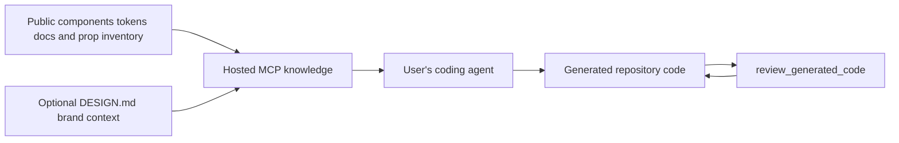

# Marmo UI

> Research status: **Source-level** · Last reviewed: **2026-08-12**

| Layer | Evidence boundary |
|---|---|
| React component and token system | public MIT source |
| CLI and Claude Code plugin | public source |
| component docs and generated prop inventory | public source and deployment input |
| hosted MCP composition patterns validation and account platform | explicitly private implementation |
| Pinned source | [`05757863545a4c940e8c0e770c77c514ea40071b`](https://github.com/mahmoudilyan/marmoui/tree/05757863545a4c940e8c0e770c77c514ea40071b) |

Marmo UI constrains an external coding agent with a real design-system vocabulary. Generation occurs in the user's own agent and code lands in the user's repository; the hosted MCP supplies current component knowledge and a review gate.

## The design system is executable authority

`@marmoui/ui` publishes React 19 components semantic light/dark tokens and layout primitives. The public docs generate a component-props JSON inventory. The agent workflow requires fresh MCP knowledge then component search or pattern retrieval followed by `review_generated_code`.

Validation catches wrong imports invented props and unsupported compositions. It is not a visual acceptance test and cannot prove that correct component calls create a useful product experience.

## Public source and private service must not be collapsed

| Pinned path | What it proves |
|---|---|
| [`packages/ui/src/components/`](https://github.com/mahmoudilyan/marmoui/tree/05757863545a4c940e8c0e770c77c514ea40071b/packages/ui/src/components) | concrete React component APIs |
| [`packages/ui/src/tokens/`](https://github.com/mahmoudilyan/marmoui/tree/05757863545a4c940e8c0e770c77c514ea40071b/packages/ui/src/tokens) | semantic light and dark token authorities |
| [`apps/design-system-docs/`](https://github.com/mahmoudilyan/marmoui/tree/05757863545a4c940e8c0e770c77c514ea40071b/apps/design-system-docs) | docs knowledge and generated prop data |
| [`packages/cli/`](https://github.com/mahmoudilyan/marmoui/tree/05757863545a4c940e8c0e770c77c514ea40071b/packages/cli) | agent connection setup |
| [`tools/claude-plugin/`](https://github.com/mahmoudilyan/marmoui/tree/05757863545a4c940e8c0e770c77c514ea40071b/tools/claude-plugin) | enforced find-generate-validate workflow |

`README.md` and `CLAUDE.md` explicitly say the MCP server composition patterns and platform services live in a private repository. This dossier does not infer their index model authentication or review implementation from the public component library.

## Authority and failure modes

The consuming repository is authoritative. A `DESIGN.md` can add brand tokens and overrides in the Pro path but source files still determine the shipped result. MCP unavailability or stale knowledge can block the guarded workflow; bypassing it lets an agent hallucinate APIs. A valid review result can still hide responsive accessibility data and interaction defects.

Team region remains unknown because the reviewed maintainer sources did not provide a stable first-party location.

## Primary evidence

- [Pinned repository](https://github.com/mahmoudilyan/marmoui/tree/05757863545a4c940e8c0e770c77c514ea40071b)
- [Marmo UI product](https://www.marmoui.com/)
- [Public/private boundary](https://github.com/mahmoudilyan/marmoui/blob/05757863545a4c940e8c0e770c77c514ea40071b/README.md)
- [MIT license](https://github.com/mahmoudilyan/marmoui/blob/05757863545a4c940e8c0e770c77c514ea40071b/LICENSE)
