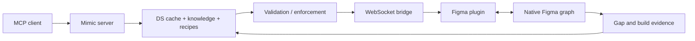

# Mimic AI

> Research status: **Source-level** · Pinned commit: `c9a737ad27ba1f19b38e8cdead73a6a8c86bc196` · Last reviewed: **2026-08-11**

| Field | Value |
|---|---|
| Maintainer | `miapre` / Mimic AI contributors · maintainer region not established |
| Ordinary job | have an external agent build a screen in Figma from real design-system components and learn from corrections |
| Native authority | active Figma document components instances variables styles and auto-layout |
| Local side authority | cached design-system knowledge recipes corrections and evidence-backed gap reports |

## Enforcement sits between MCP and Figma

Mimic's server exposes a tool surface to any MCP client. Its intelligence layer discovers and caches the published design system chooses component recipes validates variable usage and applies a multi-phase enforcement path. A WebSocket bridge reaches the Figma plugin which creates native nodes and returns binding feedback.

## Corrections become explicit local policy

The project stores reusable recipes after repeated successful builds and turns user corrections into later rules. A post-build report identifies design-system gaps with evidence rather than silently substituting hardcoded approximations. These side records guide future native mutation; they do not replace Figma as the visual authority.

The local-first implementation avoids a hosted service and declares no telemetry. Figma library discovery can still encounter platform quotas and any connected model client has its own data boundary.

## Source boundary

Claims are pinned to [`c9a737a`](https://github.com/miapre/mimic-ai/tree/c9a737ad27ba1f19b38e8cdead73a6a8c86bc196). The repository exposes server plugin bridge and knowledge/enforcement code. Actual behavior still depends on the installed Figma host the user's design system and model client; a green tool call is not proof that the resulting screen follows product intent.

## Primary evidence

- [Pinned Mimic AI source](https://github.com/miapre/mimic-ai/tree/c9a737ad27ba1f19b38e8cdead73a6a8c86bc196)
- [Mimic AI installation and architecture README](https://github.com/miapre/mimic-ai/blob/c9a737ad27ba1f19b38e8cdead73a6a8c86bc196/README.md)
- [Package release](https://www.npmjs.com/package/@miapre/mimic-ai)
