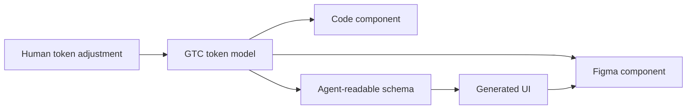

# Program UI

> Research status: **Architecture-level** · Last reviewed: **2026-08-11**

| Field | Value |
|---|---|
| Team | Program UI / BuninUX · team region not established |
| Ordinary job | generate and adjust mobile components from one token model shared by Figma code and agents |
| Shipped surface | live token-bound demo components that copy into Figma |
| Lifecycle | active-transition; broader generation product remains waitlisted |

## One token model binds several projections

Every Program UI component carries a schema tied to the GTC token model. A human adjustment and an agent-generated component are intended to reference the same source rather than copy resolved colors and dimensions. Current demo components can be copied into Figma; the site also shows the token source as the generator for code and design output.

## Transition status is part of the evidence

The page offers working copy-to-Figma examples while asking users to join the broader product waitlist. The record therefore captures a partially shipped mechanism without representing planned full-system generation as current availability. It also avoids claiming bidirectional Figma/code synchronization; shared token naming is evidenced but conflict or update propagation is not.

Program UI is included rather than treated as a static component library because the live product binds generated output and direct human token adjustment to a project-specific design-system authority. Its future agent surface may expand that loop but is not required for the present classification.

## Evidence ceiling

No source or full schema is public. Token generation algorithm persistence versioning Figma instance structure and code regeneration behavior remain unknown.

## Primary evidence

- [Program UI](https://programui.com/)
- [BuninUX design-token work](https://buninux.com/design-tokens)
