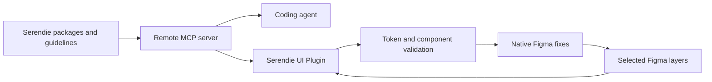

# Serendie Design System AI

> Research status: **Source-level for the MCP server; architecture-level for the Figma plugin** · Last reviewed: **2026-08-11**

| Field | Value |
|---|---|
| Team | Mitsubishi Electric · Japan |
| Ordinary job | let agents retrieve an official design system and let designers validate or repair selected Figma structures against it |
| Artifact authority | Serendie tokens components and guidelines govern; the Figma document remains the edited artifact |
| Lifecycle | active |
| Source status | MCP server and system packages open; native Figma agent implementation not located |
| Pinned source | `serendie/serendie-web` at `9fbdc87a33df38d593e2343a0d566e9361f04cb2` |

## Read-side governance and write-side correction are separate

The remote MCP server gives coding agents structured access to Serendie components symbols design tokens and guideline search. The Figma plugin shares the currently selected layer and validation results with an AI consultation surface. It can detect token violations find places where official components fit and apply token or component fixes back to the Figma file.

This is system governance rather than generic UI generation. The agent's choice space is bounded by named token roles official components and documented usage. The designer can inspect the exact native layers that change.

## Commit-level evidence

At the pinned commit `src/mcp/server.ts` registers typed tools for UI overview symbols token lists token details components component details and guideline/document search. `src/mcp/tools/design-tokens.ts` reads the published `@serendie/design-token` package and filters tokens by type category theme and limit. This proves the agent context is generated from versioned system data rather than an unstructured marketing prompt.

The open server is primarily read-side. Public plugin documentation establishes native validation and bulk fixes but its implementation was not located in the organization repositories. Those mutations remain an architecture-level product contract.

## Evidence ceiling

Plugin source model prompts Figma transaction boundaries undo behavior and component-replacement matching are not public. Documentation warns that fix accuracy depends on screen complexity. The dossier therefore does not treat automated conformance as proof of accessible or production-ready UI.

## Primary evidence

- [Serendie AI workflows](https://serendie.design/ai/)
- [Serendie MCP documentation](https://serendie.design/en/ai/mcp-server/)
- [Serendie Figma plugin documentation](https://serendie.design/en/ai/serendie-ui-plugin/)
- [Pinned open MCP server](https://github.com/serendie/serendie-web/tree/9fbdc87a33df38d593e2343a0d566e9361f04cb2/src/mcp)
