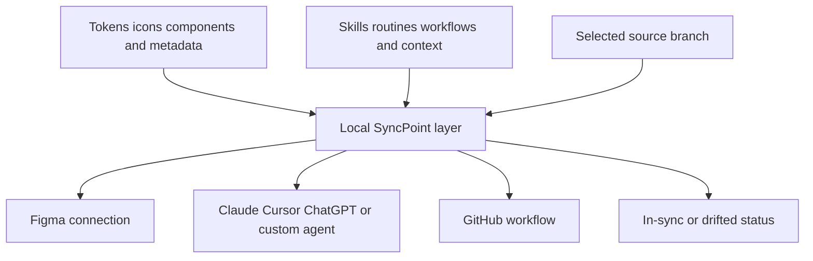

# SyncPoint

> Research status: **Architecture-level** · Last reviewed: **2026-08-12**

| Field | Verified value |
|---|---|
| Organization | Axis Labs LLC |
| Lifecycle | beta / early access |
| Connected surfaces named publicly | Claude, Cursor, Figma, GitHub, ChatGPT and custom agents |
| Storage claim | local to the user's machine |

SyncPoint treats the design system and the instructions that operate it as one synchronization problem. Its dashboard connects token, icon and component systems to skills, routines, workflows, context files and AI-tool projects; each connection can be in sync or drifted and can follow a specific source branch.

## Branch context is the routing key

The first-party page claims local storage, a Figma Professional or Organization requirement for API access and an SDK for custom models. These claims define a coordination layer, but early access means no ordinary-user installation or sync run was available for inspection.

## Beta evidence boundary

The site does not disclose the local data format, conflict resolution, encryption, branch-switch semantics, update direction, credentials boundary, offline behavior or whether “source of truth” means Figma, Git or SyncPoint for each object type. No public source or documentation content beyond the landing contract was found. Team geography remains unknown.

## Primary evidence

- [Official beta product](https://getsyncpoint.app/)
- [Official features and early-access surface](https://getsyncpoint.app/#features)
