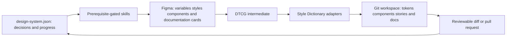

# ThroughLine

> Research status: **Source-level** · Last reviewed: **2026-08-12**

| Field | Verified value |
|---|---|
| Maintainer | Jordan Pease |
| Package | `@radicool/throughline` |
| Pinned revision | [`a747ac9108e7c9c47f5e2a0a55261af1fbd7fc73`](https://github.com/jrpease/throughline/tree/a747ac9108e7c9c47f5e2a0a55261af1fbd7fc73) |
| License | MIT |
| User authorities | Figma for design tokens and native components; Git/files for generated code and review history |

ThroughLine is an installable agent skill system for building or retrofitting a design system across Figma and code. It packages twelve ordered skills, shared design rules, commands, role-specific agents and adapters for Claude Code, Cursor, Codex and generic `AGENTS.md` hosts.

## Three authorities are deliberately not collapsed

`design-system.json` is orchestration memory, not the design payload. It records setup stage, active Figma mechanism, completed foundations, sync targets, documentation fingerprints and retrofit checkpoints. Token values remain in Figma. Generated platform files remain build artifacts, while Git provides the review and recovery boundary for code.

## Agent execution is gated by read-back and people

Figma writes use a connected plugin or Console MCP and are serialized because the bridge is concurrency-one. Planning and mechanical execution can be routed to different agent roles, but native writes are followed by programmatic read-back and reviewer checks. Component pipelines stop between Figma construction, token synchronization and code/story generation for human confirmation.

For brownfield work the project preserves variable IDs by renaming and realigning in place. A persistent crosswalk maps new token to old Figma variable and old code identifiers; a validator requires all resolved values to match before migration. Token sync extracts DTCG, normalizes platform-sensitive values, regenerates outputs, detects probable renames and lands changes as a pull request rather than silently replacing code.

## Installation is compiled from one source set

The Node installer translates canonical skills and references into host-specific adapters. It merges marked blocks into `AGENTS.md`, preserves unrelated MCP servers and stages shared payloads under `.throughline/`. Tests assert idempotence and that Claude-only dispatch degrades to inline execution for Codex.

## Source map

| Pinned path | What it establishes |
|---|---|
| [`references/manifest-schema.md`](https://github.com/jrpease/throughline/blob/a747ac9108e7c9c47f5e2a0a55261af1fbd7fc73/references/manifest-schema.md) | versioned workflow state, field ownership and recovery checkpoints |
| [`skills/figma-environment-setup/SKILL.md`](https://github.com/jrpease/throughline/blob/a747ac9108e7c9c47f5e2a0a55261af1fbd7fc73/skills/figma-environment-setup/SKILL.md) | active-file identity, read/write probe, secret boundary and bridge setup |
| [`skills/token-builder/SKILL.md`](https://github.com/jrpease/throughline/blob/a747ac9108e7c9c47f5e2a0a55261af1fbd7fc73/skills/token-builder/SKILL.md) | Figma variable authority, native write serialization, alias read-back and in-place retrofit |
| [`skills/token-sync-layer/SKILL.md`](https://github.com/jrpease/throughline/blob/a747ac9108e7c9c47f5e2a0a55261af1fbd7fc73/skills/token-sync-layer/SKILL.md) | Figma-to-DTCG-to-adapter materialization, rename detection and PR delivery |
| [`skills/component-pipeline/SKILL.md`](https://github.com/jrpease/throughline/blob/a747ac9108e7c9c47f5e2a0a55261af1fbd7fc73/skills/component-pipeline/SKILL.md) | sequential cross-surface checkpoints and resumable failure boundaries |
| [`scripts/install.mjs`](https://github.com/jrpease/throughline/blob/a747ac9108e7c9c47f5e2a0a55261af1fbd7fc73/scripts/install.mjs) | host adapter installation and non-destructive configuration merge |

## Test and portability boundary observed at the pin

A Windows source-audit run passed 166 of 174 Node tests. The eight failures are material evidence rather than being hidden: generated-file freshness comparisons were line-ending-sensitive; source-exclusion tests used path behavior that included `node_modules` and generated directories on Windows; and a symlink test was blocked by Windows permissions. The core parsing, manifest, crosswalk, installer, documentation and adapter tests otherwise passed. This local result does not prove the published package fails on its supported environments, but it prevents claiming portable conformance from CI intent alone.

No authenticated Figma end-to-end run was performed in this audit. Team region remains unknown.

## Change evidence

| Date | Commit | Causal change |
|---|---|---|
| 2026-07-05 | [`e9abdea`](https://github.com/jrpease/throughline/commit/e9abdea) | made Figma subagent dispatch explicitly degrade to inline execution on Codex |
| 2026-07-14 | [`9531b56`](https://github.com/jrpease/throughline/commit/9531b56) | added a canonical component-documentation layer across surfaces |
| 2026-08-09 | [`c4797cf`](https://github.com/jrpease/throughline/commit/c4797cf) | generated and freshness-gated the Figma documentation-card builder |
| 2026-08-11 | [`a747ac9`](https://github.com/jrpease/throughline/commit/a747ac9) | added prose standards and lint to the documentation artifact |

## Primary evidence

- [Pinned repository](https://github.com/jrpease/throughline/tree/a747ac9108e7c9c47f5e2a0a55261af1fbd7fc73)
- [Published package](https://www.npmjs.com/package/@radicool/throughline)
- [Public Figma file](https://www.figma.com/design/OCiZiGpsJ4ncPD8r205BjC/Throughline-Plugin-Test)
