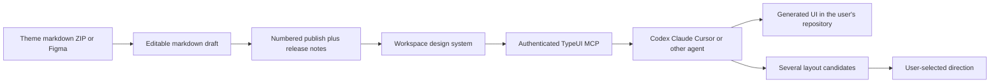

# TypeUI

> Research status: **Architecture-level** · Last reviewed: **2026-08-12**

TypeUI defines Design as a versioned body of instructions that an AI coding tool can install and use. Its decisive artifact is not the downstream webpage. It is the editable design-system package that mediates between Figma or a theme and many otherwise independent coding agents.

## Markdown is the review surface rather than an incidental export

A design system can begin from a TypeUI theme, a ZIP of markdown files or a beta Figma import. The resulting package exposes files such as `SKILL.md`, `brand.md`, `colors.md` and component-specific guidance. The user reviews and edits those files before publishing.

The Figma importer converts styles, component sets, variants, typography, radii, shadows, fills, strokes and layout examples into that editable source. It is therefore a lossy governance projection of a Figma system rather than a second synchronized Figma document.

## Draft and publish separate experimentation from agent-visible state

Each design-system publish creates a numbered version and asks for release notes. Draft edits remain outside the published package until promotion, and older versions can be restored. Project packages separately track the latest saved project state served through MCP. Those two state concepts should not be collapsed: a numbered design-system release is a governance checkpoint; the project package is what the connected agent currently installs.

## The agent interface carries choices as well as rules

After authentication, an MCP-connected agent can list workspace systems and install the one the user selects. TypeUI also supplies UI prompts, layout variations and cleanup settings. In the ordinary variation loop the agent produces several alternatives and the person explicitly names the direction to continue. TypeUI does not own the resulting application repository and public evidence does not establish a live node-to-source binding.

## Why this crosses the inclusion boundary

TypeUI is more than a prompt catalog because it owns an editable, publishable and restorable design-system artifact whose selected state governs repeated agent authoring. UIPrompt and static style skills are excluded elsewhere because their public loop ends at copied text or policy files without an independently operated governed package and selection interface.

## Primary evidence

- [TypeUI introduction](https://www.typeui.sh/docs)
- [Design-system source and version workflow](https://www.typeui.sh/docs/features/design-systems)
- [Getting started and MCP selection](https://www.typeui.sh/docs/getting-started)
- [Workspace and current-package semantics](https://www.typeui.sh/docs/resources/workspaces)
- [Current changelog](https://www.typeui.sh/changelog)
