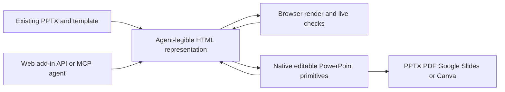

# Visk

> Research status: **Architecture-level** · Last reviewed: **2026-08-12**

| Field | Value |
|---|---|
| Team | Visk · team region not established |
| Ordinary job | let an agent reason in HTML while preserving the user's real PowerPoint template and native editability |
| Representations | agent-legible HTML and native PPTX |
| Access | web app PowerPoint add-in API and MCP |
| Lifecycle | active |

## The mapping is the product

Visk defines a near-pixel-matched bidirectional conversion between PPTX and HTML. An agent can inspect and author unconstrained HTML/CSS while a deterministic converter materializes charts tables connectors groups text and shapes as real PowerPoint primitives. The reverse render gives the agent browser-visible feedback on layout and visibility problems.

Template masters inherited layout shapes and theme colors are protected during generation. Automatic fitting constrains content to the slide boundary. Extensions provide agent-friendly constructs for objects such as maps or logos and are ultimately resolved into the presentation.

The first-party technical page establishes the contract but not implementation source numerical fidelity benchmarks or merge semantics when HTML and PPTX both change concurrently. “Bidirectional” is therefore recorded as representation conversion not assumed real-time multi-master synchronization.

## Primary evidence

- [Visk HTML and PowerPoint engine](https://visk.com/)
- [Official Visk documentation](https://docs.visk.com/)
- [Visk MCP connection reference](https://docs.visk.com/mcp)
