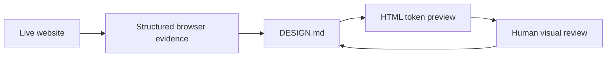

# web-to-design-md

> Research status: **Source-level** · Lifecycle: **active-transition** · Last reviewed: **2026-08-12**

`web-to-design-md` is an operational agent skill for turning a live site into two coupled artifacts: an evidence-grounded `DESIGN.md` and an HTML preview that lets the user review the extracted system visually.

## DOM evidence comes before screenshots

The skill directs `agent-browser` to collect DOM structure, computed styles, CSS variables, stylesheet rules, visible text and interaction states. Screenshots are a last-resort verification aid when the DOM is ambiguous, not the primary extraction source.

The preview is generated from the same tokens documented in markdown, so disagreement between prose and rendered system can be detected before a coding agent adopts it.

## Pinned implementation

Commit [`8a08b3e`](https://github.com/Paidax01/web-to-design-md/commit/8a08b3e8339bff21da059c6fb84380cb996e3fbf) includes:

- the full [skill contract](https://github.com/Paidax01/web-to-design-md/blob/8a08b3e8339bff21da059c6fb84380cb996e3fbf/SKILL.md);
- [browser-tool checks](https://github.com/Paidax01/web-to-design-md/blob/8a08b3e8339bff21da059c6fb84380cb996e3fbf/scripts/check-browser-tooling.mjs);
- [evidence extraction](https://github.com/Paidax01/web-to-design-md/blob/8a08b3e8339bff21da059c6fb84380cb996e3fbf/scripts/extract-browser-evidence.mjs);
- [preview rendering](https://github.com/Paidax01/web-to-design-md/blob/8a08b3e8339bff21da059c6fb84380cb996e3fbf/scripts/render-design-preview.mjs);
- explicit website-reading and bootstrap references under [`references/`](https://github.com/Paidax01/web-to-design-md/tree/8a08b3e8339bff21da059c6fb84380cb996e3fbf/references).

## Limits

No license file was present. The repository is a focused initial release and is marked active-transition. It does not own the downstream site's source code; it owns the evidence and design-system handoff. No team region was established.

## Decisive sources

- [Repository README](https://github.com/Paidax01/web-to-design-md/blob/8a08b3e8339bff21da059c6fb84380cb996e3fbf/README.md)
- [Pinned source tree](https://github.com/Paidax01/web-to-design-md/tree/8a08b3e8339bff21da059c6fb84380cb996e3fbf)
