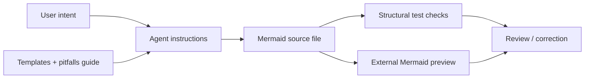

# AI Diagrams Toolkit

> Research status: **Source-level** · Lifecycle: **active** · Last reviewed: **2026-08-12**

AI Diagrams Toolkit defines diagram quality as a repository-level convention that an external coding agent can follow. It is not a hosted diagram product and does not own an inference provider. Its product surface is a portable bundle of instructions, slash commands, templates, guides and tests that constrain Mermaid files.

## A visual design system is expressed as source policy

At commit [`98499ad1`](https://github.com/joserprieto/ai-diagrams-toolkit/tree/98499ad182c038d3457d23ddca25eedfcc054e59), [`.ai/AGENTS.md`](https://github.com/joserprieto/ai-diagrams-toolkit/blob/98499ad182c038d3457d23ddca25eedfcc054e59/.ai/AGENTS.md) assigns colors by meaning—operational, warning, error, information and architectural layer—rather than by arbitrary palette choice. It also specifies semantic node IDs, reserved-word avoidance, type selection and different styling rules for flowcharts, sequences, classes and states.

[`create-flowchart.md`](https://github.com/joserprieto/ai-diagrams-toolkit/blob/98499ad182c038d3457d23ddca25eedfcc054e59/.ai/commands/generic/create-flowchart.md), [`create-sequence.md`](https://github.com/joserprieto/ai-diagrams-toolkit/blob/98499ad182c038d3457d23ddca25eedfcc054e59/.ai/commands/generic/create-sequence.md) and the correction commands turn that policy into bounded agent tasks. The resulting `.mmd` source is the artifact; a Mermaid renderer remains external.

## Portability comes from indirection, not a universal runtime

The install scripts expose one canonical command directory to Claude Code and Cursor with symlinks; Codex instructions use a manual copy because its prompt scope differs. The repository's versioned instruction files are therefore the shared implementation, while each host supplies its own invocation mechanism and model.

The current source calls these assets commands and agent instructions. The roadmap still places richer skills and subagents in a later phase, so describing the verified commit as an already completed cross-host skill runtime would overstate it.

## Tests measure conformance, with a deliberate manual gap

The [flowchart command test](https://github.com/joserprieto/ai-diagrams-toolkit/blob/98499ad182c038d3457d23ddca25eedfcc054e59/tests/commands/01-create-flowchart/test.sh) invokes a configured Claude CLI, extracts a Mermaid fence and checks declarations, node shapes, connections and color directives with shell predicates. The [validation command test](https://github.com/joserprieto/ai-diagrams-toolkit/blob/98499ad182c038d3457d23ddca25eedfcc054e59/tests/commands/04-validate-diagram/test.sh) checks that the model reports issues and emits a correction.

Those automated checks do not parse or render the diagram through Mermaid. Both tests explicitly ask a person to open the output and verify rendering and semantic quality. The test suite is useful prompt-contract evidence, but its green result is not visual acceptance.

## What persists and what does not

Templates, commands, guides and `.mmd` results are ordinary repository files and can be reviewed or versioned in Git. There is no database, live canvas, source map or runtime history. The toolkit's contribution is governance: it makes otherwise ephemeral prompting into inspectable design rules and repeatable conformance cases.

## Evidence

- [Pinned toolkit contract](https://github.com/joserprieto/ai-diagrams-toolkit/blob/98499ad182c038d3457d23ddca25eedfcc054e59/README.md)
- [Canonical agent policy](https://github.com/joserprieto/ai-diagrams-toolkit/blob/98499ad182c038d3457d23ddca25eedfcc054e59/.ai/AGENTS.md)
- [Validation command contract](https://github.com/joserprieto/ai-diagrams-toolkit/blob/98499ad182c038d3457d23ddca25eedfcc054e59/.ai/commands/generic/validate-diagram.md)
- [Structural Mermaid checks](https://github.com/joserprieto/ai-diagrams-toolkit/blob/98499ad182c038d3457d23ddca25eedfcc054e59/scripts/tests/lib/mermaid/validation.sh)
