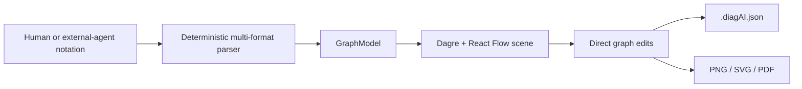

# DiagAI

> Research status: **Source-level** · Lifecycle: **active** · Last reviewed: **2026-08-12**

DiagAI is not an embedded AI generator. It is an interoperability surface for text that people or external agents already produce: several informal diagram notations are deterministically parsed into a native React Flow graph that can then outgrow its textual input.

## A permissive parser is the agent boundary

At commit [`886e18de`](https://github.com/Manas1329/DiagAI/tree/886e18ded0cbde9b25aa88974e7f8e811612e12f), [`textParser.ts`](https://github.com/Manas1329/DiagAI/blob/886e18ded0cbde9b25aa88974e7f8e811612e12f/frontend/src/parser/textParser.ts) detects inline arrows, vertical Unicode flows, bullets, tree/ASCII drawings, a Mermaid-like subset and a basic PlantUML form. Regex rules infer actors, databases, security modules, APIs, decisions and services from labels, then deduplicate IDs and enrich the resulting `GraphModel`.

No OpenAI, Gemini, Anthropic or other model call exists in the source. “ChatGPT-style” describes the accepted handoff format: an external assistant can emit a rough notation, but DiagAI itself is the deterministic adapter and editor.

## Authority moves from text to the React Flow scene

[`App.tsx`](https://github.com/Manas1329/DiagAI/blob/886e18ded0cbde9b25aa88974e7f8e811612e12f/frontend/src/App.tsx) parses on demand, maps the graph into React Flow nodes and edges, and runs Dagre for top-to-bottom or left-to-right layout. After materialization, users can move, resize, add, delete and relabel nodes; reconnect and label edges; change anchors, arrow tips and line types; align selections; and relayout.

Those direct changes do not round-trip into the original notation. The live React Flow arrays become the editing authority, while `graphModel` remains the parse-time record. A saved file contains both, making their possible divergence visible rather than pretending there is lossless bidirectional source synchronization.

## Recovery is local and explicit

The UI keeps at most fifty node/edge snapshots in memory for undo and redo. Save downloads a `diagram.diagAI.json` file containing the parsed model plus the current React Flow arrays; load restores those arrays and starts a fresh history.

An optional Express backend has parse routes and an in-memory diagram map, but the verified frontend does not call it. That map disappears with the server process and should not be counted as ordinary product persistence.

## Delivery uses the edited graph

[`exportUtils.ts`](https://github.com/Manas1329/DiagAI/blob/886e18ded0cbde9b25aa88974e7f8e811612e12f/frontend/src/utils/exportUtils.ts) fits the React Flow viewport to fixed export bounds and produces PNG, SVG or a PNG-backed PDF. The editable JSON is the portable handoff; the visual exports are projections of the latest scene.

DiagAI adds an AI-adjacent technical approach that a model-centric census can easily miss: make the textual conventions agents naturally emit into a forgiving import protocol, then return authority to a full direct-manipulation graph editor.

## Evidence

- [Pinned product and supported formats](https://github.com/Manas1329/DiagAI/blob/886e18ded0cbde9b25aa88974e7f8e811612e12f/README.md)
- [Deterministic notation parser](https://github.com/Manas1329/DiagAI/blob/886e18ded0cbde9b25aa88974e7f8e811612e12f/frontend/src/parser/textParser.ts)
- [Materialization, editing, history and file save](https://github.com/Manas1329/DiagAI/blob/886e18ded0cbde9b25aa88974e7f8e811612e12f/frontend/src/App.tsx)
- [Process-local optional backend store](https://github.com/Manas1329/DiagAI/blob/886e18ded0cbde9b25aa88974e7f8e811612e12f/backend/src/routes/diagrams.ts)
