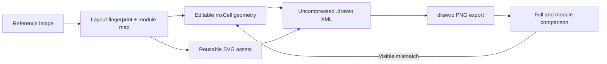

# Draw.io Figure Replicator

> Research status: **Source-level** · Lifecycle: **active** · Last reviewed: **2026-08-12**

Draw.io Figure Replicator defines AI-assisted design as reconstruction rather than invention. Its input is an existing visual reference; its required output is not another bitmap but an editable, inspectable draw.io document accompanied by render evidence.

## The product is a procedure encoded for an agent

At commit [`d03f1094`](https://github.com/ai-jiaqian/drawio-figure-replicator/tree/d03f10946de55ad842158fb967ea7786eb44fe58), the core implementation is the [`drawio-figure-replication` skill](https://github.com/ai-jiaqian/drawio-figure-replicator/blob/d03f10946de55ad842158fb967ea7786eb44fe58/skills/drawio-figure-replication/SKILL.md). It tells an agent to measure the reference, record a layout fingerprint, map panels and uncertainty, decide which details are native primitives, and reserve SVG assets for reusable symbols that draw.io cannot express cleanly.

For dense figures, the unit of work becomes a module rather than the whole canvas. Each panel is generated and visually checked before cross-panel connectors are integrated. This is a meaningful technical strategy: it reduces coordinate and routing errors that compound when a model emits a large XML document in one pass.

The repository does not bundle a model, agent runtime or automated similarity optimizer. The intelligence comes from whichever compatible agent executes this written protocol.

## Editability is an explicit artifact invariant

[`drawio-xml-patterns.md`](https://github.com/ai-jiaqian/drawio-figure-replicator/blob/d03f10946de55ad842158fb967ea7786eb44fe58/skills/drawio-figure-replication/references/drawio-xml-patterns.md) standardizes uncompressed `mxfile`/`mxGraphModel` output, editable cells, explicit connector points, groups and embedded SVG data URIs. A pasted full-frame screenshot fails the contract even if it looks accurate. Text, boxes, tables, lanes and arrows must remain native objects.

The deliverable is therefore a package: `.drawio` source, PNG preview, optional standalone SVG files and an asset provenance note. The editable XML is the authority; the PNG is evidence and a comparison surface.

## Validation combines executable and visual checks

The skill requires XML validation with `xmllint`, rendering through draw.io Desktop where available, and inspection of both the full preview and module crops. XML validity proves only that the document is structurally readable. Successful export proves that draw.io can execute it. Fidelity—region proportions, typography, connector routing and clipping—still depends on visual comparison and iterative judgment.

The checked-in [SkillCircuit example](https://github.com/ai-jiaqian/drawio-figure-replicator/tree/d03f10946de55ad842158fb967ea7786eb44fe58/examples/skillcircuit) demonstrates that evidence package, including module-level QA. There is no encoded pixel metric or automatic acceptance threshold in the skill, so a compliant agent must not confuse “exported” with “faithfully replicated.”

## Persistence is deliberately ordinary

The workflow writes portable files next to the reference and forbids overwriting user input. It has no account database, cloud project or internal revision ledger. History and collaboration can be supplied by the surrounding filesystem and Git, while the `.drawio` file remains independently editable in diagrams.net.

This project adds a narrow but distinct definition to the landscape: AI design can mean converting visual evidence into maintainable native structure, with render-and-compare feedback as part of the artifact contract.

## Evidence

- [Pinned project scope and output contract](https://github.com/ai-jiaqian/drawio-figure-replicator/blob/d03f10946de55ad842158fb967ea7786eb44fe58/README.md)
- [Agent replication procedure](https://github.com/ai-jiaqian/drawio-figure-replicator/blob/d03f10946de55ad842158fb967ea7786eb44fe58/skills/drawio-figure-replication/SKILL.md)
- [Native XML patterns](https://github.com/ai-jiaqian/drawio-figure-replicator/blob/d03f10946de55ad842158fb967ea7786eb44fe58/skills/drawio-figure-replication/references/drawio-xml-patterns.md)
- [Dense-figure recreation plan](https://github.com/ai-jiaqian/drawio-figure-replicator/blob/d03f10946de55ad842158fb967ea7786eb44fe58/examples/concept-board/RECREATION_PLAN.md)
