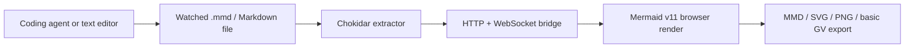

# Sirelia

> Research status: **Source-level** · Lifecycle: **active** · Last reviewed: **2026-08-12**

Sirelia defines AI diagram collaboration as a local visual feedback loop around a file that any coding agent can edit. It does not generate diagrams with its own model. Instead, it watches Mermaid or Markdown source, broadcasts extracted diagrams to a browser, and lets a human see render failures and export results immediately.

## The bridge is one-way by design—and by implementation

At commit [`d33fd0f3`](https://github.com/SkeloGH/sirelia/tree/d33fd0f3e202f2ae59b0d8e44ff11ac663e65781), [`file-watcher.ts`](https://github.com/SkeloGH/sirelia/blob/d33fd0f3e202f2ae59b0d8e44ff11ac663e65781/src/watcher/file-watcher.ts) uses Chokidar to read the watched file, extracts pure Mermaid content or fenced blocks from Markdown, and POSTs each accepted block to the local bridge. [`bridge-server.ts`](https://github.com/SkeloGH/sirelia/blob/d33fd0f3e202f2ae59b0d8e44ff11ac663e65781/src/server/bridge-server.ts) broadcasts those messages to connected browsers over WebSocket.

[`page.tsx`](https://github.com/SkeloGH/sirelia/blob/d33fd0f3e202f2ae59b0d8e44ff11ac663e65781/src/app/page.tsx) also exposes CodeMirror editing, but those changes update browser state only. There is no endpoint that writes them back to the watched file. The loop is file-to-preview, not bidirectional synchronization; browser edits persist only if separately exported and reconciled by the user.

## Rendering, not preflight, is the useful validator

[`mermaid.ts`](https://github.com/SkeloGH/sirelia/blob/d33fd0f3e202f2ae59b0d8e44ff11ac663e65781/src/config/mermaid.ts) performs lightweight type and pattern checks before accepting source. That is not a full parse. The actual [`MermaidRenderer`](https://github.com/SkeloGH/sirelia/blob/d33fd0f3e202f2ae59b0d8e44ff11ac663e65781/src/components/MermaidRenderer.tsx) calls Mermaid v11, displays parse errors, and provides pan and zoom. The live renderer is therefore the meaningful correction surface for an external agent's file edits.

PNG export crosses a second execution path: [`export-png/route.ts`](https://github.com/SkeloGH/sirelia/blob/d33fd0f3e202f2ae59b0d8e44ff11ac663e65781/src/app/api/export-png/route.ts) writes temporary source and invokes `mmdc`; SVG is the browser fallback. Delivery proves renderability but does not validate diagram semantics.

## The watched file is the only durable state

There is no database, account, revision log or browser autosave in the verified source. `sirelia init` creates `.sirelia.mmd` and, notably, adds that default file to `.gitignore`. A team that wants the diagram versioned must remove that ignore rule or watch a tracked path such as `diagrams.md`.

Markdown input may contain multiple Mermaid blocks, but the watcher broadcasts them sequentially into a UI documented as single-diagram; the latest received block becomes the active browser state. This is a lightweight feedback utility, not a multi-diagram repository index.

Sirelia contributes an external-agent pattern: keep authority in ordinary source and make rendering fast enough to close the correction loop. Its limitation is equally clear—the visual editor is not yet a durable co-author of that source.

## Evidence

- [Pinned product and CLI contract](https://github.com/SkeloGH/sirelia/blob/d33fd0f3e202f2ae59b0d8e44ff11ac663e65781/README.md)
- [Watched-file extraction and broadcast](https://github.com/SkeloGH/sirelia/blob/d33fd0f3e202f2ae59b0d8e44ff11ac663e65781/src/watcher/file-watcher.ts)
- [Local HTTP/WebSocket bridge](https://github.com/SkeloGH/sirelia/blob/d33fd0f3e202f2ae59b0d8e44ff11ac663e65781/src/server/bridge-server.ts)
- [Initialization and default ignore behavior](https://github.com/SkeloGH/sirelia/blob/d33fd0f3e202f2ae59b0d8e44ff11ac663e65781/src/cli/init.ts)
