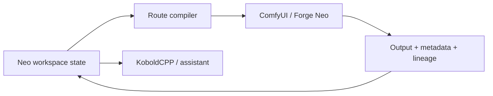

# Neo Studio V2

> Research status: **Source-level** · Lifecycle: **active** · Last reviewed: **2026-08-12**

Neo Studio V2 is a local control layer over separately installed image video and language runtimes. Its design contribution is to make ComfyUI Forge Neo KoboldCPP prompts outputs metadata and project memory behave like one recoverable creative workspace.

## Routing is part of the artifact contract

At commit [`c6adbd4`](https://github.com/MoodPixel/Neo_Studio_V2/tree/c6adbd4e456fe880614dad7e740fb267eedbc02d) model-family registries compile user choices into backend-specific graphs and fail closed when required nodes or assets are absent. The project does not pretend that every backend supports the same controls. Route capability fingerprints and source-asset metadata make replay failures visible.

Outputs retain prompts model family parameters source references elapsed time and reusable action state. Project-brain code such as [`project_brain.py`](https://github.com/MoodPixel/Neo_Studio_V2/blob/c6adbd4e456fe880614dad7e740fb267eedbc02d/neo_app/assistant/project_brain.py) separates project context from global assistant memory; runtime data lives under `neo_data` instead of mutating installed model folders.

V1 is explicitly a legacy predecessor and is counted in this same product lineage. Paid model execution was not run and the maintainer's public profile does not state a region.

## Decisive sources

- [V2 README](https://github.com/MoodPixel/Neo_Studio_V2/blob/c6adbd4e456fe880614dad7e740fb267eedbc02d/README.md)
- [Image action replay contract](https://github.com/MoodPixel/Neo_Studio_V2/blob/c6adbd4e456fe880614dad7e740fb267eedbc02d/guides/01_IMAGE/image_action_state_replay_lineage.md)
- [Provider-aware diagnostics](https://github.com/MoodPixel/Neo_Studio_V2/blob/c6adbd4e456fe880614dad7e740fb267eedbc02d/guides/01_IMAGE/provider_aware_preview_diagnostics.md)
