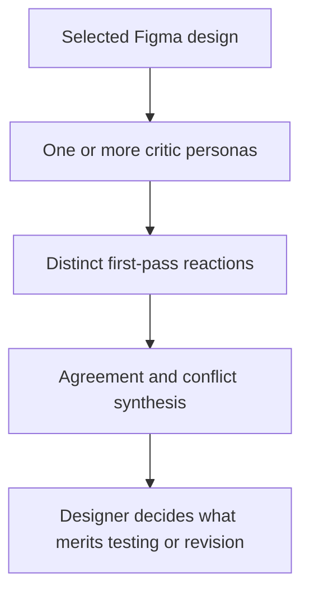

# Candor

> Research status: **Architecture-level** · Last reviewed: **2026-08-12**

Candor is a Figma feedback plugin built around six synthetic critic personas. A designer can ask one persona for a quick reaction or combine several and receive a synthesis of where their critiques agree or conflict.

## Deliberate disagreement is the artifact

Candor does not generate layouts or touch the design. Its value is candidate criticism, not authoritative usability evidence. The creator explicitly says the personas should not be trusted like real research and describes the plugin as an early gut check before formal testing.

## Evidence and bias boundary

The persona histories are tuned to produce different concerns rather than a single generic checklist. That can expose blind spots, but invented personas do not represent a target population. Current public evidence does not establish product-specific data grounding, interaction testing, custom persona creation, citation provenance, saved report versions or a binding from each comment to a precise node.

The plugin is current and publicly installable. Legal organization and team region remain unknown.

## Primary evidence

- [Candor Figma Community plugin](https://www.figma.com/community/plugin/1628422272500301906/candor)
- [Creator explanation, workflow and limitations](https://www.reddit.com/r/FigmaDesign/comments/1tb26iq/i_spent_9_weekends_building_a_figma_plugin_that/)
