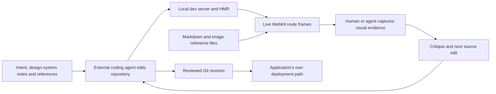

# Design Canvas

> Research status: **Architecture-level / closed native-app boundary reached** · Last reviewed: **2026-08-11**

| Field | Value |
|---|---|
| Organization / team | Design Canvas / Charlie Ellington |
| Category | Agent-controlled spatial runtime and visual-verification canvas |
| Status | Active beta; creator app currently macOS-only, Windows/Linux waitlist |
| Product boundary | Renders running application routes and local reference material; an external coding agent writes the application |
| Working center | Native Mac canvas containing live route WebViews, Markdown/image frames and optional labelled sections |
| Durable implementation | The user's application repository and its own Git/deployment workflow, not the canvas or a screenshot |
| Current public agent adapter | `design-canvas-mcp` 0.6.0, MIT, published 2026-05-19 |
| Source availability | Native Mac app closed; TypeScript source is public only for MCP 0.1.0, while npm 0.6.0 ships readable compiled JavaScript and declarations without corresponding public commits |
| Evidence ceiling | Public product behavior, local HTTP/MCP protocol, distributed adapter implementation and package evolution are established; native layout, WebView lifecycle, persistence format and source-reconciliation internals remain closed |

## The canvas is runtime topology, not the application artifact

Design Canvas describes itself as a [“Figma-style canvas” whose user's agent writes the code](https://www.designcanvas.app/). The distinction after the slogan is decisive: this product does not generate a design document and later convert it to an application. It spatially arranges **live routes from an already running application** so a person and an external coding agent can inspect several screens and viewport sizes together.

The dedicated [AI design tool page](https://www.designcanvas.app/ai-design-tool) makes the negative boundary explicit: Design Canvas does not generate designs from prompts; another tool or coding agent does that, and Design Canvas renders the result. Its ordinary loop is therefore:



This yields three different claims that must not be collapsed:

1. **A frame is present**: the native app has a route/path/viewport record and a WebView.
2. **A frame renders correctly now**: the dev server, runtime state and WebKit observation look right at capture time.
3. **The application is durably correct**: intended repository files changed, were reviewed and were delivered through the application's own version and deployment process.

Design Canvas directly establishes the first and helps inspect the second. The external agent, repository and delivery system establish the third.

## The ordinary-user journey is a code–server–evidence loop

The official site and the distributed MCP workflow support this end-to-end path:

| Stage | Ordinary action | State actually advanced | Evidence needed before moving on |
|---|---|---|---|
| 1. Prepare the application | open a repository and start its real development command | source checkout and dev-server process | intended revision is checked out; server responds on the expected port |
| 2. Connect the canvas | point the Mac app at the dev server | one server binding and native canvas session | binding reports the correct project, origin and connected status |
| 3. Build review topology | add routes at desktop/tablet/mobile sizes; optionally group them into sections | canvas route and section records | list exact ids, paths, server bindings, positions and viewport dimensions |
| 4. Add design context | place `design-intent.md`, `design-system.md`, specs or reference images beside routes | path-bound document/image frames | inspect the actual local files; a frame id does not snapshot their repository revision |
| 5. Modify source | ask the external coding agent to implement or repair UI | application files and runtime build | review the source diff and wait for the dev server/HMR to settle |
| 6. Verify visually | capture only the changed route ids and critique them against intent | fresh WebKit screenshots and review notes | inspect every returned image plus warnings/partial-capture state; exercise interaction separately |
| 7. Close the loop | apply bounded fixes, reload and recapture | newer source/runtime/evidence clocks | clean reload and the ordinary user journey, not one attractive frame, pass |
| 8. Promote | commit/review/deploy through the application's own workflow | Git and deployment authorities | reviewed commit/PR and the actual delivered target |

The canvas is useful precisely because it keeps the runtime projection visible while code changes. It is not a replacement for source review, interaction testing, browser coverage or release verification.

## One board federates several authorities

Version 0.6.0 exposes four object families, but only one is the running product:

| Object family | Public identity and fields | What it represents | What remains authoritative elsewhere |
|---|---|---|---|
| server binding | `serverId`, optional port/project directory, project name, origin, connected/stale/offline status and primary flag | a dev-server origin available to the active canvas | process command, source checkout, environment variables and server state |
| route frame | stable frame `id`, path, x/y, width/height, optional status, screenshot path and server identity | one live WebView at one route and viewport on the board | rendered application behavior comes from the bound server and repository |
| document/image frame | frame `id`, absolute `filePath`, x/y, width/height and optional display name | local reference material arranged beside routes | the local file itself; the protocol carries no content hash or repository revision |
| section | section `id`, title, rectangle and arrays of contained route/document/image ids | a labelled spatial group and deletion unit | no application behavior or source boundary |

The `update_route` contract is the strongest published persistence clue: it replaces a route's path while preserving viewport and position, says the saved route survives app restart, and warns that the MCP layer has no undo. The optional `removed` route status and section membership arrays reveal more native state, but the app's storage file, schema, migration rules, undo journal and crash-recovery behavior are not public.

Documents and images are path-addressed rather than content-addressed. Public types do not show that Design Canvas copies their bytes, records a hash or binds them to a Git commit. A working review therefore needs to preserve the referenced files and recapture after they or the implementation change.

## The public MCP is a local control adapter

The architecture first published in the [0.1.0 repository README](https://github.com/charlieellington/design-canvas-mcp/blob/a5fa9eaeb0ab0ac8aa8dca13ab4d044617269831/README.md) remains visible in the current distribution:

```text
MCP client / external coding agent
    -> stdio design-canvas-mcp process
        -> bearer-authenticated HTTP on localhost:7420
            -> closed native Design Canvas Mac app
                -> WebKit views of one or more local dev servers
```

The current [compiled API client](https://unpkg.com/design-canvas-mcp@0.6.0/dist/api-client.js) defaults to `http://localhost:7420`, permits a `DESIGN_CANVAS_URL` override and reads a bearer token once at process startup from `DESIGN_CANVAS_TOKEN` or `~/.designcanvas/api_token`. Ordinary requests have a 30-second adapter timeout; batch/section creation uses 60 seconds and capture uses 200 seconds so the native app can enforce its documented 180-second capture budget.

The adapter does not contain the WebView canvas implementation. It serializes typed requests to these public local endpoints:

| HTTP edge | Agent-facing operations | Consequence |
|---|---|---|
| `GET/POST/DELETE/PATCH /routes` | list, add, remove and pin route path | route id is canvas identity; path alone is ambiguous across duplicate viewports |
| `GET /servers` | enumerate bound dev servers | 0.6.0 can target several projects/origins on one canvas |
| `POST /capture` | capture all or selected route ids | the native app decides loading/settling and writes screenshot files |
| `GET/POST/DELETE /documents` | manage Markdown frames | mutation affects board topology, not Markdown contents |
| `GET/POST/DELETE /images` | manage reference-image frames | mutation affects board topology, not image contents |
| `POST /frames/batch` | add mixed routes/documents/images | package contract advertises one collision-free, all-or-nothing placement decision |
| `GET/POST/DELETE /sections` | list, create and remove labelled groups | removing a section also removes every contained frame |

The [0.6.0 server entry](https://unpkg.com/design-canvas-mcp@0.6.0/dist/index.js) registers **16 tools**, not the four still shown on the product page or the eleven described by the package README: six route/server/capture tools, three document tools, three image tools, one mixed-frame batch tool and three section tools.

### Current mutation semantics

- `add_route` accepts path, dimensions, optional coordinates, a placement hint and optional port or `serverId`; with multiple bound servers, omission produces a structured 409 disambiguation response instead of guessing.
- a path can appear several times at different viewports; `remove_route` by path removes only the first match, so id is the safe key.
- `update_route` pins a newly navigated path to an existing frame; it is a saved-canvas mutation, not a source edit.
- `add_frames` accepts mixed route/document/image objects and advertises atomic validation and one layout pass. That guarantee is implemented by the closed `/frames/batch` endpoint; the open adapter only forwards the request and reports the result.
- `add_section` creates frames and a labelled grouping together. `remove_section` is deliberately broader than hiding a label: its contract deletes every contained frame as one operation.
- each route is described as a live WebView. The tool text warns that eight or more routes can be slow and resource-intensive, so breadth of visual context has a direct runtime cost.

## The agent can control review topology, not source targets

Design Canvas has stable **frame** ids, but the public protocol exposes no element selection, DOM node, component name, authored file, line/range, AST node, source map or repository revision. `capture_canvas` returns visual evidence; it does not return a source target. The distributed `verify` prompt explicitly asks the external agent to grep for a component name “where possible,” which is heuristic repository reasoning rather than a durable reverse mapping.

The actual convergence path is therefore indirect:

```text
route id + viewport + screenshot + design intent
    -> external agent interpretation
        -> repository edit
            -> dev-server rebuild/HMR
                -> fresh WebKit observation
```

An MCP call that adds, moves, updates or removes a route cannot change the application's files. Conversely, a source edit is not durably represented by the canvas until the dev server rebuilds and the relevant frame is observed again. No public transaction binds a route id, screenshot, source diff and Git commit.

## Design intent enters through files and prompt workflows

Version 0.2.0 added three MCP resources and three prompts. In current 0.6.0:

- `design-canvas://design-intent.md` reads `design-intent.md` or `.design-intent.md` from a client-declared project root;
- `design-canvas://design-system.md` reads `design-system.md` or `docs/design-system.md`;
- `design-canvas://routes.json` projects the current native route list as machine-readable JSON;
- `setup`, `verify` and `start-design` prompts describe bootstrap, capture/critique and cold-start workflows.

The [resource implementation](https://unpkg.com/design-canvas-mcp@0.6.0/dist/resources.js) uses fixed candidate paths below MCP client roots and refuses symbolic links before reading. Missing files produce templates rather than fabricated project facts. The [prompt implementation](https://unpkg.com/design-canvas-mcp@0.6.0/dist/prompts.js) is workflow text, not an enforced transaction: it can tell the calling agent to ask before starting a dev server, inspect source, make limited fixes or request approval, but the MCP server itself does not perform those repository operations.

This separates two useful artifacts:

- intent/design-system Markdown can be durable, reviewable repository context;
- the native canvas arranges that context with a runtime projection but does not prove which file revision informed any given source mutation.

## Capture is bounded visual evidence

The native app uses WebKit. The current [capture handler](https://unpkg.com/design-canvas-mcp@0.6.0/dist/tools.js) asks the app for fresh route captures and then applies a second adapter-side boundary:

1. selected `ids`, when present, are sent to the native endpoint; otherwise every route is captured;
2. the native app has a 180-second budget and may return HTTP 504 with completed images plus counts and unsettled routes;
3. the adapter waits up to 200 seconds, preserves partial images and marks the MCP result as an error;
4. each returned file must exist, be at most 5 MiB and end in `.jpg` or `.jpeg`;
5. `sharp` downsizes it to at most 1,200 pixels wide without enlargement and recompresses at JPEG quality 80;
6. only three images are placed into MCP context by default.

`limit` controls how many already captured images enter model context; it does **not** reduce the native capture workload. Passing exact route ids is the operation that narrows work. The screenshot response retains route path and file path, not a source revision, DOM target or interaction trace.

The package's server instructions call these “PNG screenshots,” while the handler accepts and returns JPEG only. This is a documentation inconsistency inside the same 0.6.0 artifact. More importantly, WebKit evidence cannot establish Chromium/Firefox behavior, and a still image cannot establish focus, keyboard, auth, animation, data mutation or navigation correctness. The official troubleshooting text itself recommends a separate browser runner for precise cross-browser verification.

## Persistence and delivery have separate clocks

| Clock | Known persistence or promotion path | What it cannot prove |
|---|---|---|
| repository | normal files and Git chosen by the user/external agent | that the dev server or canvas loaded this exact revision |
| dev server | current process, build cache, HMR and runtime session | durability after restart or production behavior |
| native canvas | saved frame/section topology; route-path updates are documented to survive restart | storage schema, complete undo, portable export or repository binding |
| local references | absolute Markdown/image file paths | immutable content, relocation safety or revision pinning |
| capture evidence | temporary native screenshot files plus recompressed MCP image blocks | interactive acceptance, source identity or future runtime state |
| MCP configuration | Claude/Cursor config and the local API token file | project artifact state or canvas backup |
| delivery | application's own commit/PR/deployment system | any automatic relationship to canvas state |

The public site labels **Share Links** “Coming soon.” The example shared board, pinned comments and stakeholder review UI are roadmap/demo evidence, not current delivery semantics. No current public export, cloud version graph, collaboration transaction or native-canvas backup format is established.

The distributed installer is careful about its own much smaller persistence surface: it refuses symlink targets, protects differing entries unless `--force` is supplied, uses temporary-file-plus-rename writes, preserves backups and requires a project-scoped config file to exist before it will edit it. From 0.4.0 onward the default command is `npx -y design-canvas-mcp@latest`; `repair` converts stale absolute cache/workspace paths to that form. This improves client startup durability but makes the agent protocol float unless a team deliberately pins a package version.

## Failure and recovery map

| Failure boundary | Observable result | Safest interpretation and recovery |
|---|---|---|
| Mac app absent or local API reset | structured “Design Canvas is not running” MCP error | open the native app and confirm port 7420; do not treat retries as source progress |
| token absent, stale or rotated | authorization/default HTTP error; token is loaded only when the MCP process starts | reopen/restart the MCP client after token changes and re-run a read operation |
| wrong or stopped dev server | route exists but page is blank/stale | verify server process, origin, checkout and port independently |
| several server bindings but no selector | `server_required` error with available server ids/ports/projects | choose the intended port or stable `serverId`; never let the adapter guess across projects |
| duplicate path at several widths | path-based removal can delete the wrong first match | list routes and mutate by full id |
| navigated frame was not pinned | refresh/restart returns to the saved path rather than the current in-frame location | call `update_route` only after confirming the exact id/new path; no MCP undo exists |
| too many or unsettled/authenticated routes | 180-second native timeout, possibly with partial images | preserve the partial result, capture smaller id subsets and test auth/session state directly |
| `limit` mistaken for workload control | long capture still runs across every route | pass `ids`; `limit` only trims images returned to context |
| screenshot missing, too large or non-JPEG | per-route warning and omitted image | inspect native output and recapture; a nominal capture response can contain no usable visual proof |
| missing/invalid reference path | document/image addition fails; batch contract says nothing is added | repair the absolute path and re-list the board before retrying |
| broad section removal | label and all member frames disappear together | list the section membership first; source files are not deleted, but canvas topology may need rebuilding |
| old absolute MCP command path | agent reports failed MCP connection after workspace/cache cleanup | run the packaged doctor/repair flow or install a deliberately pinned npx entry |
| non-macOS creator | no current native authoring app | join the documented waitlist; do not infer Windows/Linux support from MCP's cross-platform Node code |

## Distribution truth outruns the public repository

The project's open boundary is unusual enough to require three separate version records:

| Surface at 2026-08-11 | Observable version/content | What can be concluded |
|---|---|---|
| product page | example terminal says “Connected to Design Canvas v2.1.67” and shows four tools | a current marketing/demo example, not a signed release feed or proof of the installed native version |
| GitHub repository | one commit, `a5fa9eaeb0ab0ac8aa8dca13ab4d044617269831`, dated 2026-04-10; package 0.1.0; four tools | immutable TypeScript source for the initial MCP only |
| npm registry | latest `design-canvas-mcp` 0.6.0, published 2026-05-19 | the ordinary unpinned `npx` route obtains a substantially newer agent protocol |
| npm 0.6.0 README | says “Eleven tools” and lists route/document/image/capture operations | package documentation still omits five tools present in its own executable |
| npm 0.6.0 executable | 16 tools, three resources, three prompts and install/doctor/repair commands | strongest public evidence for the currently distributed adapter, but not for closed native implementation details |

The inspected [0.6.0 registry record](https://registry.npmjs.org/design-canvas-mcp/0.6.0) and [immutable tarball](https://registry.npmjs.org/design-canvas-mcp/-/design-canvas-mcp-0.6.0.tgz) establish:

| Package fact | Observation |
|---|---|
| tarball size | `32,205` bytes |
| unpacked size / files | `123,119` bytes / 23 files |
| SHA-256 | `53ac0e1ca3a32b19c9e1d723c97c6b1d49c79e6eba57be85d7448fc60a95459e` |
| npm shasum / integrity | `87694a8f23c80e5e147d24ecc689c21033071402` / `sha512-nzznlsVkOfVpZ9elkjt5/4PiBxfFCUwYrlAC/wlrzlBWBcBZ7M2/t+F96jhD+3v9VyDaz7pY1qMQRsPWeo73aA==` |
| license and runtime | MIT; ESM; Node.js 20+ |
| package contents | README, license, package manifest, compiled `.js` and `.d.ts`; no TypeScript source, test files or source maps |

Readable MIT JavaScript permits adapter-level inspection. It does not make the Swift/native app, WebKit orchestration, layout engine or persistence implementation open source.

## Package history reveals the product's expanding control plane

The npm registry supplies publish times; immutable tarballs expose the following implementation progression:

| Package | Published | Publicly inspectable change |
|---|---|---|
| 0.1.0 | 2026-04-10 | four route/capture tools over localhost; no auth token, resources, prompts or installer |
| 0.2.0 | 2026-04-24 | bearer-token file/env support, setup/verify/start-design prompts, intent/system/route resources, installer, doctor and first-response setup hint |
| 0.3.0 | 2026-05-01 | Markdown and image frames expand the board from routes into a mixed visual-context surface |
| 0.4.0 | 2026-05-08 | repair/doctor path checks and npx-default configuration address stale absolute workspace/cache paths |
| 0.5.1 | 2026-05-13 | `update_route`, server-side id-filtered capture and structured partial results at the native 180-second timeout |
| 0.6.0 | 2026-05-19 | multi-server identity/disambiguation, atomic mixed-frame batches, labelled sections and group removal |

This history changes the architectural reading: the first release was a four-operation screenshot bridge; the current distribution is a local review-topology protocol that can federate several running projects and their reference material. The product page did not yet catch up at this snapshot.

## Commit-level evidence stops at 0.1.0

The public repository has no tag, release branch or later commit. At pinned commit [`a5fa9ea`](https://github.com/charlieellington/design-canvas-mcp/commit/a5fa9eaeb0ab0ac8aa8dca13ab4d044617269831):

- [`src/api-client.ts`](https://github.com/charlieellington/design-canvas-mcp/blob/a5fa9eaeb0ab0ac8aa8dca13ab4d044617269831/src/api-client.ts) defines `/routes` and `/capture`, 30-second ordinary requests and a 200-second capture request;
- [`src/tools.ts`](https://github.com/charlieellington/design-canvas-mcp/blob/a5fa9eaeb0ab0ac8aa8dca13ab4d044617269831/src/tools.ts) implements four schemas/handlers, first-match path removal and JPEG validation/downscaling;
- [`src/index.ts`](https://github.com/charlieellington/design-canvas-mcp/blob/a5fa9eaeb0ab0ac8aa8dca13ab4d044617269831/src/index.ts) registers the four tools over stdio;
- [`src/errors.ts`](https://github.com/charlieellington/design-canvas-mcp/blob/a5fa9eaeb0ab0ac8aa8dca13ab4d044617269831/src/errors.ts) maps local connection, timeout, JSON and HTTP failures into structured MCP results;
- [`package.json`](https://github.com/charlieellington/design-canvas-mcp/blob/a5fa9eaeb0ab0ac8aa8dca13ab4d044617269831/package.json) declares 0.1.0, Node 20+, MCP SDK, Zod and Sharp; it has no test script.

A clean `npm ci && npm run build` of that commit succeeded in the audit environment. Seven of eight emitted files were byte-identical to the npm 0.1.0 package; `tools.js` differed only because the Windows checkout preserved CRLF inside multiline string literals, and normalized content matched. This ties the initial published package to the public commit without inventing later Git history.

Versions 0.2.0–0.6.0 can be inspected as immutable compiled packages, but no public commit maps to them. Comments in 0.6.0 refer to internal documentation and “PR 2”; those references do not supply a public source revision. Commit-level claims therefore stop at 0.1.0, while distribution-level claims are pinned to the 0.6.0 tarball and hash.

## Evidence boundary

**Established facts** come from the current official product pages, immutable Git commit `a5fa9ea`, npm registry metadata and all six published package tarballs. They establish the no-generation product boundary, Mac/WebKit runtime, live-route loop, local authenticated HTTP adapter, current public schemas/tool behavior, screenshot transformation, package evolution and documentation/version skew.

**Inferences are explicitly bounded:** application source is the durable implementation center because Design Canvas tools do not write it; absolute-path reference frames can drift from repository revisions because the schema carries no hash/revision; screenshots and frame topology are independent clocks because no transaction binds them to Git.

**Not established:** native app source or current signed version feed; automatic route discovery; WebView process/storage/cookie isolation; HMR detection; “fully loaded” criteria; canvas storage location/schema/migrations; copy-versus-reference behavior for local files; native undo/redo and crash recovery; batch atomicity implementation; collaborative conflict rules; source/DOM mapping; deployment integration; or a current share-link/comment protocol.

Live native-app verification was not possible from the Windows audit environment, and the beta download is email-gated. No signup was submitted. Product facts that require the Mac binary remain official/distribution-level evidence rather than first-hand runtime observation.

## Research gaps

- Where and in what format are route, document, image and section records persisted, and is there a supported backup/export?
- Does a local document/image frame reread the original path live, cache it, copy it or snapshot its bytes?
- How are route ids generated and retained across restart, server rebinding, project relocation and removed-route tombstones?
- What exact load/settle signal drives capture, and how are authenticated, streaming or animation-heavy routes handled?
- Are cookies, local storage and service workers shared across frames, viewports or server bindings?
- How does automatic route discovery work across frameworks, dynamic routes and client-side navigation?
- What native transaction enforces `add_frames` atomicity, and can a failed section removal be undone?
- Is there any element-level inspection or source-coordinate protocol beyond the currently published frame/capture API?
- Which native build corresponds to MCP 0.6.0, and what compatibility negotiation occurs when adapter and app versions differ?
- What will Share Links persist and expose, and how will comments bind to changing routes/viewports/revisions?

## Primary sources

### Official product

- [Design Canvas homepage](https://www.designcanvas.app/)
- [AI design tool for code, not mockups](https://www.designcanvas.app/ai-design-tool)

### Pinned public source

- [`charlieellington/design-canvas-mcp` at `a5fa9eaeb0ab0ac8aa8dca13ab4d044617269831`](https://github.com/charlieellington/design-canvas-mcp/tree/a5fa9eaeb0ab0ac8aa8dca13ab4d044617269831)
- [Initial commit](https://github.com/charlieellington/design-canvas-mcp/commit/a5fa9eaeb0ab0ac8aa8dca13ab4d044617269831)
- [MIT license at the pinned commit](https://github.com/charlieellington/design-canvas-mcp/blob/a5fa9eaeb0ab0ac8aa8dca13ab4d044617269831/LICENSE)

### Immutable distribution evidence

- [npm package metadata and version history](https://registry.npmjs.org/design-canvas-mcp)
- [npm 0.6.0 version record](https://registry.npmjs.org/design-canvas-mcp/0.6.0)
- [npm 0.6.0 tarball](https://registry.npmjs.org/design-canvas-mcp/-/design-canvas-mcp-0.6.0.tgz), SHA-256 `53ac0e1ca3a32b19c9e1d723c97c6b1d49c79e6eba57be85d7448fc60a95459e`
- Version-pinned distributed files: [README](https://unpkg.com/design-canvas-mcp@0.6.0/README.md), [package manifest](https://unpkg.com/design-canvas-mcp@0.6.0/package.json), [server entry](https://unpkg.com/design-canvas-mcp@0.6.0/dist/index.js), [HTTP client](https://unpkg.com/design-canvas-mcp@0.6.0/dist/api-client.js), [tool schemas/handlers](https://unpkg.com/design-canvas-mcp@0.6.0/dist/tools.js), [resources](https://unpkg.com/design-canvas-mcp@0.6.0/dist/resources.js), [prompts](https://unpkg.com/design-canvas-mcp@0.6.0/dist/prompts.js), [installer](https://unpkg.com/design-canvas-mcp@0.6.0/dist/install.js) and [repair command](https://unpkg.com/design-canvas-mcp@0.6.0/dist/repair.js)
