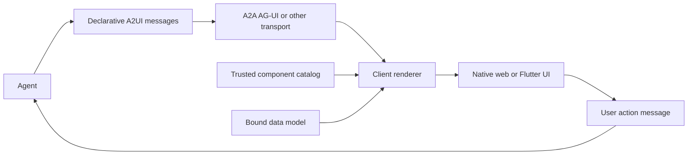

# A2UI

> Research status: **Source-level** · Last reviewed: **2026-08-12**

| Field | Verified value |
|---|---|
| Project | A2UI Project with Google contributor lineage |
| Status at pinned revision | v0.9.1 stable protocol family; v1.0 release candidate; early public preview overall |
| Canonical artifact | declarative agent-to-renderer messages plus component catalog and data model |
| License | Apache-2.0 |
| Pinned source | [`43a7bdd89ef678911c0686e634ca7d442b4b8234`](https://github.com/a2ui-project/a2ui/tree/43a7bdd89ef678911c0686e634ca7d442b4b8234) |

A2UI separates an agent's requested interface structure from executable host implementation. The agent emits data; the client resolves that data through a trusted component catalog into its own framework-native controls.

## A flat message graph supports incremental updates

Instead of streaming nested executable code A2UI represents components as a flat list with IDs and references plus a data model. A renderer can receive partial additions or updates and progressively rebuild the visible component tree. User actions travel back through protocol messages.

The catalog is the main trust boundary. An agent can request only registered component types and properties. A custom “smart wrapper” can extend the vocabulary including an iframe but then the host owns the wrapper's sandbox and authorization policy.

## Protocol versions are real lifecycle boundaries

The pinned tree contains v0.8 legacy v0.9 stable and v1.0 candidate schemas and tests. Claims must name a family rather than describing a timeless single JSON shape. Client capabilities and catalog definitions allow endpoints to negotiate what they understand; a payload valid for one family is not automatically valid for another.

## Source map

| Pinned path | Evidence |
|---|---|
| [`specification/v0_9/`](https://github.com/a2ui-project/a2ui/tree/43a7bdd89ef678911c0686e634ca7d442b4b8234/specification/v0_9) | current stable-family schemas examples and tests |
| [`specification/v1_0/`](https://github.com/a2ui-project/a2ui/tree/43a7bdd89ef678911c0686e634ca7d442b4b8234/specification/v1_0) | release-candidate agent renderer catalog and function contracts |
| [`renderers/lit/`](https://github.com/a2ui-project/a2ui/tree/43a7bdd89ef678911c0686e634ca7d442b4b8234/renderers/lit) | web rendering and bound-state implementation |
| [`renderers/react/`](https://github.com/a2ui-project/a2ui/tree/43a7bdd89ef678911c0686e634ca7d442b4b8234/renderers/react) | React renderer package |
| [`renderers/flutter/`](https://github.com/a2ui-project/a2ui/tree/43a7bdd89ef678911c0686e634ca7d442b4b8234/renderers/flutter) | Flutter integration guidance |
| [`samples/`](https://github.com/a2ui-project/a2ui/tree/43a7bdd89ef678911c0686e634ca7d442b4b8234/samples) | complete agent transport and client paths |

## What the protocol does not own

A2UI does not prescribe a hosted project database model provider conversation store or universal transport. Persistence and versioning belong to the embedding application. Declarative structure reduces arbitrary-code execution but does not ensure accessible useful or truthful UI; catalog design property validation and action authorization remain host responsibilities.

The public project has multi-organization contributors so one geographic team location is not assigned.

## Primary evidence

- [Pinned repository](https://github.com/a2ui-project/a2ui/tree/43a7bdd89ef678911c0686e634ca7d442b4b8234)
- [v0.9 specification](https://github.com/a2ui-project/a2ui/blob/43a7bdd89ef678911c0686e634ca7d442b4b8234/specification/v0_9/README.md)
- [v1.0 release-candidate specification](https://github.com/a2ui-project/a2ui/blob/43a7bdd89ef678911c0686e634ca7d442b4b8234/specification/v1_0/README.md)
- [Apache-2.0 license](https://github.com/a2ui-project/a2ui/blob/43a7bdd89ef678911c0686e634ca7d442b4b8234/LICENSE)
