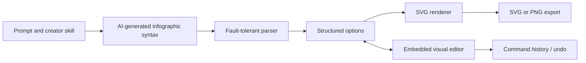

# AntV Infographic

> Research status: **Source-level** · Last reviewed: **2026-08-11**

| Field | Value |
|---|---|
| Team | AntV |
| Ordinary job | generate an infographic from compact text syntax, then refine its structured SVG representation and export it |
| Canonical embeddable state | parsed infographic options / syntax in the host application |
| Rendering result | editable SVG with optional PNG export |
| Pinned source | [`69eae2ee4bd856fa2af9a8ffbe7f5d173d76c6b7`](https://github.com/antvis/Infographic/tree/69eae2ee4bd856fa2af9a8ffbe7f5d173d76c6b7) |

## The syntax is shaped for model output

AntV Infographic defines a compact declarative grammar for infographic structure, data, text and styling. Its parser is designed to tolerate incomplete or incrementally streamed text, which lets a host render useful partial output while a model is still generating. That is a different technical direction from asking a model to emit a finished SVG string with no retained semantics.

The repository ships creator skills for whole infographics, syntax, custom structures, items and template updates. AI generation happens through those instructions and a host agent; the core library remains deterministic once it receives syntax/options.

## Editing changes options, then reprojects SVG

The runtime `Infographic` component parses input and renders SVG through registered structures, items, palettes and composite elements. The editor layer adds selection, brush/drag interactions, text editing, resize behavior and commands that update elements or complete options. Its command manager supplies undo/redo history for an editor session.

Because the renderer can be embedded, the project does not impose one hosted project database. A consumer must decide where to save the syntax/options, how to identify versions and how to restore history after reload. The library's in-memory command history should not be reported as universal persistent versioning.

## SVG retains more editability than a raster result

The primary renderer produces structured SVG. Export code can serialize SVG and produce PNG while handling fonts and resources. SVG preserves vector elements and text more effectively than a flat screenshot, although round-tripping an exported SVG back into the AntV option model is not established as the canonical edit path. The safest authoring artifact is still the syntax/options owned by the host.

## Fault tolerance has a cost

A parser that accepts partial or imperfect model output can keep a preview responsive, but it may also repair or omit malformed intent. Hosts should surface diagnostics and preserve the generated source so a plausible picture is not mistaken for complete data. Tests should include truncated streams, unknown templates, invalid hierarchy, large datasets, undo after structural edits and export with non-default fonts.

## Commit-level evidence map

| Pinned path | Evidence |
|---|---|
| `src/syntax/parser.ts`, `src/syntax/schema.ts` | AI-oriented textual grammar and parsing |
| `src/options/parser.ts` | normalization into renderable options |
| `src/runtime/Infographic.tsx` | public render/update lifecycle |
| `src/editor/managers/command-manager.ts` | command history and undo/redo |
| `src/editor/plugins/core-sync.ts` | editor-to-option synchronization |
| `src/exporter/` | SVG and PNG materialization |
| `skills/` | first-party agent instructions for generation and extension |

## Census boundary

This is counted as visual-editor infrastructure with an implemented AI-generation contract. It is not counted as a hosted end-user account/workspace, and every site embedding `@antv/infographic` is not a new product. A separate consumer would need its own team, user loop and persistence authority to qualify independently.

## Primary evidence

- [Pinned repository](https://github.com/antvis/Infographic/tree/69eae2ee4bd856fa2af9a8ffbe7f5d173d76c6b7)
- [Official AntV Infographic site](https://infographic.antv.vision/)
- [Pinned syntax parser](https://github.com/antvis/Infographic/blob/69eae2ee4bd856fa2af9a8ffbe7f5d173d76c6b7/src/syntax/parser.ts)
