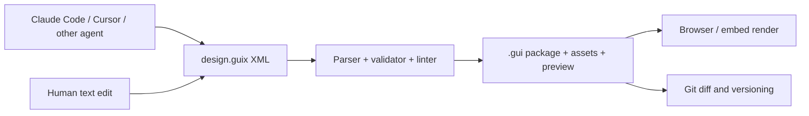

# dotGUI

> Research status: **Source-level** · Pinned commit: `bdcb1eb7b5f51e951773bd39507fc852c1975054` · Last reviewed: **2026-08-11**

| Field | Value |
|---|---|
| Maintainers | dotGUI contributors · maintainer region not established |
| Ordinary job | ask an existing coding agent to author a portable UI design file then validate render inspect and version that file locally |
| Canonical artifact | `.gui` package containing `design.guix` XML assets and `preview.webp` |
| AI boundary | the deterministic toolchain contains no model; the user's agent writes the artifact |

## Layout intent is the file authority

The format stores stacks grids gaps alignment semantic roles tokens fonts effects and light/dark modes rather than only fixed pixels. `design.guix` is human-readable XML; assets and a preview travel in the package. The reference engine parses validates lints autofixes scores and renders that same authority.

## Determinism bounds agent freedom

`gui setup` installs a format skill into supported agents. The CLI refuses invalid writes unless deterministic fixes can repair them and then packages the validated result. The agent is replaceable; the file grammar and validator remain the acceptance boundary. Rendering uses a locally available Chromium browser and can proceed offline once the artifact exists.

The specification distinguishes a UI design file from HTML runtime source. A renderer can project the design to DOM but application behavior and arbitrary framework logic are not part of the `.gui` authority. A Figma plugin is documented as forthcoming and is not treated as shipped round-trip evidence.

## Source boundary

Claims here are pinned to commit [`bdcb1eb7`](https://github.com/dotgui/core/tree/bdcb1eb7b5f51e951773bd39507fc852c1975054). Public source covers the format specification and deterministic toolchain. Example designs demonstrate representational coverage but do not prove fidelity for every production interface or future renderer.

## Primary evidence

- [dotGUI specification and product](https://dotgui.org/)
- [Format FAQ](https://dotgui.org/faq/)
- [Pinned source](https://github.com/dotgui/core/tree/bdcb1eb7b5f51e951773bd39507fc852c1975054)
