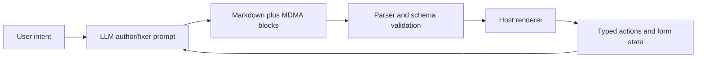

# MDMA

> Research status: **Source-level** · Lifecycle: **active** · Last reviewed: **2026-08-13**

MDMA—Markdown Document with Mounted Applications—defines Design as an AI-authorable interactive document format. An LLM writes Markdown plus validated `mdma` blocks; a host renders forms, tables, charts, task lists, approvals and actions; user interaction produces structured events that an agent or application can continue processing.

## The document is portable source

Pinned revision: `1f60d3745178f3587f8b2f556a1f8f79263be22d`.

The canonical artifact is text, not a React tree. The parser validates fenced YAML components and stable ids. Renderer packages project the same document into React, Vue or other host environments, while custom component registration provides an explicit extension boundary. Because behavior and content live in the document, an AI can repair or revise source without serializing a private canvas.

## Interaction adds state without silently rewriting source

Forms, approval gates and webhooks emit actions. Renderer stores can hold input and component state, but those events are not automatically edits to the Markdown definition. Hosts decide how events are persisted, sent through AG-UI/MCP or used to ask the model for a revised document.

## Product boundary

MDMA is counted as visual-editor infrastructure with an ordinary demo/CLI authoring loop, not as a hosted project-management service. Persistence, access control and business transaction semantics belong to the embedding host.

## Pinned evidence

- [Repository](https://github.com/MobileReality/mdma)
- [Creating documents guide](https://github.com/MobileReality/mdma/blob/1f60d3745178f3587f8b2f556a1f8f79263be22d/docs/guides/creating-documents.md)
- [React document renderer](https://github.com/MobileReality/mdma/blob/1f60d3745178f3587f8b2f556a1f8f79263be22d/packages/renderer-react/src/components/MdmaDocument.tsx)
- [Agent integration](https://github.com/MobileReality/mdma/blob/1f60d3745178f3587f8b2f556a1f8f79263be22d/packages/agui/src/react/MdmaAgentView.tsx)
- [MCP integration](https://github.com/MobileReality/mdma/tree/1f60d3745178f3587f8b2f556a1f8f79263be22d/packages/mcp)
