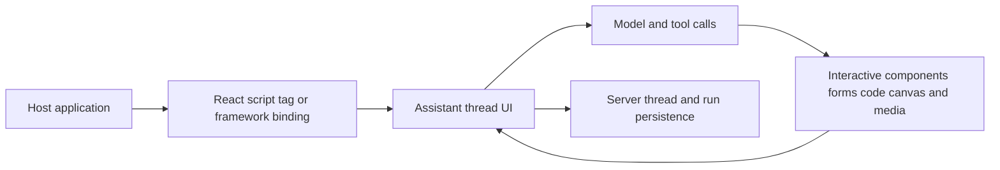

# Superinterface

> Research status: **Source-level** · Last reviewed: **2026-08-12**

| Field | Verified value |
|---|---|
| Maintainer | Supercorp |
| Team region | Ireland from the first-party GitHub organization profile |
| Product form | embeddable assistant and generative-interface open core |
| Canonical authorities | host application components plus server Workspace Assistant Thread and Tool records |
| Pinned source | [`2afe2c10ab2666c7488da282a4bdb37385dc9323`](https://github.com/supercorp-ai/superinterface/tree/2afe2c10ab2666c7488da282a4bdb37385dc9323) |

Superinterface is not a standalone design canvas. It lets an application owner embed a model-facing interaction surface whose messages tools files voice and custom interactive components participate in the host product.

## One interface package spans several host frameworks

The React package contains the primary component and hook implementation. The JavaScript package wraps those surfaces for script-tag use while `root-element` establishes a custom root insertion path. Published guidance also covers Vue Solid Svelte Angular and dedicated-page embedding.

The host controls theme placement and supplied client components. A model can request a custom UI only through the handlers and component vocabulary the integrator makes available; Superinterface does not magically understand every application's design system.

## Thread identity crosses browser and server boundaries

The React source stores a thread ID using cookies by default and local storage inside an iframe. That client locator is not the full conversation. The server schema separately persists workspaces assistants threads messages runs tools transports and provider configuration.

| Pinned path | Decisive evidence |
|---|---|
| [`packages/react/src/`](https://github.com/supercorp-ai/superinterface/tree/2afe2c10ab2666c7488da282a4bdb37385dc9323/packages/react/src) | rendered thread surfaces streams tools files and thread-ID adapters |
| [`packages/javascript/src/`](https://github.com/supercorp-ai/superinterface/tree/2afe2c10ab2666c7488da282a4bdb37385dc9323/packages/javascript/src) | script and framework-neutral packaging |
| [`packages/root-element/src/`](https://github.com/supercorp-ai/superinterface/tree/2afe2c10ab2666c7488da282a4bdb37385dc9323/packages/root-element/src) | root-element injection contract |
| [`packages/server/prisma/`](https://github.com/supercorp-ai/superinterface/tree/2afe2c10ab2666c7488da282a4bdb37385dc9323/packages/server/prisma) | Workspace Assistant Thread Message Run Tool and transport persistence |
| [`packages/server/src/lib/toolCalls/`](https://github.com/supercorp-ai/superinterface/tree/2afe2c10ab2666c7488da282a4bdb37385dc9323/packages/server/src/lib/toolCalls) | tool-call handling and streamed outputs |

## Failure and trust boundaries

A browser cookie or local-storage key can become stale relative to server deletion permissions or assistant configuration. A custom interactive component can invoke powerful host tools so its safety depends on the embedding application's handlers and authorization. Self-hosting exposes source but does not automatically supply secure tenant isolation secrets storage or policy.

The repository establishes the open core; any separately hosted Supercorp service operations and deployment internals are not inferred from it.

## Primary evidence

- [Pinned repository](https://github.com/supercorp-ai/superinterface/tree/2afe2c10ab2666c7488da282a4bdb37385dc9323)
- [Superinterface product](https://superinterface.ai/)
- [Supercorp organization](https://github.com/supercorp-ai)
- [MIT license](https://github.com/supercorp-ai/superinterface/blob/2afe2c10ab2666c7488da282a4bdb37385dc9323/LICENSE)
