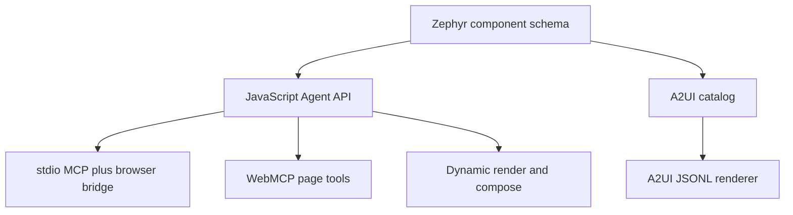

# Zephyr Framework

> Research status: **Source-level** · Last reviewed: **2026-08-12**

| Field | Verified value |
|---|---|
| Maintainer | Dalton Carr / `daltlc` |
| UI authority | authored Web Components plus typed state action and catalog contracts |
| Agent surfaces | JavaScript Agent API MCP WebMCP A2UI renderer and catalog |
| Pinned source | [`430f70d395f6b889df0a6df647634a2143619d68`](https://github.com/daltlc/zephyr-framework/tree/430f70d395f6b889df0a6df647634a2143619d68) |

Zephyr is a component/runtime substrate designed so agents can discover render inspect and operate UI without reconstructing intent from screenshots or arbitrary DOM events.

## One component contract feeds four agent paths

Fourteen Web Components publish properties actions events methods and ARIA behavior. The `Zephyr.agent` API exposes `getState` `describe` `act` `render` and `compose`. The MCP server bridges typed calls to a live browser page; WebMCP registers equivalent page tools; the A2UI catalog and renderer let an agent construct new UI from declarative messages.

MCP is the control plane for an existing live page; A2UI is a description plane for generated interface structure. Treating them as interchangeable would erase their different authority and trust boundaries.

## Deterministic interaction narrows timing uncertainty

Core visual interactions use CSS state selectors and transitions after components initialize. Agents invoke named actions rather than replaying coordinates. `getState` returns tags IDs state and available actions while `describe` adds slots events methods and accessibility information.

The A2UI renderer buffers a component adjacency list until `beginRendering` then applies bound data updates user actions and list templates. Agent text uses `textContent` and URL schemes are restricted. These controls reduce injection risk but custom slot content and extended renderers still remain application trust decisions.

## Source map

| Pinned path | Evidence |
|---|---|
| [`zephyr-framework.js`](https://github.com/daltlc/zephyr-framework/blob/430f70d395f6b889df0a6df647634a2143619d68/zephyr-framework.js) | component definitions and Agent API |
| [`zephyr-mcp/server.js`](https://github.com/daltlc/zephyr-framework/blob/430f70d395f6b889df0a6df647634a2143619d68/zephyr-mcp/server.js) | MCP tool server |
| [`zephyr-mcp/bridge-client.js`](https://github.com/daltlc/zephyr-framework/blob/430f70d395f6b889df0a6df647634a2143619d68/zephyr-mcp/bridge-client.js) | live-page transport |
| [`zephyr-a2ui-catalog.json`](https://github.com/daltlc/zephyr-framework/blob/430f70d395f6b889df0a6df647634a2143619d68/zephyr-a2ui-catalog.json) | discoverable component contract |
| [`zephyr-a2ui.js`](https://github.com/daltlc/zephyr-framework/blob/430f70d395f6b889df0a6df647634a2143619d68/zephyr-a2ui.js) | streaming A2UI renderer and data binding |
| [`tests/`](https://github.com/daltlc/zephyr-framework/tree/430f70d395f6b889df0a6df647634a2143619d68/tests) | interaction A2UI agent guard and accessibility cases |

## Persistence ceiling

Zephyr owns runtime UI state and action recording/replay while mounted. It does not impose a universal database project history or deployment service. Page authors must persist application data and audit consequential actions. Locks and guards coordinate agent operations but do not replace server authorization.

Team region remains unknown from reviewed maintainer sources.

## Primary evidence

- [Pinned repository](https://github.com/daltlc/zephyr-framework/tree/430f70d395f6b889df0a6df647634a2143619d68)
- [Agent and protocol architecture](https://github.com/daltlc/zephyr-framework/blob/430f70d395f6b889df0a6df647634a2143619d68/README.md)
- [License](https://github.com/daltlc/zephyr-framework/blob/430f70d395f6b889df0a6df647634a2143619d68/LICENSE)
