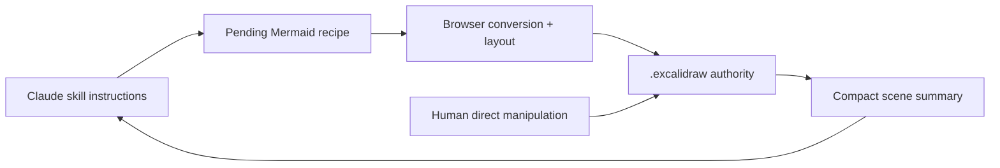

# drawloop-skill

> Research status: **Source-level** · Lifecycle: **active** · Last reviewed: **2026-08-12**

drawloop-skill is neither a hosted AI app nor an MCP diagram server. It is a Claude Code skill plus a local Excalidraw editor, organized around one unusually strict contract: the `.excalidraw` file in the user's repository is the shared state between human and agent.

## The file closes the human–agent loop

At commit [`0166bce5`](https://github.com/sashiksu/drawloop-skill/tree/0166bce5cafd161c050238343c7eecfa09bcf422), [`SKILL.md`](https://github.com/sashiksu/drawloop-skill/blob/0166bce5cafd161c050238343c7eecfa09bcf422/SKILL.md) instructs the host agent to draft Mermaid, preview layout, obtain an orientation decision, and write an Excalidraw scene with a `_drawloopSkillPending` recipe. The browser resolves that recipe through Mermaid-to-Excalidraw, Dagre or ELK, role tags, palettes and embedded icons, then saves the fully resolved scene back to the same path.

After the human moves or restyles shapes and presses Save, a later agent turn does not replay its old prompt. It calls `/api/describe` for a compact summary of the current scene, reads only target elements and performs minimal edits. [`bidirectional-edit.md`](https://github.com/sashiksu/drawloop-skill/blob/0166bce5cafd161c050238343c7eecfa09bcf422/references/bidirectional-edit.md) makes manual placement sacred unless movement was explicitly requested.

## Excalidraw is both data model and delivery format

[`schema.md`](https://github.com/sashiksu/drawloop-skill/blob/0166bce5cafd161c050238343c7eecfa09bcf422/references/schema.md) documents native Excalidraw elements, bindings, embedded files and semantic `customData.role` tags. The browser implementation in [`App.tsx`](https://github.com/sashiksu/drawloop-skill/blob/0166bce5cafd161c050238343c7eecfa09bcf422/ui/src/App.tsx) compensates for conversion losses, sizes icon-bearing nodes, reanchors arrows and switches to ELK for large graphs. The output remains directly openable in the broader Excalidraw ecosystem and versionable by Git; no proprietary intermediate format is required.

## The local server synchronizes files; it does not run the model

[`server.ts`](https://github.com/sashiksu/drawloop-skill/blob/0166bce5cafd161c050238343c7eecfa09bcf422/server.ts) exposes load, save, watch, describe, palette, icon and snapshot endpoints. Every overwrite first copies `<path>.bak-<timestamp>`, and server-sent events reload browser state after agent-side changes. The model and conversation remain in Claude Code; the server is a filesystem/editor bridge.

That narrowness also defines the trust boundary. Load and save accept caller-supplied host paths without a configured workspace root, so the loopback service assumes a trusted local caller and should not be exposed beyond the host. Backups are timestamped recovery copies rather than a named version graph; Git is the intended durable history.

## Landscape significance

drawloop-skill shows a different answer to AI-native design: do not embed an agent into the editor. Give an external coding agent a disciplined, token-efficient interface to a portable design file, and make user edits legible on the next turn. Its originality lies in bidirectional source mapping across process boundaries, not in owning inference or collaboration infrastructure.

## Evidence

- [Pinned product rationale and architecture](https://github.com/sashiksu/drawloop-skill/blob/0166bce5cafd161c050238343c7eecfa09bcf422/README.md)
- [Agent interface and workflow contracts](https://github.com/sashiksu/drawloop-skill/blob/0166bce5cafd161c050238343c7eecfa09bcf422/SKILL.md)
- [Browser-side resolution and source mapping](https://github.com/sashiksu/drawloop-skill/blob/0166bce5cafd161c050238343c7eecfa09bcf422/ui/src/App.tsx)
- [Filesystem bridge, snapshots and watch channel](https://github.com/sashiksu/drawloop-skill/blob/0166bce5cafd161c050238343c7eecfa09bcf422/server.ts)
