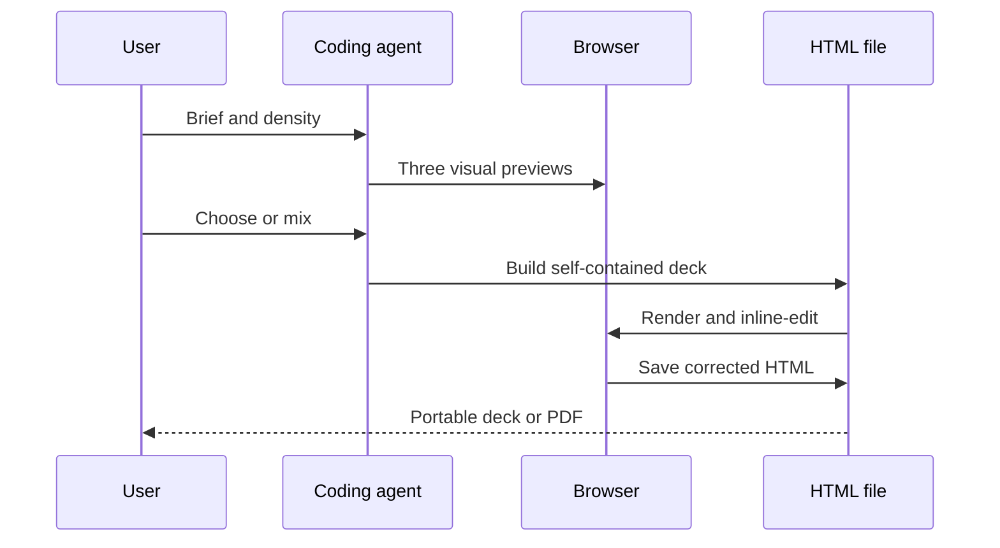

# Frontend Slides

> Research status: **Source-level** · Last reviewed: **2026-08-11**

| Field | Value |
|---|---|
| Team | `zarazhangrui/frontend-slides` contributors |
| Ordinary job | ask a coding agent to produce a presentation, choose a visual direction, edit it in the browser and export it |
| Canonical artifact | one self-contained HTML file with inline CSS and JavaScript |
| Pinned source | [`9906a34d640d2111f724544cbc50f7f130569ae1`](https://github.com/zarazhangrui/frontend-slides/tree/9906a34d640d2111f724544cbc50f7f130569ae1) |

## The visual decision happens before the full deck

Frontend Slides is principally a skill contract for a coding agent, not a hosted slide database. Its unusual design decision is to prevent the agent from immediately committing an entire deck to one guessed visual language. After gathering the subject and intended density, the workflow creates three first-slide-quality visual previews. The user can select one or explicitly mix elements before the agent expands the direction across the presentation.

Those previews are candidates, not durable branches. Once a direction is adopted, temporary preview material can be removed. The durable result is the final HTML deck. This is a lightweight candidate-promotion mechanism rather than a full version graph.

## HTML is both authoring source and runtime

The skill requires a single self-contained HTML document. Slide structure, styles, transitions, keyboard navigation and optional inline editing travel together. The browser is the rendering engine, so the artifact remains inspectable and editable with ordinary web tools instead of being locked inside a project service.

Inline editing and browser `localStorage` make quick corrections possible during a session. They do not create an independent canonical cloud document: the saved or downloaded HTML file remains the portable authority. A user who edits in the browser must save/export the changed document if they want those corrections to survive outside that browser state.

## PDF is a materialized view

`scripts/export-pdf.sh` uses Playwright to render each `.slide` at a fixed 1920×1080 viewport, capture it and combine the captures into a PDF. The PDF is therefore a static delivery projection. Animations, browser editing behavior and responsive runtime logic do not survive that conversion.

The repository also includes a PowerPoint extraction helper. Its role is to obtain content and assets that can seed an HTML presentation; it does not establish a reversible HTML-to-native-PowerPoint object round trip. Calling the result “PowerPoint editing” would overstate the evidence.

## Commit-level implementation map

| Pinned path | What it decides |
|---|---|
| `SKILL.md` | brief gathering, three-preview decision gate, HTML constraints and correction workflow |
| `STYLE_PRESETS.md` | lightweight style vocabulary used before full template loading |
| `bold-template-pack/selection-index.json` | searchable candidate index for visual directions |
| `bold-template-pack/templates/*/design.md` | full instructions loaded only after selection |
| `scripts/export-pdf.sh` | browser-rendered PDF materialization |
| `scripts/extract-pptx.py` | one-way extraction of presentation content and assets |

## Where the workflow can fail

The agent owns much of the HTML generation, so source correctness and visual correctness can diverge. Acceptance should check overflow at the fixed slide viewport, missing web fonts or remote images, keyboard navigation, print/PDF capture, and whether an inline edit was actually saved into the artifact. A good-looking first slide is not evidence that later content density or export works.

## Primary evidence

- [Pinned repository](https://github.com/zarazhangrui/frontend-slides/tree/9906a34d640d2111f724544cbc50f7f130569ae1)
- [Pinned skill contract](https://github.com/zarazhangrui/frontend-slides/blob/9906a34d640d2111f724544cbc50f7f130569ae1/SKILL.md)
- [Pinned PDF exporter](https://github.com/zarazhangrui/frontend-slides/blob/9906a34d640d2111f724544cbc50f7f130569ae1/scripts/export-pdf.sh)
