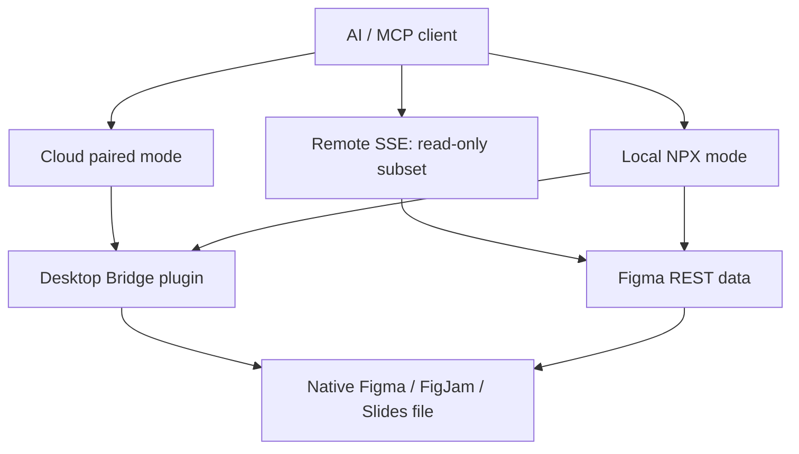

# Figma Console MCP

> Research status: **Source-level** · Last reviewed: **2026-08-11**

| Field | Value |
|---|---|
| Team | Southleft |
| Ordinary job | let an AI client inspect, create, repair and govern native Figma, FigJam and Slides content |
| Canonical artifact | the targeted native Figma file or files |
| Distinctive scope | broad plugin-backed writes, token round trips, audits and host-version analysis across multiple files |
| Pinned source | [`08ff31edbf1c4a57a2564d5020d4e28453eea10f`](https://github.com/southleft/figma-console-mcp/tree/08ff31edbf1c4a57a2564d5020d4e28453eea10f) |

## Capability depends on the transport chosen

Figma Console MCP is not one uniformly privileged endpoint. The pinned product contract distinguishes three paths:

- remote SSE is a small read-only exploration surface;
- cloud mode pairs a web AI client with a Figma Desktop bridge and enables writes;
- local NPX/source mode combines REST access with the local Desktop Bridge plugin and exposes the full tool set, including live monitoring.

This distinction is essential evidence. A successful read from the remote service does not imply that the same session can modify a file, and a model should not infer write authority merely because write tools exist elsewhere in the repository.

## Plugin API closes the write gap left by REST

The Desktop Bridge runs inside Figma and exchanges requests with the MCP server over a local WebSocket path. Plugin-side code can create or modify frames, nodes, components, variables, FigJam objects and Slides content. REST-backed tools supplement this with file metadata, comments, versions and published-library information.

The result stays in Figma's graph. Screenshots, audit reports, exported token files and generated documentation are projections or companion artifacts. They do not replace the design document as the authority for layout and node identity.

## Tokens can travel both directions

The project can export Figma variables into DTCG and several code-oriented formats, parse code-side token files and apply changes back to Figma. Applying is not a blind overwrite: the source includes schema/parsers and operations for creation, rename, alias retargeting and gated deletion. This makes Figma Console broader than a context extractor, but also introduces reconciliation risk when code and design variables have both changed.

An acceptance test should include aliases, modes, renames, deleted variables and a second apply after no changes. A syntactically valid token file does not prove that semantic references in components remained correct.

## Multi-file execution is explicit

The pinned revision supports several connected Figma files. Calls can name a `fileKey`, and `figma_execute_across_files` requires an explicit list or `allFiles: true`; it does not silently fan out. That is a meaningful authority guard because a bulk audit and a bulk mutation have very different consequences.

Concurrency also creates partial-success semantics. If one file rejects or times out after other files changed, the source does not establish a cross-file transaction that rolls everything back.

## History tools analyze host versions; they do not own them

Version tools list Figma versions, cache snapshots, compare states, generate changelogs and trace when properties or variants appeared. The version objects remain Figma-owned. Local caches accelerate analysis; they are not an independent immutable design repository. Recovery still depends on Figma permissions and version history plus whatever exports the team preserves.

## Commit-level map

| Pinned path | Evidence |
|---|---|
| `src/local.ts` and server entry points | local MCP assembly and capability registration |
| `figma-desktop-bridge/` | plugin code and local bridge protocol |
| `src/core/write-tools.ts` | native mutation surface |
| `src/core/tokens-tools.ts`, `src/core/tokens/` | token formats and bidirectional apply |
| `src/core/multi-file-tools.ts` | explicit target and concurrent multi-file behavior |
| `src/core/version-tools.ts`, `src/core/diff/` | host version retrieval and comparison |
| `src/core/slides-tools.ts`, `src/core/figjam-tools.ts` | non-canvas Figma document surfaces |

## Primary evidence

- [Pinned repository](https://github.com/southleft/figma-console-mcp/tree/08ff31edbf1c4a57a2564d5020d4e28453eea10f)
- [Official documentation](https://docs.figma-console-mcp.southleft.com/)
- [Pinned tool reference](https://github.com/southleft/figma-console-mcp/blob/08ff31edbf1c4a57a2564d5020d4e28453eea10f/docs/tools.md)
