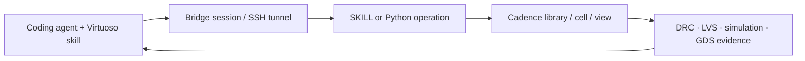

# Virtuoso Bridge Lite

> Research status: **Source-level** · Lifecycle: **active** · Last reviewed: **2026-08-12**

Virtuoso Bridge Lite defines AI design as an external coding agent operating a real Cadence Virtuoso installation. The bridge does not replace the EDA database with a chat transcript: schematics layouts Maestro setups Spectre results and exported GDS remain the engineering authority.

## The bridge keeps the expensive state in Virtuoso

At commit [`6a0d5f6`](https://github.com/Arcadia-1/virtuoso-bridge-lite/tree/6a0d5f636e8908d6f5d998e3454d5043c79b3167) the package maintains persistent local or SSH sessions and exposes Python and SKILL operations for reading and mutating Cadence objects. The [schematic editor](https://github.com/Arcadia-1/virtuoso-bridge-lite/blob/6a0d5f636e8908d6f5d998e3454d5043c79b3167/src/virtuoso_bridge/virtuoso/schematic/editor.py) and [connectivity reader](https://github.com/Arcadia-1/virtuoso-bridge-lite/blob/6a0d5f636e8908d6f5d998e3454d5043c79b3167/src/virtuoso_bridge/virtuoso/schematic/reader.py) turn agent requests into domain operations rather than screen-coordinate automation.

The examples include stepwise schematic creation connectivity inspection parameter edits Maestro sweeps and [GDS export](https://github.com/Arcadia-1/virtuoso-bridge-lite/blob/6a0d5f636e8908d6f5d998e3454d5043c79b3167/examples/01_virtuoso/layout/15_export_gds.py). This is a live-tool authority architecture: the bridge is the control plane while Cadence owns design truth and sign-off evidence.

## What the public source does not prove

A usable run requires licensed Cadence software technology libraries and often private PDK data. The repository proves the adapter and session mechanisms but cannot make proprietary verification inputs reproducible. The maintainer profile supplies Beijing coordinates; that supports a China team-region attribution without exposing a street-level claim.

## Decisive sources

- [Agent setup contract](https://github.com/Arcadia-1/virtuoso-bridge-lite/blob/6a0d5f636e8908d6f5d998e3454d5043c79b3167/AGENTS.md)
- [Schematic operation implementation](https://github.com/Arcadia-1/virtuoso-bridge-lite/blob/6a0d5f636e8908d6f5d998e3454d5043c79b3167/src/virtuoso_bridge/virtuoso/schematic/ops.py)
- [Pinned README](https://github.com/Arcadia-1/virtuoso-bridge-lite/blob/6a0d5f636e8908d6f5d998e3454d5043c79b3167/README.md)
