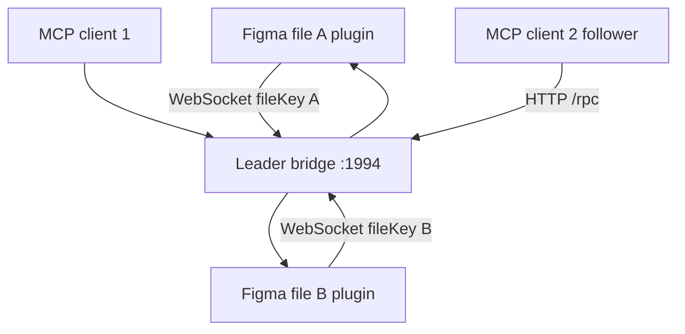

# Figma MCP Bridge

> Research status: **Source-level** · Last reviewed: **2026-08-11**

| Field | Value |
|---|---|
| Team | Hopp |
| Ordinary job | stream one or more open Figma files to an AI client without consuming REST read quotas and permit a bounded set of native edits |
| Canonical artifact | each connected native Figma file |
| Transport | Figma plugin ↔ local WebSocket leader ↔ MCP stdio clients |
| Pinned source | [`12181227f5dc7ce767fa9b26d97a1b3c9b589747`](https://github.com/gethopp/figma-mcp-bridge/tree/12181227f5dc7ce767fa9b26d97a1b3c9b589747) |

## Live plugin serialization avoids the REST bottleneck

The Figma plugin runs in every file the user wants to expose. It serializes current document, selection, styles, variables, screenshots and design context through Figma's Plugin API. A local WebSocket bridge registers those connections by `fileKey`, so the server reads the live open files instead of repeatedly fetching them through Figma REST.

Multiple MCP client processes cannot all own the same listening port. The server elects one leader that hosts WebSocket and HTTP endpoints; follower processes forward requests to it over `/rpc` and can attempt takeover if the leader disappears.

## The write surface is intentionally smaller than the read surface

Read tools expose document/selection trees, styles, variables, metadata, screenshots and motion information. Write tools cover common geometry and appearance, text, fills/effects/strokes, auto-layout, basic shapes/images, grouping/reparenting, selection/viewport and deletion.

The pinned contract explicitly omits broad areas such as component/instance authoring, variable/style creation, per-segment rich text and vector boolean operations. An agent can assemble a basic slide deck but cannot truthfully claim complete Figma parity. The limited surface is a product decision, not an implementation defect to paper over in the dossier.

## File targeting and deletion are explicit

Every operation can name a `fileKey` when several plugins are connected. The server routes the request to the corresponding live plugin. `delete_nodes` requires an explicit confirmation flag. Text mutations load the fonts used by the target node before applying content, while Dev Mode rejects edits as read-only.

These guards reduce accidental writes but do not create a transaction. A multi-step deck build can leave earlier nodes in the file if a later call fails. Figma's own undo/version history remains the recovery system.

## Runtime identity does not outlive the host automatically

The bridge addresses nodes by Figma node ID and files by live `fileKey`. Those identities are meaningful inside Figma, but a copied file or replaced node may receive different IDs. The bridge does not persist an external project database mapping agent tasks to immutable file revisions.

Screenshots saved to the local filesystem are visual evidence or delivery assets; they cannot reconstruct the native nodes. The open Figma file remains authoritative.

## Commit-level map

| Pinned path | Evidence |
|---|---|
| `plugin/src/main/serializer.ts` | document-to-agent representation |
| `plugin/src/main/code.ts` | Plugin API reads and bounded mutations |
| `server/src/bridge.ts` | file-keyed WebSocket request routing |
| `server/src/election.ts`, `leader.ts`, `follower.ts` | multi-client leader/follower behavior |
| `server/src/tools.ts` | exact MCP read/write surface |
| `server/src/schema.ts` | mutation validation and confirmation fields |

## Primary evidence

- [Pinned repository](https://github.com/gethopp/figma-mcp-bridge/tree/12181227f5dc7ce767fa9b26d97a1b3c9b589747)
- [Pinned tool definitions](https://github.com/gethopp/figma-mcp-bridge/blob/12181227f5dc7ce767fa9b26d97a1b3c9b589747/server/src/tools.ts)
- [Pinned plugin implementation](https://github.com/gethopp/figma-mcp-bridge/blob/12181227f5dc7ce767fa9b26d97a1b3c9b589747/plugin/src/main/code.ts)
