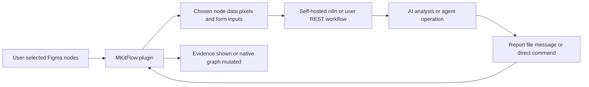

# MKitFlow

> Research status: **Architecture-level** · Last reviewed: **2026-08-12**

MKitFlow is a user-configured control plane between an active Figma plugin session and external automation or agent runtimes. Its core is generic webhook transport, but the creator demonstrates a complete Design-specific AI loop and exposes returned commands that can modify the native canvas; that combination places it inside this census rather than among passive automation connectors.

## Figma initiates the session and bounds the disclosure

The user begins inside Figma, chooses the relevant frames or nodes, and can provide a workflow-specific form. MKitFlow can serialize granular Plugin API properties and exported images to an endpoint controlled by the user. The push model matters: an outside service does not independently wake a dormant Figma plugin or obtain the entire file.

The return path accepts messages, documents and direct commands. In the creator's demonstrated analysis workflow, three selected dashboard screens become data for an n8n job, an AI estimates implementation complexity, and a PDF report returns. Other advertised workflows include audits, documentation, token-to-code delivery and issue synchronization.

## The bridge moves authority but does not define the remote agent

MKitFlow supplies transport and native mutation capability; the user owns the n8n/REST workflow, model, prompts and credentials. A successful webhook therefore proves neither model quality nor safe mutation. Endpoint trust, command validation, node-ID stability, replay/idempotency, undo grouping, payload redaction, schema/version negotiation and behavior after the plugin closes are not documented publicly.

This differs from a generic automation connector with no AI-native Design evidence: the first-party material shows both selected design context entering an AI operation and results returning to the design workflow. It also differs from a hosted design agent because no single MKitFlow model or managed project graph is established.

## Primary evidence

- [Creator launch and transport contract](https://forum.figma.com/showcase-your-work-14/mkitflow-securely-connect-figma-to-n8n-automation-platforms-custom-rest-apis-54360)
- [Creator AI analysis and bidirectional-command demonstration](https://forum.figma.com/showcase-your-work-14/ired-of-figma-api-limitations-solve-the-pull-problem-with-mkitflow-n8n-or-other-workflows-53996)
- [Earlier push-model description](https://forum.figma.com/showcase-your-work-14/are-you-already-connecting-figma-with-your-automation-tools-like-n8n-45636)

No public source repository or reliable first-party team-location evidence was found.
