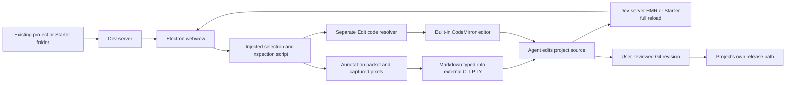

# Dosmos

> Research status: **Source-level** · Last reviewed: **2026-08-11**

| Field | Value |
|---|---|
| Organization / team | Dosmos / `assentorp`; solo-maintained project |
| Category | Code-native visual surface |
| Status | Active; current public desktop release `2.0.1` |
| Previous name | Design In The Browser; renamed to Dosmos for `2.0.0` |
| Product boundary | Local Electron browser, editor, terminal and DevTools shell around the user's existing project and separately installed coding agent |
| Durable implementation authority | Project source files and the user's own Git/release process |
| Canonical product | https://dosmos.app/ |
| Canonical source | https://github.com/assentorp/dosmos |
| License / governance | MIT; source is readable and forkable, but the maintainer does not accept external pull requests |
| Pinned shipped source | tag `v2.0.1`, commit [`06ab19c2c2ed13c0efb9428dc72fdacb64d0ddbf`](https://github.com/assentorp/dosmos/tree/06ab19c2c2ed13c0efb9428dc72fdacb64d0ddbf) |
| Binary distribution | Separate public repository, [`assentorp/ditb-releases`](https://github.com/assentorp/ditb-releases/releases/tag/v2.0.1) |
| Evidence ceiling | The shipped desktop implementation, source-resolution heuristics, PTY prompt path, local persistence and release workflow are source-visible. Correctness of an external CLI agent, arbitrary project dev servers and deployed applications remains outside Dosmos itself. |

## One click enters two different pipelines

The product page says that clicking an element gives the AI the exact element, “source file, line number and all,” and later says the coding agent receives that exact source location. The `2.0.1` implementation has two separate click outcomes, however:

1. **Submit an annotation to the coding agent.** Dosmos reduces the selection to a short Markdown instruction plus optional temporary image paths and types it into the external CLI's pseudo-terminal. The default prompt contains no source file, line, selector or page URL.
2. **Press the floating Edit code button.** Dosmos independently tries to resolve the element to a source file, then opens that file in its built-in CodeMirror editor. This path can return a file and line, but it does not send that result through the normal annotation formatter.

That distinction is the decisive technical fact of this dossier. The product does provide precise visual targeting and a separate source-opening workflow. The shipped default point-and-click-to-agent packet does **not** establish the stronger advertised file-and-line handoff.

The [official setup guide](https://dosmos.app/setup) also makes the product boundary clear: install Node.js, install and authenticate a coding agent, install Dosmos, choose a project and let the separately installed agent write code. Dosmos does not contain a model or hosted generation service.

## The ordinary journey is a runtime-to-source feedback loop



An ordinary existing-project session advances through these concrete states:

| Stage | What the user does | What Dosmos actually advances | Evidence before calling it complete |
|---|---|---|---|
| 1. Configure | choose a folder, start command, URL, shell and CLI | an in-memory `Session`; optionally a persisted `ProjectPreset` | correct folder, command, URL and intended agent executable |
| 2. Start | open the project | one PTY for the dev server and one for the CLI; one live webview | both commands really start and the webview shows the intended app/revision |
| 3. Target | click an element, select text/area or queue several edits | injected DOM selection state and an annotation record | target highlight and captured region still match the current page after HMR/navigation |
| 4. Dispatch | submit now or manually send the queue | prompt text written to the intended CLI PTY, followed by carriage return | terminal visibly receives the complete prompt and image paths remain readable |
| 5. Materialize | let the external agent work | whatever files/processes that agent changes under the selected project | inspect the real diff; terminal activity alone is not a mutation receipt |
| 6. Re-observe | wait for HMR or reload | a newer runtime projection in the webview | clean reload, intended viewport and interaction path pass |
| 7. Promote | review, commit and deploy outside Dosmos | repository and destination-specific release state | reviewed Git identity and the actual delivered target |

For a Starter Project, Dosmos creates a folder with one `index.html`, starts a loopback-only static server, injects an EventSource reload script into HTML and watches the tree with `fs.watch`. Existing projects keep their own framework/dev-server semantics; Dosmos merely runs the configured command and observes its URL.

## The clicked DOM is evidence, not the artifact

The product coordinates several representations, but only one is the durable application implementation:

| Representation | Identity / contents | Lifetime | Authority |
|---|---|---|---|
| project source | existing files, optional Git history and whatever backend/config the project owns | filesystem / repository lifetime | **durable implementation authority** |
| runtime page | URL, DOM, React fibers when present, computed CSS, browser storage and current viewport | dev-server/webview lifetime | observable projection, potentially stale |
| annotation target | generated CSS selector, tag, truncated text/attributes, bounds, note and optional images | injected-page memory; summarized in the current React `Session` | prompt/queue context only |
| source candidate | file, line and human-readable matching strategy | one Edit code resolution | navigation hint, not a guarded binding |
| built-in editor buffer | text read from one existing project file | panel lifetime until save/discard | volatile until a direct file write succeeds |
| project preset | path, commands, URL, agent/shell/permission options and last-open time | `presets.json` | reusable launch configuration, not source history |
| project card preview | 640px-wide JPEG keyed by SHA-1 of resolved project path | Electron `userData/project-previews` | visual thumbnail only |
| annotation/reference screenshot | PNG or original image bytes in OS temp storage | configured delay; stale-run sweep after one hour | short-lived agent evidence |

The browser, overlays, terminal transcript and source resolver do not form a second design document. A correct-looking webview and a completed CLI turn are not substitutes for the resulting source diff and application behavior.

## The agent path becomes plain text before the PTY

The injected script initially records more context than the CLI finally receives. A single element carries page URL, a CSS selector, padded bounds, up to 50 characters of text, the first three classes, and bounded values for `data-testid`, `data-component`, `aria-label`, `name` and `href`. Text and area selections use related packets; queued edits retain selector/tag/text/attributes so they can be re-highlighted after a page reload.

The renderer then captures the selected rectangle with Electron `webview.capturePage`. The main process writes the screenshot and any reference images into the OS temp directory. WSL sessions receive `/mnt/<drive>/...` paths; native sessions receive native paths.

The terminal formatter deliberately discards most of the transport record:

```text
- <button> "Get started" [class="btn primary"]: Make this larger
  (see element screenshot: C:\...\claude-design-screenshot-....png)
```

The formatter uses tag, short text, selected attributes and request. It does not include the packet's URL, CSS selector, bounds, component name, source candidate, file or line. Multi-edit output is one similar Markdown list item per target. A user can explicitly type an `@` project-file mention, but that is an additional human choice, not the default click contract.

The resulting string is written directly to the selected `node-pty` process, and Dosmos sends a carriage return 100ms later. There is no request id, structured agent protocol, acknowledgement, tool-result schema, source-diff receipt or completion callback. Dosmos infers “CLI running” from terminal output volume and clears the spinner after 1.5 seconds of silence. Small TUI redraw chunks extend that timer; a quiet agent or permission prompt can therefore be misclassified. Queued edits are intentionally sent manually rather than auto-flushed when the timer expires.

Reference images have two different transports:

- images added to an annotation become temporary file paths embedded in prompt text;
- images dragged into the terminal are written to the OS clipboard and Dosmos sends `Ctrl+V`, allowing compatible CLIs to attach actual image bytes.

These paths depend on the external CLI understanding the prompt, having permission to read the temp path and retaining the image before cleanup. Dosmos does not prove consumption.

## Edit code uses a three-tier source resolver

The floating Edit code button follows a separate resolver, in priority order:

| Tier | Source evidence | Returned identity | Boundary |
|---|---|---|---|
| explicit DOM marker | walk up to 12 ancestors for `data-dib-source="path:line:column"` or `react-dev-inspector`'s `data-inspector-*` attributes | file, line, column | Dosmos contains the marker reader but no producer/build plugin for `data-dib-source`; the project must already expose compatible attributes |
| React debug fiber | find `__reactFiber$` / `__reactInternalInstance$`, walk up to 20 fibers and read `_debugSource` | file, line, column | comment and implementation target React 18 development internals; React 19, server components, production builds and bundler path formats can omit or transform it |
| weighted project search | extract up to five React component names, id/data/ARIA/role attributes, own/heading/full text and URL path, then run many concurrent `grep` searches | up to six file/line candidates plus confidence gap and agreeing-signal count | heuristic and environment-dependent; repeated/shared strings, generated files and route conventions can mis-rank candidates |

The heuristic scores a component filename match at 95, data attributes at 90, id at 88, headings at 84, own text at 80 and route-file baseline at 60. It adds 45 points for each independent signal class after the first, adds another 25 when component structure and content agree, penalizes root layout/providers and non-UI paths, keeps at most two lines per file and opens a “wrong file?” picker when the winning file has fewer than two agreeing classes and a gap under 30.

That is a thoughtful ranking model, but the shipped Windows route has a concrete ordinary-user break:

1. the process calls `spawn('grep', ...)` directly;
2. the official clean-PC setup installs Windows Terminal, Node.js, a coding agent and Dosmos, not GNU `grep`;
3. spawn failure is silently converted to an empty result;
4. even if Git for Windows' `grep.exe` is manually made available, absolute output begins `C:\...:line:text`, while the parser splits at the **first** colon and therefore treats `C` as the filename and the remaining path as a non-numeric line.

This snapshot reproduced both boundaries on Windows: `Get-Command grep` returned no command, while Git's explicit `usr/bin/grep.exe` produced drive-letter-prefixed output of exactly the unparseable form. Route-baseline candidates can still work for a narrow set of Next-style files, and explicit markers/fibers remain separate fallbacks, but Smart Source Matching is not generally operational on the advertised stock Windows journey.

There is a second Windows edge in the exact path: the renderer regards only strings starting with `/` as absolute. An absolute React source path such as `C:\project\src\Hero.tsx` is prefixed with the project path and becomes invalid. Relative paths remain usable.

## The built-in editor closes one safety boundary, not concurrency

Before reading or writing, the main process resolves both project root and target with `realpath`, rejects symlink escape, requires an existing file and limits reads to 2MiB. A forged or malformed webview path therefore cannot directly make the editor access an arbitrary file outside the selected project.

The CodeMirror panel protects a dirty buffer before closing or switching files. Saving, however, is a synchronous `writeFileSync` of the full string to the existing file. There is no temp-and-rename write, baseline content hash, file revision, mtime precondition or reconciliation with a concurrent external-agent/editor change. A file can change after it was read and before the built-in buffer overwrites it. Switching projects also drops the dirty panel because the project switch has already occurred.

The successful write is still not a version. HMR or the Starter watcher may render it, but only the project's own Git and release workflow create reviewable implementation and delivery identities.

## Rendering is an injected Electron inspection surface

The shipped stack is Electron 33, React 18, Vite 6, TypeScript 5.6, CodeMirror 6, xterm/node-pty, PostHog and electron-updater. Each open project keeps a live `<webview>` mounted in `2.0.1`, so tab switching preserves page scroll/form state, DevTools and per-project queued edits instead of recreating the page.

On each relevant page load, Dosmos injects:

- callback shims and a 3,800-line selection/overlay script through `executeJavaScript`;
- project file names for `@` autocomplete, capped at 10,000 and cached for 30 seconds;
- Tailwind/CSS-variable tokens for `>` autocomplete, also cached for 30 seconds;
- runtime overlays for CSS inspection, spatial/baseline grids, crosshair guides, area selection and animation freeze.

Docked Chrome DevTools uses a top-level `WebContentsView`, because Electron DevTools contents cannot remain embedded in another webview. Responsive controls change the webview frame/CSS zoom; they do not emulate every device or browser engine.

Freeze Animations illustrates the runtime-only boundary precisely: it sets every element's inline `animationPlayState` to `paused` and `transitionDuration` to `0s`, then restores both properties to an empty string. A page with meaningful pre-existing inline values can lose those values for the current runtime session. No project source is intentionally changed.

The Starter server binds only `127.0.0.1`, uses no-store responses and coalesces file-watch events for 80ms before broadcasting reload. Its traversal guard is lexical (`path.resolve` plus prefix check), unlike the editor's `realpath` guard; a symlink/junction inside the Starter root can therefore resolve outside the root when the server later stats/reads the target. This is a local serving trust boundary, not a claim that ordinary non-symlink projects escape it.

## Persistence is deliberately asymmetric

| Clock | Public implementation | What survives | What does not |
|---|---|---|---|
| project files / Git | external filesystem and user's repository | source and normal repository history | runtime DOM, terminal/UI state unless the project itself persists them |
| presets | `userData/presets.json`, `.tmp` atomic rename and one `.bak` rotation; refuses an empty overwrite after a failed load | launch configuration, last-open time, static-server/agent choices | open tabs, terminal processes and queued prompts |
| settings | `userData/settings.json` written directly | editor choice, analytics consent, screenshot delay, window/layout/grid sizes | no backup, transaction or schema migration is public |
| active session | React state plus main-process PTY maps | page/form/scroll/DevTools state while its mounted webview and process live | app restart; the changelog explicitly records that session restore was removed |
| queued edits | injected-page objects plus selector-based summaries in current `Session` | tab switches and re-injection after a reload when selector still resolves | app restart; structural DOM changes can retarget/fail the selector |
| project preview | path-hashed JPEG in `userData/project-previews` | app restart and dashboard display | source revision, interaction state or proof that the page still looks that way |
| annotation images | `claude-design-screenshot-*` / `claude-design-reference-*` in OS temp | configured delay, default five minutes | delayed cleanup after normal use; startup sweep removes matching orphan files older than one hour |
| browser storage | Electron `defaultSession` | normal Chromium cache/cookies/storage across page use | Clear cache & reload clears cache and **all storage data for the shared default session**, affecting every open project/origin rather than one tab |

Re-injecting a queued edit uses its generated selector—up to the last five ancestor segments, first three classes and `:nth-of-type` where siblings share a tag. If no element matches after navigation/HMR, the script creates a hidden placeholder. The queue text survives inside the running app, but its screenshot bounds collapse around that placeholder and the original visual target is no longer proved.

## The webview-to-agent bridge is a consequential trust boundary

The main window enables webviews, disables Node integration, enables context isolation and runs without Electron sandboxing. It also removes response CSP headers on the default session and installs a permissive CSP so arbitrary pages can be inspected and injected.

Inside each page, the renderer installs a `window.message` listener that accepts five `claude-design-*` message types without checking `event.origin`, `event.source` or an unforgeable capability. Any JavaScript running in the viewed page can therefore emit a syntactically valid annotation, edit-code or terminal-toggle message. A forged edit-code path remains bounded by the realpath project guard, but a forged annotation can become text typed into the active coding agent. This is a source-visible page-to-agent prompt-injection boundary.

The app's privacy policy is narrower and separately evidenced: official builds make PostHog opt-in and off by default, disable autocapture/session recording/IP collection, and source builds have no analytics unless release-time environment keys are supplied. The app still displays arbitrary web content and launches third-party CLIs; those parties retain their own network and data behavior.

## Release truth is stronger than the repository landing page

The source tag and binary publication are joined by the release workflow:

- source tag `v2.0.1` points to commit `06ab19c2c2ed13c0efb9428dc72fdacb64d0ddbf` dated 2026-08-04;
- [GitHub Actions run 30945214261](https://github.com/assentorp/dosmos/actions/runs/30945214261) checked out that tag/commit, completed successfully, built macOS arm64/x64 and Windows on separate runners and published assets to the separate release repository;
- the distribution release was published at `2026-08-04T19:59:06Z`;
- current source `main` is `0b9bc7ff4d2c62e605a6c01748abef1df09429f9`; the three commits after `v2.0.1` only change README video links, so the shipped implementation remains the right analysis target.

GitHub's release metadata reports these principal asset identities:

| Asset | Bytes | SHA-256 |
|---|---:|---|
| `Dosmos-Setup-2.0.1.exe` | 99,021,515 | `8e1a2251fa45b0e2951729a0d5d2a09dd5e7a4fc50ec3393a57fb2c2551d4f06` |
| `Dosmos-2.0.1-arm64.dmg` | 117,787,570 | `6273704a5eee7995906795d6d6c1d2a5b217d4ed0d9b12653dd6539714c00d74` |
| `Dosmos-2.0.1-x64.dmg` | 124,942,948 | `becbae2142b15a0d4875732d844ede132116e3d3d9415ffa903e3b3ccdb9b9c6` |

The tag's `package.json` and in-app changelog say `2.0.1`, while its README—and even current `main`—still links `2.0.0` binaries and labels itself `v2.0.0`. The website and release metadata are therefore the reliable current-download surfaces; the repository landing page is stale distribution documentation.

The rename also intentionally preserved legacy internals: npm package name `designinthebrowser`, app id `com.designinthebrowser.app`, temp-file prefix `claude-design-*`, injected globals `__claudeDesign*` and the old preset migration key. Those names explain upgrade continuity; they are not evidence of a second current product.

## Validation at the pinned tag

The following checks were run on a clean detached clone of `06ab19c2...` on Windows on 2026-08-11:

| Check | Result | Boundary |
|---|---|---|
| ordinary `npm ci` | dependency install reached `electron-rebuild`, then `node-pty` failed because this evidence machine has no Visual Studio C++ installation | environment blocked native rebuild; not treated as a repository test failure |
| `npm ci --ignore-scripts` | 577 packages installed from the lock file | deliberately skipped native Electron ABI rebuild |
| `npm test` | 2 files, 35/35 tests passed | tests cover prompt formatting and session helpers only; no source-search, IPC, webview, PTY, persistence or security integration test exists |
| `npm run typecheck` | main/preload and renderer passed | static type evidence only |
| `npm run build:main` | passed | compiled Electron main/preload TypeScript |
| `npm exec vite build` | passed; 74 modules, 1.35MB main JS chunk with Vite size warning | renderer bundle evidence, not packaged/native runtime acceptance |
| npm audit response | 49 findings: 2 low, 14 moderate, 28 high, 5 critical | registry advisory snapshot across production/dev dependency graph; no reachability/exploit analysis was performed |

The release workflow's successful native builds are the stronger packaging evidence for the published binaries. This local validation establishes source coherence and exposes the narrow automated-test surface; it does not prove signed/notarized binary behavior or an end-to-end ordinary-user edit.

## Commit history marks the architectural changes

The repository has 257 commits at `v2.0.1` and a dense tag history from `1.0.0` to `2.0.1`. The commits that materially change this dossier's conclusions are:

| Revision | Product/architecture change | Why it matters now |
|---|---|---|
| [`b4c57fe`](https://github.com/assentorp/dosmos/commit/b4c57fe) (`v1.0.0`, 2026-01-27) | initial public lineage | establishes the project's short, rapid release history |
| [`fa8d0e5`](https://github.com/assentorp/dosmos/commit/fa8d0e5) | added unit tests for prompt/session core | explains the current 35-test boundary |
| [`c05fdc8`](https://github.com/assentorp/dosmos/commit/c05fdc8) / [`2826a76`](https://github.com/assentorp/dosmos/commit/2826a76) | capped buffers/disposed listeners, then replaced polling with event-driven page messages | explains both lower idle cost and the current message-bridge trust boundary |
| [`efecd3c`](https://github.com/assentorp/dosmos/commit/efecd3c) (`v1.5.0`) | open-source release | source-level analysis begins here; earlier releases were not public implementation evidence at the time |
| [`1f62e51`](https://github.com/assentorp/dosmos/commit/1f62e51) / [`d651ad0`](https://github.com/assentorp/dosmos/commit/d651ad0) | Starter Project and local hot-reload server | creates the zero-framework path and its distinct filesystem/server boundary |
| [`54d1a1c`](https://github.com/assentorp/dosmos/commit/54d1a1c) / [`c2ed884`](https://github.com/assentorp/dosmos/commit/c2ed884) | built-in editor and Smart Source Matching shipped as `1.8.0` | creates the separate Edit code pipeline analyzed above |
| [`068117e`](https://github.com/assentorp/dosmos/commit/068117e) / [`c4c8c24`](https://github.com/assentorp/dosmos/commit/c4c8c24) | renamed Design In The Browser to Dosmos for `2.0.0` | explains preserved legacy storage/app identifiers |
| [`e714bee`](https://github.com/assentorp/dosmos/commit/e714bee) / [`06ab19c`](https://github.com/assentorp/dosmos/commit/06ab19c) | kept project webviews alive across tabs, corrected per-project queue routing and released `2.0.1` | establishes the current session/persistence behavior |

Unmerged remote branches visible after the release contain later design-panel/direct-manipulation experiments. They are not on source `main`, not in `v2.0.1` and not treated as current product behavior here.

## What the evidence proves—and what remains open

Established at the pinned release:

- Dosmos is an MIT Electron desktop application over local project files and external coding-agent CLIs.
- The normal agent annotation and the Edit code source resolver are separate paths.
- The annotation prompt does not carry the resolver's file/line identity by default.
- Exact source opening consumes optional DOM markers or React 18 debug fibers; otherwise a weighted `grep` heuristic ranks candidates.
- The generic heuristic is broken on the advertised stock Windows path at `2.0.1` because of both command availability and drive-colon parsing.
- Source files/Git remain the durable implementation authority; presets, sessions, queued edits, previews, screenshots and browser state keep separate lifetimes.
- The page-message bridge admits forged recognized messages from viewed-page JavaScript, while file access is separately confined to realpathed existing project files.
- Tag, successful release workflow and release-asset digests form a concrete source-to-binary evidence chain.

Not established by public source or this validation:

- that every supported framework provides an exact source marker or usable React debug path;
- that an annotation reached, was understood by or was correctly applied by any particular external agent;
- conflict-safe concurrent writes between the agent, built-in editor and other editors;
- a transaction joining target, prompt, source revision, runtime screenshot, Git commit and deployment;
- packaged-binary behavior on every supported OS/architecture, signing/notarization validity or updater rollback;
- lossless recovery of an open session or queued visual targets after process failure;
- production readiness of the project being edited.

## Primary and implementation sources

Product and lifecycle:

- [Dosmos product page](https://dosmos.app/)
- [plain-English setup guide](https://dosmos.app/setup)
- [About](https://dosmos.app/about)
- [Privacy policy](https://dosmos.app/privacy)
- [source repository at `v2.0.1`](https://github.com/assentorp/dosmos/tree/06ab19c2c2ed13c0efb9428dc72fdacb64d0ddbf)
- [`v2.0.1` binary release](https://github.com/assentorp/ditb-releases/releases/tag/v2.0.1)
- [successful source-tag release workflow](https://github.com/assentorp/dosmos/actions/runs/30945214261)

Pinned implementation paths:

- [annotation record creation and submission](https://github.com/assentorp/dosmos/blob/06ab19c2c2ed13c0efb9428dc72fdacb64d0ddbf/src/annotation/injected-script.ts#L3070-L3208)
- [explicit-marker and React-fiber source readers](https://github.com/assentorp/dosmos/blob/06ab19c2c2ed13c0efb9428dc72fdacb64d0ddbf/src/annotation/injected-script.ts#L1843-L1947)
- [Edit code resolver dispatch](https://github.com/assentorp/dosmos/blob/06ab19c2c2ed13c0efb9428dc72fdacb64d0ddbf/src/annotation/injected-script.ts#L2708-L2779)
- [terminal prompt formatter](https://github.com/assentorp/dosmos/blob/06ab19c2c2ed13c0efb9428dc72fdacb64d0ddbf/src/shared/format-prompt.ts#L12-L67)
- [screenshot/reference-image and PTY submission](https://github.com/assentorp/dosmos/blob/06ab19c2c2ed13c0efb9428dc72fdacb64d0ddbf/src/main/ipc.ts#L588-L738)
- [weighted `grep` source search](https://github.com/assentorp/dosmos/blob/06ab19c2c2ed13c0efb9428dc72fdacb64d0ddbf/src/main/ipc.ts#L1138-L1425)
- [realpath-confined editor reads/writes](https://github.com/assentorp/dosmos/blob/06ab19c2c2ed13c0efb9428dc72fdacb64d0ddbf/src/main/ipc.ts#L1081-L1136)
- [event-driven page message bridge and source-opening UI](https://github.com/assentorp/dosmos/blob/06ab19c2c2ed13c0efb9428dc72fdacb64d0ddbf/src/renderer/components/Browser.tsx#L613-L819)
- [session-local CLI activity inference](https://github.com/assentorp/dosmos/blob/06ab19c2c2ed13c0efb9428dc72fdacb64d0ddbf/src/renderer/App.tsx#L212-L268)
- [atomic preset storage](https://github.com/assentorp/dosmos/blob/06ab19c2c2ed13c0efb9428dc72fdacb64d0ddbf/src/main/presets.ts)
- [release workflow](https://github.com/assentorp/dosmos/blob/06ab19c2c2ed13c0efb9428dc72fdacb64d0ddbf/.github/workflows/release.yml)
