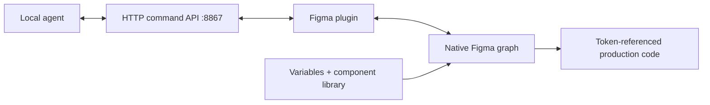

# PlexUI AI Bridge

> Research status: **Architecture-level** · Last reviewed: **2026-08-11**

| Field | Value |
|---|---|
| Team | Plex UI · team region not established |
| Ordinary job | let a local coding agent inspect and create native Figma UI without discarding design-token meaning |
| Transport | local HTTP server at `localhost:8867` connected to a development Figma plugin |
| Authority | Figma nodes component instances variables and property bindings |

## The differentiator is semantic binding

The bridge returns both node structure and the variable names bound to fills spacing radii and typography. An agent can create frames text components and instances and then bind properties to those variables. A value such as `spacing/lg` survives instead of becoming an unexplained `12px`, so theme density and dark-mode behavior remain governed by the host design system.

## Local-first does not mean unbounded trust

The plugin and server run locally and the design need not be uploaded to Plex UI. The API is read-write; tunneling it for a remote agent exposes mutation authority and first-party guidance explicitly recommends short-lived tunnel and access controls. Host version history remains the visible recovery mechanism.

Plex UI's component library is related context but the canonical record is the bridge. The bridge works with any Figma design system and is therefore not merely an installer for Plex components.

## Evidence ceiling

The paid implementation is closed. Public command examples establish structure and variable-binding operations but not authentication defaults command completeness transaction boundaries or conflict behavior. “Production-ready” remains contingent on code-side verification.

## Primary evidence

- [PlexUI AI Bridge](https://plexui.com/bridge)
- [Bridge versus Figma MCP](https://plexui.com/blog/figma-mcp-vs-ai-bridge)
- [Codex connection and security boundary](https://plexui.com/blog/connect-codex-to-figma)
