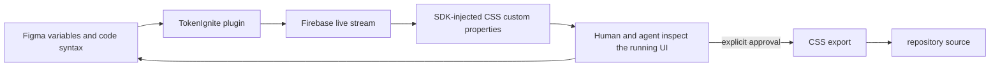

# TokenIgnite

> Research status: **Architecture-level / inspectable distribution** · Last reviewed: **2026-08-12**

TokenIgnite makes a running application a temporary validation surface for Figma variables. It does not silently make runtime state or generated code authoritative: the public contract keeps variables in Figma, streams them into local or closed staging clients, and leaves repository files unchanged until a person deliberately exports CSS.

## The unusual artifact is a live candidate that has not yet become source

The plugin reads native variables and their Figma code syntax. When a WEB custom-property name is absent it can generate and write that syntax back into the Figma file. A signed-in plugin instance then streams values to connected runtimes. The browser SDK injects a style element for root and named theme contexts, so a token change can be judged against the actual application without a build or source edit.

This is a candidate-promotion mechanism: runtime appearance is review evidence, not a hidden second source of truth. Stopping the client or exporting the approved variables makes the boundary visible.

## AI is a participant rather than the owner

Figma's Design Agent can change the native variables, and an MCP-connected coding agent can consume the code syntax when generating UI. TokenIgnite then exposes drift in the browser immediately. The mechanism does not give the model independent authority to promote those values into repository source; the human-controlled CSS export is the commit boundary.

## Public implementation boundary

The creator describes an Express/Firebase/Next.js monorepo, but that source is not public. The published `tokenignite@0.13.6` package was inspected as the reachable implementation boundary. It exposes the runtime client and CLI/package contracts, is currently marked `UNLICENSED`, and contains no public repository coordinate. The Figma plugin, service and Firebase rules remain closed.

Operational constraints are consequential: at least one authenticated plugin instance must remain open for live synchronization; the documented ceiling is 5,000 variables; supported use is local development or a closed staging environment; and correct development-only installation should leave no production trace.

## Primary evidence

- [Creator launch and ordinary workflow](https://forum.figma.com/showcase-your-work-14/tokenignite-live-stream-figma-variables-straight-into-your-dev-runtime-no-build-steps-56622)
- [Product story and implementation disclosure](https://tokenignite.live/the-story)
- [Designer documentation](https://tokenignite.live/docs/en/designer-documentation)
- [Developer documentation](https://tokenignite.live/docs/en/developer-documentation)
- [npm distribution](https://www.npmjs.com/package/tokenignite)
- [Legal identity and German location](https://tokenignite.live/imprint)
