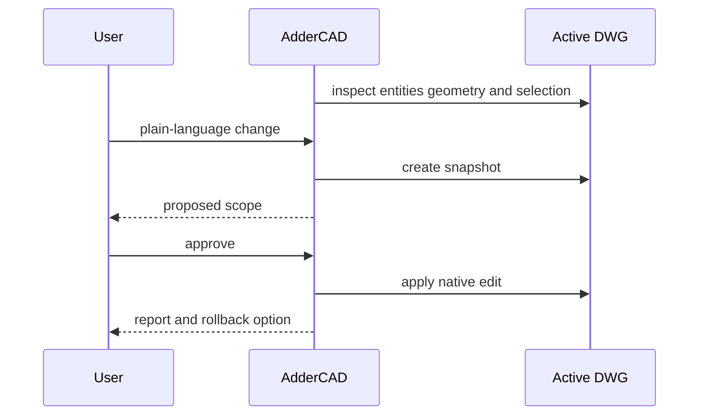

# AdderCAD

> Research status: **Architecture-level** · Last reviewed: **2026-08-12**

| Field | Value |
|---|---|
| Team | Adder Labs · team region not established |
| Availability | Windows early access |
| Ordinary job | inspect and safely automate repetitive drafting in an existing AutoCAD-compatible drawing |
| Authority | active local DWG in the host CAD application |
| Lifecycle | active transition |

## Every proposed edit has a recovery boundary

AdderCAD detects the active drawing and inspects layers selected entities geometry and a visual preview. A natural-language request becomes a proposed entity-level operation such as layer changes moves resizing annotation updates renumbering cleanup or QA.

Before execution the product creates a snapshot and describes what will change where and across how many entities. The user approves or rejects it. An accepted mutation lands in the live host drawing and produces a report; one-click rollback restores the snapshot. Cross-session project memory provides context but is not the drawing authority.

Public evidence does not expose the AutoCAD integration API exact snapshot format model context or whether rollback survives external host edits. DWG remains local although selected context may be sent to an AI provider for planning.

## Primary evidence

- [AdderCAD live-drawing workflow](https://www.adderlabs.com/)
- [AdderCAD safety and early-access contract](https://www.adderlabs.com/#safety)
