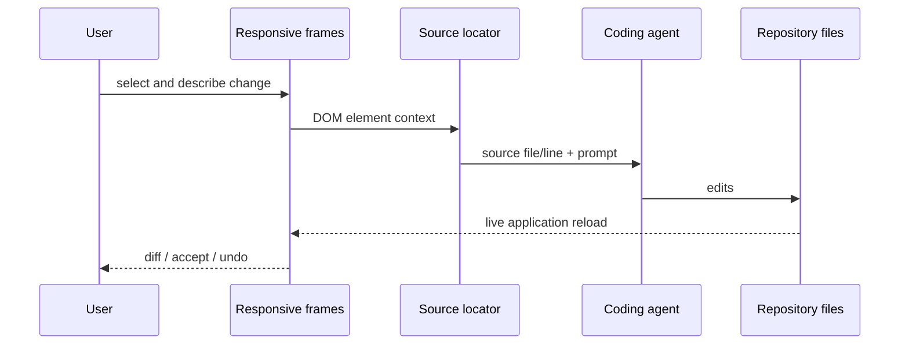

# Airship

> Research status: **Source-level** · Lifecycle: **active-transition** · Last reviewed: **2026-08-12**

Airship places a Figma-like responsive canvas in front of an existing development server. It does not import the application into a second design document. Selection is mapped back to the source file and line; Claude Code, Codex or OpenCode edits that source; Airship shows the diff and can rewind it.

## One source across many live frames

Desktop and mobile frames are real browser projections of the same running app. Selecting an element captures the element/source relation and inspector intent. The agent sees that context, performs file edits, and the frames reload from the changed application.

## History is more than chat

Airship records before-state file content and agent output. Undo is content-restore first; SDK-native session revert/checkpointing is used when available. Codex and OpenCode recovery depends on the target project being a Git repository, and the CLI warns when that precondition is absent. Session history is also stored under `~/.airship/history`.

Pinned commit [`c1417e3`](https://github.com/0xnyn/airship/commit/c1417e3504ed74b15375483d7d954cc84ad54075) exposes:

- element/source mapping in [`packages/source`](https://github.com/0xnyn/airship/tree/c1417e3504ed74b15375483d7d954cc84ad54075/packages/source);
- agent adapters and diff capture in [`packages/core`](https://github.com/0xnyn/airship/tree/c1417e3504ed74b15375483d7d954cc84ad54075/packages/core/src);
- persistent history in [`packages/server/src/history.ts`](https://github.com/0xnyn/airship/blob/c1417e3504ed74b15375483d7d954cc84ad54075/packages/server/src/history.ts);
- frame, diff and history UI in [`packages/overlay/src`](https://github.com/0xnyn/airship/tree/c1417e3504ed74b15375483d7d954cc84ad54075/packages/overlay/src);
- explicit checkpoint/rewind semantics in the [contributor architecture](https://github.com/0xnyn/airship/blob/c1417e3504ed74b15375483d7d954cc84ad54075/CONTRIBUTING.md).

## Safety and maturity

`--safe` changes agent permission behavior, but the README also states that agents run unsandboxed by default; this is a consequential operational boundary. The MIT-licensed repository was created only days before review and is marked active-transition. The maintainer profile says BLR; this is interpreted as Bengaluru and supports India as region evidence without claiming incorporation there.

## Decisive sources

- [Repository README](https://github.com/0xnyn/airship/blob/c1417e3504ed74b15375483d7d954cc84ad54075/README.md)
- [MIT license](https://github.com/0xnyn/airship/blob/c1417e3504ed74b15375483d7d954cc84ad54075/LICENSE)
- [Maintainer profile](https://github.com/0xnyn)
- [Product site](https://airship.design)
