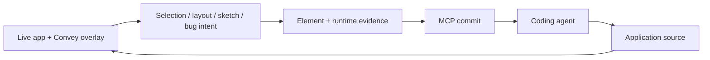

# Convey

> Research status: **Source-level** · Last reviewed: **2026-08-12**

Convey treats the running application as a visual decision surface and the repository as final authority. A user can tune design-system values, arrange existing components, sketch a feature or mark a bug in the browser; Convey packages that intent together with element and runtime context for a coding agent to implement.

## A visual commit is not a DOM patch

The overlay knows the current page, selected element and framework component context. For a bug it can also attach recent errors, console output, DOM snapshots and events. When the user commits the visual change, MCP tools hand this evidence to the agent. The agent edits the actual React/Angular/Tailwind project; reloading the application verifies the result.

This is why Convey's authority is a runtime-intent relay rather than a second visual source of truth. Temporary overlay state can guide a change, but only source changes survive outside the session.

## Framework and component grounding

Convey loads into pages built with React or Angular and Tailwind v3/v4. Storybook can be used to fine-tune a design system; the feature canvas can place known components into a proposed page. Selection auto-population reduces the lossy step between a rectangle on screen and the actual component an agent must modify.

Pinned commit [`6dcb7ed`](https://github.com/bitovi/convey/commit/6dcb7ed057550f20a606465332b126beb91c0061) exposes:

- the MCP mutation/evidence contract in [`server/mcp-tools.ts`](https://github.com/bitovi/convey/blob/6dcb7ed057550f20a606465332b126beb91c0061/server/mcp-tools.ts);
- shared protocol formatting in [`shared/mcp-format.ts`](https://github.com/bitovi/convey/blob/6dcb7ed057550f20a606465332b126beb91c0061/shared/mcp-format.ts);
- selection grounding in [`useSelectionAutoPopulate.ts`](https://github.com/bitovi/convey/blob/6dcb7ed057550f20a606465332b126beb91c0061/panel/src/components/DrawTab/hooks/useSelectionAutoPopulate.ts);
- overlay, panel, server and end-to-end tests in the [monorepo](https://github.com/bitovi/convey/tree/6dcb7ed057550f20a606465332b126beb91c0061).

## Operational boundary

The project is MIT-licensed and distributed as `@bitovi/convey`. The review did not run a target application or agent, so framework-specific runtime behavior remains bounded by source and tests. Bitovi's public organization profile supplies a United States location.

## Decisive sources

- [Repository README](https://github.com/bitovi/convey/blob/6dcb7ed057550f20a606465332b126beb91c0061/README.md)
- [Published documentation](https://bitovi.github.io/convey/)
- [MIT license](https://github.com/bitovi/convey/blob/6dcb7ed057550f20a606465332b126beb91c0061/LICENSE)
- [Organization profile](https://github.com/bitovi)
