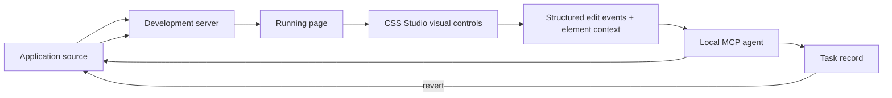

# CSS Studio

> Research status: **Architecture-level** · Last reviewed: **2026-08-11**

| Field | Value |
|---|---|
| Team | Motion · Netherlands |
| Ordinary job | edit a real web page visually while a chosen local coding agent writes each accepted change into the actual codebase |
| Canonical artifact | the user's application source files |
| Visual surface | a browser-side style, layout, content and animation editor over the running page |
| Public evidence boundary | first-party product/docs plus an issues-only public repository; implementation source is not public |

## The browser produces structured intent; the agent authors source

CSS Studio does not try to infer source edits inside the browser extension alone. As the user changes a selected element, the surface emits structured edit events containing page URL, viewport, element path/selectors, before/after property values and, for React, component and source-file context. A local MCP-compatible agent receives those events and writes the actual project files.

That split is the core architecture: CSS Studio owns visual intent and runtime grounding; the chosen agent owns repository mutation. The running page gives immediate feedback, but durable truth is the source that survives a rebuild.

## Continuous edits are batched into logical source changes

Dragging a slider can produce many runtime values. First-party documentation says the agent batches these into a source-file write per logical change instead of rewriting the same line on every pointer event. If no compatible agent is connected, the product can copy pending context as a prompt, but that fallback loses the direct write/revert contract and should be evaluated separately.

Selected-element context also accompanies chat. That allows requests beyond a single CSS property—responsive changes, component refactors or variants—while keeping the target visible. Such requests widen agent authority beyond CSS Studio's deterministic visual controls, so repository diffs and runtime checks remain necessary.

## Tasks are the unit of concurrency and reversion

Visual edit groups, chat messages, generated variants and viewport adaptation become separate tasks, and background agents may run them in parallel. The product says a task can be reverted independently: both its browser-side visual effect and source-file change are rolled back, even when another task touched the same file. A per-element session undo stack handles smaller property corrections.

This is a stronger product contract than generic “undo,” but public architecture evidence does not reveal the merge algorithm for overlapping source edits. Acceptance should deliberately run two tasks against the same selector and file, revert them in both orders and inspect the resulting diff and page.

## Why this qualifies despite closed implementation

The public `motiondivision/css-studio-public` repository is explicitly for issues and feature requests. It does not expose the code required for a source-level audit. The product is nevertheless included because first-party documentation establishes a complete ordinary-user Design loop, explicit MCP interface, durable source authority and correction mechanism. Its dossier remains architecture-level and makes no claims about internal implementation beyond those contracts.

The one-time paid product and free visual-editor mode also have different capability boundaries: direct AI source updates require the agent integration. Visual controls alone would be a traditional editor, outside the AI-native reason for inclusion.

## Evidence-backed limits

Public sources establish structured edit streaming, source writes, selected-element grounding, parallel task state and task reversion. They do not establish:

- atomic repository transactions under every coding agent;
- framework/source-map support for every build system;
- conflict-free parallel edits;
- durable task history after all local product data is removed;
- a public commit-level implementation that can be independently traced.

## Primary evidence

- [First-party AI editing documentation](https://cssstudio.ai/learn/ai-editing)
- [First-party pricing and capability boundary](https://cssstudio.ai/pricing)
- [Public issues repository](https://github.com/motiondivision/css-studio-public)
- [Motion organization profile and team region](https://github.com/motiondivision)
