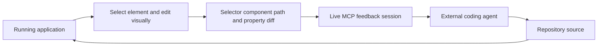

# Handle

> Research status: **Source-level** · Last reviewed: **2026-08-12**

| Field | Verified value |
|---|---|
| Maintainer | Tonkotsu AI |
| Human surface | Chrome extension over a running application |
| Agent surface | `get_design_feedback` MCP tool with a live repeated session |
| Durable writer | external coding agent acting on the repository |
| Pinned source | [`36510552969211e77ada7b32cce8f991c5896d46`](https://github.com/tonkotsu-ai/handle/tree/36510552969211e77ada7b32cce8f991c5896d46) |

Handle converts direct browser refinement into structured instructions for a coding agent. The browser can show temporary edits but Handle does not claim those DOM mutations are the source change.

## Element identity is best-effort context

The content script captures DOM structure computed styles selector paths and React component names or paths when available. The shared edit tracker keys edits by selector path and retains each property's original and current value plus optional token name and a note.

`generateFeedbackDescription` groups the result by owning component and emits statements such as “on this selector change padding from X to Y.” This packet is more precise than a screenshot prompt but can still become stale after rerender or source refactor.

## The MCP tool is a rendezvous rather than a writer

The MCP server runs over stdio and opens a Socket.IO server on an OS-assigned port. A discovery endpoint on port 58932 lets the extension find active session files under `.handle/sessions`. `get_design_feedback` waits for feedback or an exit signal and returns a session ID; agent installation prompts instruct the caller to implement feedback then call again until the user stops.

| Pinned path | Mechanism |
|---|---|
| [`ext/entrypoints/handle.content.ts`](https://github.com/tonkotsu-ai/handle/blob/36510552969211e77ada7b32cce8f991c5896d46/ext/entrypoints/handle.content.ts) | DOM tree style and selector capture plus runtime editing |
| [`shared/src/hooks/useEditTracker.ts`](https://github.com/tonkotsu-ai/handle/blob/36510552969211e77ada7b32cce8f991c5896d46/shared/src/hooks/useEditTracker.ts) | before/after property and note authority |
| [`mcp/src/server.ts`](https://github.com/tonkotsu-ai/handle/blob/36510552969211e77ada7b32cce8f991c5896d46/mcp/src/server.ts) | session discovery Socket.IO queue grace period and MCP tool |
| [`mcp/src/agents.ts`](https://github.com/tonkotsu-ai/handle/blob/36510552969211e77ada7b32cce8f991c5896d46/mcp/src/agents.ts) | supported-agent configuration and repeat-until-exit loop |

## Persistence and failure boundaries

Session JSON exists to connect processes and is removed on normal exit; it is not a design-version database. The durable result is whatever the coding agent successfully writes and the repository accepts. Page reload receives an eight-second default grace period but selector paths component annotations and original style values may still drift. The local discovery endpoint and permissive Socket.IO CORS increase the importance of the random session identifier and host security.

Team region remains unknown in reviewed first-party maintainer material.

## Primary evidence

- [Pinned repository](https://github.com/tonkotsu-ai/handle/tree/36510552969211e77ada7b32cce8f991c5896d46)
- [Architecture and ordinary loop](https://github.com/tonkotsu-ai/handle/blob/36510552969211e77ada7b32cce8f991c5896d46/README.md)
- [MIT license](https://github.com/tonkotsu-ai/handle/blob/36510552969211e77ada7b32cce8f991c5896d46/LICENSE)
