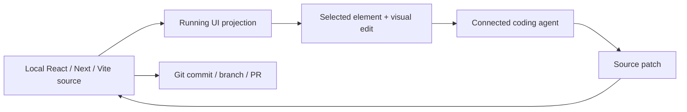

# Inspector

> Research status: **Architecture-level** · Last reviewed: **2026-08-11**

| Field | Value |
|---|---|
| Team | Inspector · team region not established |
| Ordinary job | select the running front end and express a visual correction that lands in the local source tree |
| Durable authority | the user's application files and Git history |
| Visual surface | a local rendered application with element-to-source mapping |

## The canvas is a projection of source

Inspector opens an existing front-end project and renders it as a visual editor. Inline text edits and element movement are translated into source changes; connected coding agents such as Claude Code and Codex handle broader intent. Selection supplies the rendered element and source location, reducing the ambiguity of a screenshot-only prompt.

## Recovery belongs to the repository

Inspector does not need a second proprietary design graph to be durable. Source files remain canonical and Git provides review and recovery. Local-first product language also places code and chat state on the user's machine. Public documentation does not specify how pending visual intents are journaled or rolled back before a commit, so ordinary application and Git checks remain the trust boundary.

This record is distinct from a generic coding agent because Inspector supplies a Design-specific runtime selection and visual manipulation surface. It is also distinct from CSS-only browser extensions because the intended result is a source patch rather than an ephemeral page override.

## Evidence ceiling

The implementation is closed. Element-to-source mapping accuracy, framework transformations, agent prompts, patch atomicity and unsupported-style behavior require installed-product testing.

## Primary evidence

- [Inspector documentation](https://www.tryinspector.com/docs/welcome)
- [Inspector product](https://www.tryinspector.com/)
- [Machine-readable documentation index](https://tryinspector.com/docs/llms.txt)
