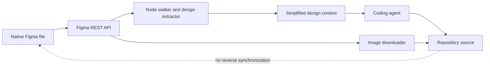

# Framelink MCP for Figma

> Research status: **Source-level** · Last reviewed: **2026-08-11**

| Field | Value |
|---|---|
| Current identity | Framelink MCP for Figma |
| Earlier/discovery names | Figma Context MCP; npm package and executable `figma-developer-mcp` |
| Ordinary job | give a coding agent compact Figma structure and referenced images so it can implement the design in code |
| Direction of authority | Figma is read-only upstream input; generated repository files are an independent downstream artifact |
| Pinned source | [`c083d65c7e002923e7cb98f4e3bdafb105e90f6d`](https://github.com/GLips/Figma-Context-MCP/tree/c083d65c7e002923e7cb98f4e3bdafb105e90f6d) |

## Deliberately narrow: two tools and no reverse sync

Framelink's MCP surface exposes two substantive operations: obtain simplified Figma data and download images referenced by that data. It does not open a Figma plugin channel and does not offer node-creation or mutation tools. This makes it categorically different from the bidirectional Figma bridges elsewhere in the census.

A user supplies a Figma URL or file/node identity. The server calls Figma's REST API with a token, walks the returned document, extracts design-relevant fields and compresses the result for model consumption. The agent can then write application code and ask the server to materialize image assets into an allowed local directory.

## Simplification is the technical bet

Raw Figma REST responses are large and contain fields irrelevant to many implementation tasks. The extractor walks nodes and preserves selected structure, styles, layout and asset references, then finalizes a reduced payload. This lowers token cost but creates a fidelity boundary: information omitted by the extractor cannot guide the agent, even though it remains present in the Figma file.

The repository includes benchmarks and fixtures for the simplification path. Those are useful evidence that payload shape is treated as an engineering concern; they do not prove pixel-perfect code generation across all Figma features.

## Local image writes are constrained

The image tool obtains export URLs and writes downloaded assets to the configured project path. Source validation guards the destination rather than accepting an arbitrary unconstrained write path. After download, the images belong to the code project. Their continued relationship to the original Figma nodes is conventional—filenames and agent output—not a maintained bidirectional identity map.

## Two authorities after generation

Before generation, Figma owns the design truth. After the coding agent writes implementation source, the repository owns runtime behavior. Framelink does not decide how later human edits in Figma merge with code edits, and it does not push code-side token changes back into the design file. Teams must choose whether to re-run materialization, manually reconcile, or declare code authoritative for the shipped product.

## Commit-level map

| Pinned path | Evidence |
|---|---|
| `src/mcp/tools/get-figma-data-tool.ts` | input schema and read-only data operation |
| `src/services/get-figma-data.ts` | REST retrieval and extraction pipeline |
| `src/extractors/node-walker.ts` | traversal boundary |
| `src/extractors/design-extractor.ts` | fields retained for implementation context |
| `src/mcp/tools/download-figma-images-tool.ts` | asset operation exposed to the agent |
| `src/services/download-figma-images.ts` | URL retrieval and validated local writes |

## Identity decision

The repository name remains `Figma-Context-MCP`, while its current README and homepage use Framelink. The package name remains `figma-developer-mcp`. These are one maintained lineage and one census record, not three products.

## Primary evidence

- [Pinned repository](https://github.com/GLips/Figma-Context-MCP/tree/c083d65c7e002923e7cb98f4e3bdafb105e90f6d)
- [Framelink product site](https://www.framelink.ai/)
- [Pinned MCP server](https://github.com/GLips/Figma-Context-MCP/blob/c083d65c7e002923e7cb98f4e3bdafb105e90f6d/src/mcp-server.ts)
