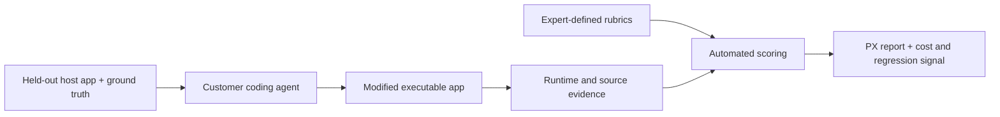

# Chordio / PX-bench

> Research status: **Architecture-level** · Last reviewed: **2026-08-11**

| Field | Value |
|---|---|
| Team | Chordio · Issaquah, Washington, United States |
| Current ordinary job | run a coding agent against held-out applications and receive an evidence-backed product-experience score report |
| Earlier surfaced jobs | clone a frontend into a Claude Code workbench for nontechnical prototyping; produce structured brand context through Design Rails |
| Current artifact | benchmark run evidence and a scored product-experience report tied to the modified host application |
| Lifecycle | active company with a rapidly transitioning product surface |

## The current product defines Design as executable evaluation

PX-bench does not generate a blank-canvas artifact. A customer supplies a coding agent and harness. The benchmark places it in held-out, multi-screen host applications with established conventions and asks it to implement product work. The result is run and scored across intent fidelity, product fit, visual craft, convention adherence, pathway completeness, content, resilience and accessibility.

This expands the map's Design boundary: product experience becomes an evidence-producing evaluation operation over a real application, not just a quality adjective applied to generated screenshots.

## Scoring is anchored in product context

The first-party site explains three safeguards: held-out apps prevent memorizing the target; scenarios contain failure modes with known answers; and rubric items are kept only where expert agreement is sufficiently high. The harness is based on Inspect AI. Reports include both category scores and concrete failures such as choosing a modal where the host application consistently uses drawers.

The benchmark's authority is split. Source and runtime behavior of the modified app decide whether the feature works; benchmark ground truth and rubric version decide the score. Chordio explicitly versions the taxonomy and says revisions will disclose diffs. A numeric score without scenario, agent/model, run evidence and rubric revision is not a durable comparison.

## Why earlier Chordio surfaces stay in this dossier

The current YC company profile still describes Chordio Workbench: a browser-assisted clone of an existing frontend into a local Claude Code repository so designers and PMs can prototype without access to the production source. The same profile records Design Rails, which generates a `design-context.zip` containing tokens, instructions, voice and logo assets for coding agents.

These are materially different mechanisms, but they share one small active company, the Chordio identity and a rapid sequence of product experiments without stable independent homes observed in this pass. The census conservatively preserves one transitioning lineage. If a surface gains an independent maintained product identity, it must be split through a new candidate record rather than silently inflating this one.

## Evidence ceiling

Public evidence establishes current evaluation categories, held-out execution, reports and company lineage. It does not expose the complete private scenario corpus, scorer implementation, run storage model or statistical calibration. The current source therefore supports architecture-level claims only.

Acceptance should repeat the same scenario, inspect score variance, deliberately break a known recovery path, compare report evidence with the running app and pin the rubric revision. A polished report is not proof that its scorer observed the correct behavior.

## Primary evidence

- [Current PX-bench product](https://www.chordio.com/)
- [Y Combinator company and product-lineage profile](https://www.ycombinator.com/companies/chordio)
- [Example PX-bench report](https://www.chordio.com/)
