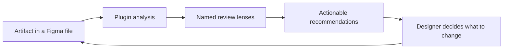

# Design Audit Lens

> Research status: **Architecture-level** · Last reviewed: **2026-08-12**

Design Audit Lens is a released Figma plugin for reviewing design work rather than generating another screen. The creator names four admissible inputs—research artifacts, wireframes, UI screens and user-testing outputs—and five review lenses: UX practice, usability heuristics, WCAG 2.2, cognitive load and interaction design.

## The durable output is an argument about the design

The public contract establishes recommendations as the plugin's output. It does not say that the model rewrites nodes, applies fixes or owns a parallel design graph. Figma therefore remains the working design authority and the analysis is decision evidence for a human correction loop.

## What the release does not disclose

The creator post does not document which node properties or research formats are extracted, whether images leave Figma, which model or rubric implementation is used, how recommendations address stable node IDs, or whether reports persist across runs. No public source repository or acceptance run was found. Those are unknowns rather than inferred capabilities.

Team geography also remains unknown in reviewed first-party evidence.

## Primary evidence

- [Creator release post](https://forum.figma.com/showcase-your-work-14/audit-your-designs-with-senior-level-precision-in-minutes-55364)
- [Figma Community plugin 1649498558808466087](https://www.figma.com/community/plugin/1649498558808466087)
