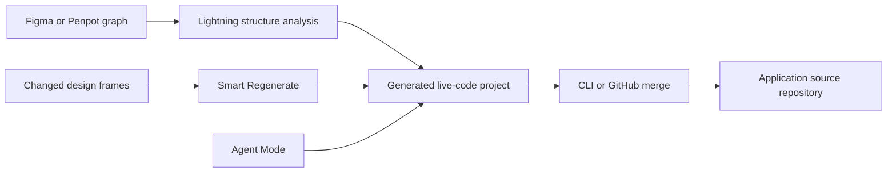

# Locofy

Locofy (team region not established) turns an existing Figma or Penpot interface into framework code and keeps integrating later design changes. Its definition of design is the structure a designer already drew: layout groups, auto-layout, breakpoints, element roles and reusable components. Its act of design is conversion — turning that graph into life-cycle code that keeps receiving the design's changes rather than escaping them. The upstream authority is the selected design frames, components, links and responsive intent; the downstream authority is the generated code once it is pulled or merged into the user's repository.

## Regeneration is a pipeline, not a one-shot ZIP

The Lightning flow reads that structure before generating a live code preview; later runs use Smart Regenerate to detect which design frames actually changed instead of rebuilding the whole project, and Agent Mode then edits the generated UI in natural language around responsiveness, accessibility and themes.

The CLI carries local project context and can reuse existing components while merging output, which turns the product into a continuing materialization pipeline rather than a converter. It does **not** make Figma and the repository co-equal: once developers add application logic the repository is the downstream authority, and a later regen is an integration event with possible conflicts. What is actually mapped: frames, grouping, auto-layout and consistently named breakpoint variants into responsive structure; prototype links and element tags into actions and semantic elements; design components into matched existing code components; and Agent and Visual modes operate the generated project before source delivery.

Public docs ([plugin quickstart and Lightning flow](https://www.dev.locofy.ai/docs/plugin/quickstart/), [context-aware CLI pull](https://www.locofy.ai/docs/export-and-deployment/cli-pull/), [Builder Agent and Visual modes](https://www.dev.locofy.ai/docs/url/builder/), [GitHub synchronization](https://www.locofy.ai/docs/plugin/export-and-deployment/sync-with-github/)) don't expose the Large Design Model's representation, diff grammar, merge algorithm or conflict invariants, so "smart merge" stays a product contract; exact behavior for hand-edited files, deletions, renames and app state needs repository-level testing.
