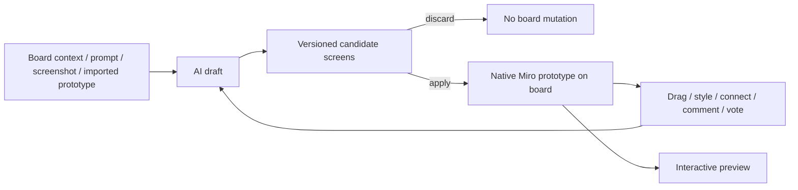

# Miro Prototypes

Miro Prototypes defines design as **deciding between directions** — turning a PRD, sticky notes, screenshots or an imported Figma/coding-agent context into several candidate UI flows that collaborators can preview, comment on and vote over on the same board. It is optimized for a decision, not pixel-final delivery; the [product page](https://miro.com/ai/prototyping/) names this prototype surface rather than a bare generator.

## Candidate promotion is the decisive mechanism

AI refinement never silently mutates the board. The [help contract](https://help.miro.com/hc/en-us/articles/26654269713682-Miro-Prototypes) describes a **draft prototype with a version selector**: each refinement is another candidate, and the user decides whether to **Add/Apply to canvas** or discard it. Discarding leaves the board untouched; applying promotes one version into a native, editable Miro prototype (screens, components, connections as host-native objects) that can be dragged, styled, connected, commented on and fed back into refinement.

## Authority and handoff

After promotion, the authoritative editable representation is Miro's host-native object graph — screenshot conversion rebuilds text, controls and layout as editable objects rather than keeping a bitmap. Miro can pull context from Figma or coding agents and push an aligned direction back out via MCP or export for refinement, but public docs don't establish lossless bidirectional sync, so the record treats those as projections across authorities rather than one universal graph. Draft refinements stay recoverable through the version selector (and AI chat history on the newer Sidekick surface); applied screens persist with the board — see the [help contract](https://help.miro.com/hc/en-us/articles/26654269713682-Miro-Prototypes) and [overview](https://help.miro.com/hc/en-us/articles/26654102601874-Miro-Prototypes-overview).

Miro Prototypes is independently countable from Uizard — a separately maintained acquired product with its own board artifact and workflow. Miro describes a multi-region hub model, so the team isn't pinned to one country ([team locations](https://miro.com/careers/locations/)).
